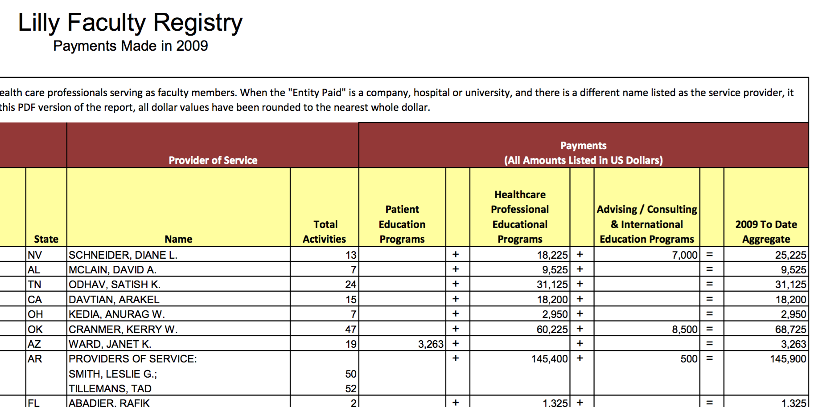

****************************************************
Grepping for big dollar amounts in unstructured text
****************************************************

PDFs of drug company payments to healthcare practitioners
=========================================================

.. note:: Downloads

    - :download:`Eli Lilly Payments to HCPs in 2009 (PDF) </stash/data/hcp-payments/eli-lilly-2009.pdf>`
    - :download:`Eli Lilly Payments to HCPs in 2009 (plain text) </stash/data/hcp-payments/eli-lilly-2009.txt>`

    If you have the `Poppler PDF tools <https://poppler.freedesktop.org/>`_ installed, you can convert any text-based PDF to plain text with the following command:

    .. code-block:: shell

        $ pdftotext -layout mydocument.pdf

    If you don't have Poppler installed, just use the plaintext version of the file.

Background:  `ProPublica's Dollars for Docs <https://projects.propublica.org/docdollars/>`_

Dollars for Docs was inspired in part by these mundane data problems described in the New York Times: `Data on Fees to Doctors Is Called Hard to Parse <http://www.nytimes.com/2010/04/13/business/13docpay.html>`_:

    Merck and GlaxoSmithKline display physician fees in Adobe PDF files, which must be laboriously copied if they are to be used in a sortable database.

The trick with these converted PDFs is to realize that **they are not structured text**. It takes considerable programmatic work --  see `Heart of Nerd Darkness: Why Updating Dollars for Docs Was So Difficult <https://www.propublica.org/nerds/item/heart-of-nerd-darkness-why-dollars-for-docs-was-so-difficult>`_ -- to convert it to "data".

Grepping for big money amounts
------------------------------

However, if we don't need to convert it to data, for use in a database, we can at least do quick **filtering** of the data. It'd be nice to sort it, but maybe it's enough to just filter the text for big money amounts.

In the Eli Lilly payment documents, the last column is where aggregate totals per healthcare practitioner (HCP) is recorded:

Here it is as raw text:

.. code-block:: text

                       Payments
            (All Amounts Listed in US Dollars)

          Healthcare
         Professional            Advising / Consulting
         Educational               & International              2009 To Date
          Programs               Education Programs              Aggregate

                   18,225 +                       7,000 =                25,225
                    9,525 +                             =                 9,525
                   31,125 +                             =                31,125
                   18,200 +                             =                18,200
                    2,950 +                             =                 2,950
                   60,225 +                       8,500 =                68,725
                          +                             =                 3,263
                  145,400 +                         500 =               145,900

The regex pattern
^^^^^^^^^^^^^^^^^

The pattern for large dollar amounts -- at least 6 digits -- anywhere in the file:

:regexp:`\\d{3},\\d{3}`

Same pattern, but only at the end of the line, including any optional trailing whitespace:

:regexp:`\\d{3},\\d{3} *$`

Here's the pattern modified to look for 6-digit amounts, or 5-digit amounts of at least $50,000:

:regexp:`(\\d{3}|[5-9]\\d),\\d{3} *$`

Note: Because parentheses denote capturing groups, its advisable to learn the syntax for `non-capturing groups <http://www.regular-expressions.info/brackets.html>`_:

:regexp:`(?:\\d{3}|[5-9]\\d),\\d{3} *$`

With ack/ag (or your favorite PCRE-grep-tool)
^^^^^^^^^^^^^^^^^^^^^^^^^^^^^^^^^^^^^^^^^^^^^

.. code-block:: shell

    $ ack '(?:\d{3}|[5-9]\d),\d{3} *$' eli-lilly-2009.txt

