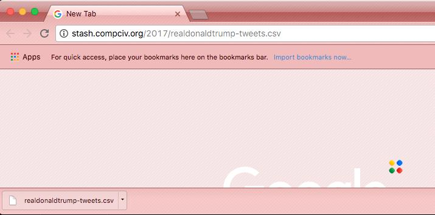

***********************************************************
Slow CSV Exploration: Examine everything and assume nothing
***********************************************************

I said at the beginning of this course that there is nothing we do in programming that we couldn't already do long before we opened our first Terminal window. To repeat what Paul Ford wrote at the beginning of his opus, "What is Code?"

    You, using a pen and paper, can do anything a computer can; you just can’t do those things billions of times per second. And those billions of tiny operations add up.

    https://www.bloomberg.com/graphics/2015-paul-ford-what-is-code/

And yet once students start trying to program, it's like they forgot that they ever knew how to use a web browser to visit/download a URL, or to open a file on their computer by double-clicking. Or that Excel and other spreadsheets were perfectly fine for handling CSV files without having to figure out Python's ``csv`` package.

So to reiterate: programming can only do things that you already know how to do *easily*. So make sure you can do those easy things -- such as downloading a file at a given URL -- before getting stuck in a pointless and frustrating coding session.

How to download a file
======================

As with every problem so far, we rely on some remote data file that is accessible at a given URL:

http://stash.compciv.org/2017/realdonaldtrump-tweets.csv

Ideally, I want you to know how to download it via Python, just so that all of your work can be done in a single script. It's generally not a good idea to have a workflow in which some mundane/mechanical/boring parts of the work are done by point-and-click -- such as downloading files -- while others steps are completely automated. Because boring steps are easily screwed up. And besides, computers are good at doing boring things *perfectly*.

But that doesn't mean we have to jump right into Python to work with that URL. Download it the old-fashioned way -- using your browser.

Don't have faith in URLS
------------------------

Before you click on that URL, I want to be clear that using your browser to download the CSV file isn't just a programming-icebreaker to get all comfortable. You've used your browser much more than you've used any programming language or other productivity tool. You have an idea of what happens when things "work", or when they don't.

Because the bigger issue is *you have no idea what is at this URL*:

http://stash.compciv.org/2017/realdonaldtrump-tweets.csv

Sure, I said to download it, but you don't know that I didn't make a typo, in which case the URL would go to a cryptic 404 page:

http://stash.compciv.org/2017/eaLdonaldtrump-tweets.csv

Or there could be some other issue. Maybe my web hosting service has cut me off, making that URL unavailable. Or maybe I've been hacked, and that URL doesn't go to a plaintext CSV file, but redirects to a nefarious phishing page.

So one of the big mistakes I see people making -- and this is programmers of all skill levels -- is diving right into Python and writing the boilerplate code to download from and deserialize it into data, without even knowing what is being downloaded from the given URL.

Try this code:

.. code-block:: python

    import requests
    import csv

    resp = requests.get('http://stash.compciv.org/2017/realdoasdfjadklsfj')
    txtlines = resp.text.splitlines()
    records = list(csv.DictReader(txtlines))

That's a nonsense URL. But guess what? No errors are thrown at all. The ``records`` variable contains a list of dictionaries, amazingly enough, and so you could spend literally hours trying to "analyze" this nonsense data, going insane because you think the problem is with your high-level analysis functions, and not the "simple" step of downloading the URL.

No need to rush ahead. Visit the data URL in your browser:

http://stash.compciv.org/2017/realdonaldtrump-tweets.csv

What does downloading even mean
-------------------------------

I wish I could say I knew what you currently see or should expect. But, even assuming the URL is what I want it to be, I have no idea what your browser did when you attempted to visit that URL.

I'm using Google Chrome, and Chrome automatically downloads the file to wherever I specified the download destination to be -- yet another variable in how different your experience is from mine. But even more problematic is that the data file is relatively small, meaning the download is instantaneous. And if I weren't used to Chrome's UI, in which a downloaded file is listed at the very bottom of the browser window, I wouldn't notice that clicking the URL did anything at all:

Your browser or system may actually render the CSV file as if it were a (really ugly) webpage, which is nice in that it's very obvious something CSV/data-like exists is at the URL, but is not particularly helpful:

.. image:: images/chrome-rendering-ugly-csv.png

Why we script, or at least curl
-------------------------------

Just a brief segue: if you're new to concepts such as programming, or using command-line utilities like `curl <http://www.compciv.org/unix-tools/#curl>`_, and you're a rational person, it should feel completely batty that, in this world of powerful and slick web browsers, that anyone would willingly go through the work of learning and then *typing out* a command to download and save a file at a Unix-like prompt:

.. code-block:: shell

    $ curl http://stash.compciv.org/2017/realdonaldtrump-tweets.csv > tweets.csv

Or worse, using Python:

.. code-block:: python

    import requests
    resp = requests.get('http://stash.compciv.org/2017/realdonaldtrump-tweets.csv')
    fname = 'tweets.csv'
    f = open(fname, 'w')
    f.write(resp.text)
    f.close()

Or, before the beautiful ``requests`` Python library was created, how files were downloaded using Python's built-in libraries:

https://docs.python.org/3/library/urllib.request.html#module-urllib.request

.. code-block:: python

    from urllib.request import urlopen
    resp = urlopen('http://stash.compciv.org/2017/realdonaldtrump-tweets.csv')
    databytes = resp.read()
    fname = 'tweets.csv'
    f = open(fname, 'wb')
    f.write(databytes)
    f.close()

Or...trying to make any kind of Internet connection using a language that was developed before the Internet/HTTP was a thing.

But I digress. The most immediate reason why we learn how to download files from the command-line, or to write a multi-line script, is because it is a **reproducible process**. If I want to download a file and save it to a specific filename, I run those commands, and I know that barring unforeseen situations -- the Internet going down, my computer suddenly dying, the URL's actual target being altered -- that I will get the same result.

By contrast, clicking a URL via browser has all of those same possible error situations, and a whole lot more. These include your browser's behavior changing, such as how the file is downloaded and where it is saved. Or, you clicking on the wrong URL -- a common catastrophic snafu in real-world data work.

How to inspect a file
=====================

Just because your browser (or script) downloaded something, it doesn't mean it successfully saved, or saved to where you expect. So go to your Downloads folder and find wherever the ``realdonaldtrump-tweets.csv`` file was saved.

Try opening the file in your text editor, such as **Atom** or **Sublime Text**. You shouldn't really be using your text editor to actually *edit* or make sense of the file, but at least know that it's all just plain text:

So even at this initial, very basic step, I can point out a piece of intentional design in this course. When you visited that URL, I really have no idea what you experienced. For some people, the browser treats that CSV text file as a webpage, and all of the plaintext rendered in your browser window.

For me, a Google Chrome user,

.. code-block:: python

    import requests
    resp = requests.get('http://stash.compciv.org/2017/realdonaldtrump-tweets.csv')
    txt = resp.text

Stop.

Ask yourself what you expect ``resp.text`` -- i.e. the variable ``txt`` -- to be.

What is its *type*, which you can and should check manually by running the `type` function on ``txt``:

.. code-block:: python

    type(txt)

