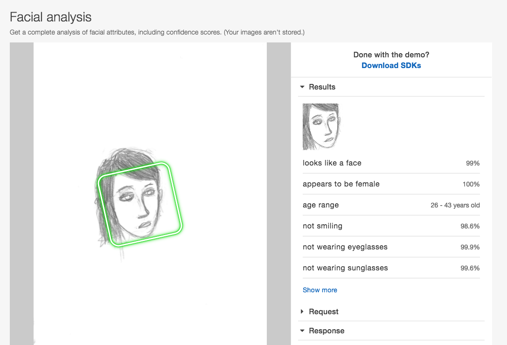

********************************************************
Understanding Face Recognition, via Humans and Computers
********************************************************

What makes a human face a human face? What can a human face be reduced or simplified to before the human eye/mind ceases to recognize it as a face? And how does the answer differ if the beholder is a computer, e.g. Amazon's Rekognition API?

.. contents::

The Drawing Contest (In-Class Pop Quiz)
=======================================

After doing the assigned reading,

- Take 2 pieces of paper (any size).
- Draw your best representation of the male and female human face, (one for each sheet of paper).
- At the very bottom of each sheet, write your name/initials. And label the faces, M and F for 'male' and female, respectively.

The artist for the most human male and female face -- as recognized by Rekognition -- gets a prize (cookies).

Students who fail to draw a recognizable human face fail the class (ha ha, just kidding...I wish...)

Aside: even though most of us understood how face detection algorithms could be "racist" depending on what data they were trained on, and most of us agreed that developers/programmers/engineers should be mindful of this, it's worth noting that no one went out of their way to draw particularly non-Caucasian faces...

The Contest Results
===================

The submitted drawings were scanned and then passed into the Amazon Rekognition API: https://aws.amazon.com/rekognition/

Of the 22 images that were submitted (presumably 11 males and 11 females), 1 male and 7 female faces were detected.

The faces were sorted in descending order of multiplying the "confidence"  that Rekognition sees a face by the "confidence" that Rekognition has that the face is either male or female.

Faces that Rekognition determines to be one gender, but was intended by the artist to be another gender, are automatically disqualified.

Example image URL:

http://stash.compciv.org/2017/facedrawingfun/originals/faces-001.png

Example API response for that image:

http://stash.compciv.org/2017/facedrawingfun/responses/faces-001.png.json

Or, if you use the `Rekognition demo <https://console.aws.amazon.com/rekognition/home?region=us-east-1#/face-detection>`_, it looks like this:

In the generated table/thumbnails below, images with a green box indicate images in which a face was found. The green box highlights what was considered by Amazon Rekognition a "face"

.. raw:: html

        <h3>All drawings</h3>
        <table>
        <tr>
        <td></td>
        <td></td>
        <td></td>
        <td></td>
        </tr>
        <tr>
        <td></td>
        <td></td>
        <td></td>
        <td></td>
        </tr>
        <tr>
        <td></td>
        <td></td>
        <td></td>
        <td></td>
        </tr>
        <tr>
        <td></td>
        <td></td>
        <td></td>
        <td></td>
        </tr>
        <tr>
        <td></td>
        <td></td>
        <td></td>
        <td></td>
        </tr>
        <tr>
        <td></td>
        <td></td>
        </table>

          

        <h3>Males</h3>
        <table>
        <tr>
        <td>
                         
                        Face confidence: 99.064
                         
                        Gender confidence: 94.278
                        </td>
        </table>

          

        <h3>Females</h3>
        <table>
        <tr>
        <td>
                         
                        Face confidence: 99.612
                         
                        Gender confidence: 100.0
                        </td>
        <td>
                         
                        Face confidence: 99.009
                         
                        Gender confidence: 100.0
                        </td>
        <tr>
        <td>
                         
                        Face confidence: 98.827
                         
                        Gender confidence: 100.0
                        </td>
        <td>
                         
                        Face confidence: 98.267
                         
                        Gender confidence: 100.0
                        </td>
        <tr>
        <td>
                         
                        Face confidence: 97.818
                         
                        Gender confidence: 100.0
                        </td>
        <td>
                         
                        Face confidence: 97.238
                         
                        Gender confidence: 100.0
                        </td>
        <tr>
        <td>
                         
                        Face confidence: 96.952
                         
                        Gender confidence: 76.275
                        </td>
        </table>

            

        

Appendix: Assigned reading about faces and face detection
=========================================================

Some relatively short clips about contemporary face-detection algorithms in the wild:

HP Responds to Claim of 'Racist' Webcams http://www.pcmag.com/article2/0,2817,2357429,00.asp

New Zealand Passport Website Rejects Asian Man's Photo For Having 'Closed' Eyes https://www.gizmodo.com.au/2016/12/new-zealand-passport-website-rejects-asian-mans-photo-for-having-closed-eyes/

Anti-surveillance clothing aims to hide wearers from facial recognition https://www.theguardian.com/technology/2017/jan/04/anti-surveillance-clothing-facial-recognition-hyperface

How a Blurry Cow Highlights Weaknesses in Google's Face Recognition http://www.pcmag.com/news/347943/how-a-blurry-cow-highlights-weaknesses-in-googles-face-reco

Facial-Recognition Software Might Have a Racial Bias Problem https://www.theatlantic.com/technology/archive/2016/04/the-underlying-bias-of-facial-recognition-systems/476991/

Here's a longer form piece in the New Yorker by the famous late neurologist Oliver Sacks, titled "Face-Blind"

http://www.newyorker.com/magazine/2010/08/30/face-blind

And here's a slightly technical article: https://medium.com/@ageitgey/machine-learning-is-fun-part-4-modern-face-recognition-with-deep-learning-c3cffc121d78#.qpzgzkd9n

No, we're not learning the math and theory behind machine learning. And it does describe examples in Python but I wouldn't try them unless you have lots of extra time. This is just one of the best explanations I've read of the basic theory of object detection algorithms. It has cool GIFS too.

And one technical paper for fun: The role of eyebrows in face recognition http://web.mit.edu/sinhalab/Papers/sinha_eyebrows.pdf

You don't have to comprehend anything beyond the Abstract. Just scroll down to the pictures of Nixon and Winona Rider.

--------------

If you have a lot of time for reading, here are other things I sometimes recommend in relation to the above articles:

You may be interested in reading the "Man who mistook his wife for a hat" story that Oliver Sacks was famous for -- in fact I recommend the entire book -- but here's the wife-for-a-hat chapter:

http://www.odysseyeditions.com/EBooks/Oliver-Sacks/The-Man-Who-Mistook-His-Wife-for-a-Hat/Excerpt

The required Sacks article for reading (Face-Blind) references "super-recognizers". The New Yorker published a long-form story about "super-recognizers" this past summer: "The Detectives Who Never Forget a Face" http://www.newyorker.com/magazine/2016/08/22/londons-super-recognizer-police-force

On that tangent, this is a cool feature about how face-recognition was implemented in the pre-Internet days of total surveillance: See the Flashcards the Stasi Used for Facial Recognition

http://www.atlasobscura.com/articles/see-the-flashcards-the-stasi-used-for-facial-recognition

Teaching the Camera to See My Skin: an essay arguing about the biases in the physical nature of photo film https://www.buzzfeed.com/syreetamcfadden/teaching-the-camera-to-see-my-skin

A VICE article about some CAPTCHA scheme that I actually haven't seen implemented: https://motherboard.vice.com/en_us/article/bring-on-this-facial-recognition-captcha-already

The concept of a CAPTCHA is in itself a fascinating topic -- since it's a program designed to differentiate between a human user and an automated process (like a web scraper), it is basically a program that has some heuristic for determining *what is human*, e.g. in the above link, the ability to recognize a human face. Which is obviously problematic when you consider the visually impaired, or Oliver Sacks.

It's hard to talk about CAPTCHAs without talking about Google's state-of-the-art, which I'm sure you've encountered before, and its built-in opinion of what makes a human a human: https://www.google.com/recaptcha/intro/

If you're interested in more technical details about object detection, Python has a great library named opencv, which I think you can install via ``pip install opencv`` and start using. This article documents the concepts and math in C++: http://docs.opencv.org/3.0-beta/modules/face/doc/facerec/facerec_tutorial.html

Here's a practical example of using OpenCV in Python. It might not work exactly as it references an older version of OpenCV, but it's pretty much the same minus maybe differences in function names: https://realpython.com/blog/python/face-recognition-with-python/

And if you like research papers, Facebook's paper on DeepFace, which claims a recognition-level on par with humans, is considered state of the art in **face verification**: https://research.fb.com/publications/deepface-closing-the-gap-to-human-level-performance-in-face-verification/

(note that face verification is a different problem than face detection)

I think that paper is best read in context with articles talking about how Facebook's system compares to the FBI's purported overhaul of its face-recognition process and databases:

Facebook's Facial Recognition Software Is Different From The FBI's. Here's Why http://www.npr.org/sections/alltechconsidered/2016/05/18/477819617/facebooks-facial-recognition-software-is-different-from-the-fbis-heres-why

Why Facebook is beating the FBI at facial recognition http://www.theverge.com/2014/7/7/5878069/why-facebook-is-beating-the-fbi-at-facial-recognition

Relevant code
=============

Here are the ugly scripts I used to generate the results (and process and sort the images):

- http://stash.compciv.org/2017/facedrawingfun/rekog.py
- http://stash.compciv.org/2017/facedrawingfun/wrangle.py
- http://stash.compciv.org/2017/facedrawingfun/publish.py
