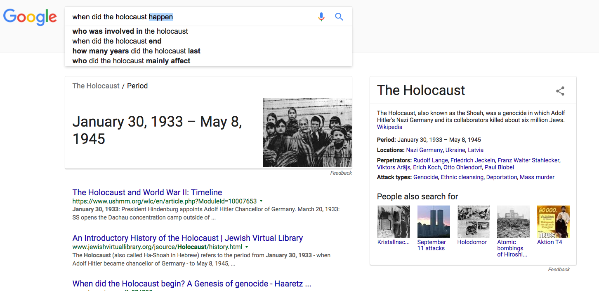
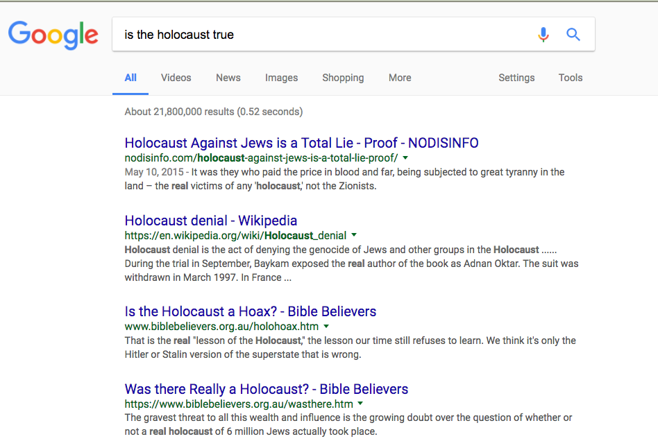

****************************************************
Google's Gnomes and other Problematic Search Results
****************************************************

Google's adherence to the truth of the algorithm is fairly extreme. From Steven Levy's, In the Plex:

        **The wrong way to fix things was to patch the algorithm to address a specific failed query. That was an approach that didn’t scale**; it clashed with the idea that Google’s giant search algorithm could find the most relevant material by its own logic alone.

        A legendary story at Google illustrated this principle. Around 2002, a team was testing a subset of search limited to products, called Froogle. But one problem was so glaring that the team wasn’t comfortable releasing Froogle: when the query “running shoes” was typed in, the top result was a garden gnome sculpture that happened to be wearing sneakers. Every day engineers would try to tweak the algorithm so that it would be able to distinguish between lawn art and footwear, but the gnome kept its top position.

        One day, seemingly miraculously, the gnome disappeared from the results. At a meeting, no one on the team claimed credit. Then an engineer arrived late, holding an elf with running shoes. He had bought the one-of-a kind product from the vendor, and since it was no longer for sale, it was no longer in the index. “The algorithm was now returning the right results,” says a Google engineer. “We didn’t cheat, we didn’t change anything, and we launched.”

More than a decade later, Google still has those issues of pesky results, except it's now the Holocaust. Via the Guardian: `Google is not ‘just’ a platform. It frames, shapes and distorts how we see the world <https://www.theguardian.com/commentisfree/2016/dec/11/google-frames-shapes-and-distorts-how-we-see-world>`_

.. raw:: html

    

Things have changed...sort of:

`Google Search will no longer tell you that the Holocaust didn’t happen... sort of <http://www.theverge.com/2016/12/26/14083308/google-holocaust-denial-search-results-algorithm-change-removal>`_

    After weeks of criticism, Google’s search engine will no longer suggest to visitors that the Holocaust never happened — at least not part of the time, or on the front page. As Digital Trends reports, it initially appeared to have removed a result for the query “did the Holocaust happen” from white supremacist site Stormfront, which previously appeared at the top of the first page. That followed a smaller change that ranked the page a bit lower. But the algorithmic change instead seems simply to be pushing it down further, and a bit inconsistently — at this writing, it’s back on the first page, toward the bottom.

And just a week later...

Consider the role of language and how we speak and search
=========================================================

