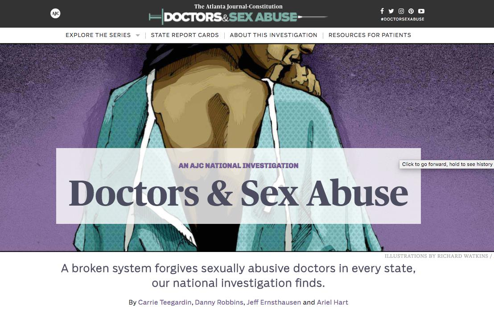

******************************************
AJC Investigation into Doctors & Sex Abuse
******************************************

Homepage: `<http://doctors.ajc.com/>`_

Origin of the project
=====================

It came through normal beat reporting and researcher. A reporter noticed a peculiar order while looking through medical board files:

    As is often the case with investigative reporting, this series in The Atlanta Journal-Constitution grew out of other work. Reporter Danny Robbins was examining orders by the Georgia Composite Medical Board for his 2015 stories on prison medical care. In doing so, he saw **orders allowing doctors to continue practicing after a finding that they had sexually violated patients**.

The next step is gathering data, manually:

    He compiled those orders, discovering about 70 cases clearly involving sexual misconduct.

Is 70 cases a lot? It's certainly enough cases to run a story or a small project. But is it *statistically significant*?

That's not the question or angle that Robbins had. His focus was on the  characteristics of those 70 cases:

    And in about **two-thirds of those cases**, he was shocked to find, doctors either didn’t lose their licenses or were reinstated after being sanctioned. **That included doctors who had repeatedly crossed the line with patients**.

Heuristics in journalism
------------------------

Just by going with what the AJC is writing

So, it's not a situation

So two things drove

