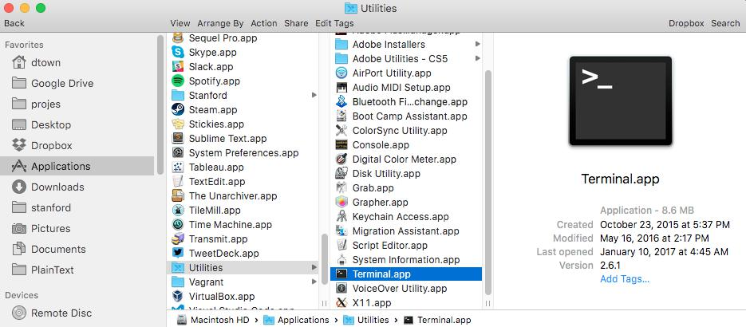
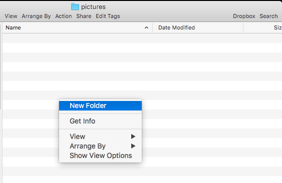
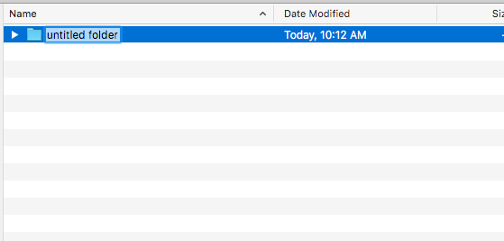
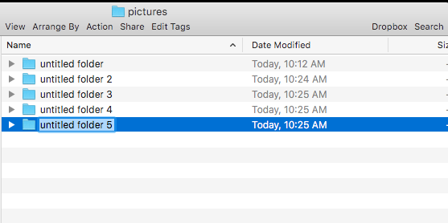

******************************************
Introduction to the Command Line Interface
******************************************

A short overview of the command line interface, i.e. CLI. Meant to supplement the in-class lesson.

Additional reading
==================

We'll be working with the command line in class, and it's just easier to do it than to read about it. But here are some supplementary readings that cover the basics:

- CompCiv 2015: `An overview of Bash and the interactive prompt <http://2015.compciv.org/topics/bash/bash-intro/>`_
- Software Carpentry: `Introducing the Shell <https://swcarpentry.github.io/shell-novice/01-intro/>`_
- Software Carpentry: `Navigating Files and Directories <https://swcarpentry.github.io/shell-novice/02-filedir/>`_
- Software Carpentry: `Working With Files and Directories <https://swcarpentry.github.io/shell-novice/03-create/>`_

- CompCiv 2015: `Text interpretation in Bash <http://www.compciv.org/topics/bash/text-values/>`_ - note: the only thing you need to be concerned about is the use of single quotes to denote a literal text string value.

Why CLI?
========

The command line is an interface to our computer, just like **Finder** for OSX is our interface for point-and-clicking our way through file folders and applications. But instead of pointing-and-clicking, we type in our commands and execute them, one-by-one.

For OSX, we access the command-line through the **Terminal** Application, which can be found in the folder: **Applications > Utilities**:

(I recommend dragging the Terminal OSX to your Dock for easy access)

Hello world
-----------

Open the **Terminal** application to bring up the command line. This *environment* is referred to as an **interactive shell**, i.e. a `read-eval-print-loop <https://en.wikipedia.org/wiki/Read%E2%80%93eval%E2%80%93print_loop>`_, or **REPL** for short.

Type in these words at the prompt, and hit **Enter** to execute them as a command:

.. code-block:: shell

    $ echo hello world

.. warning::

    The dollar sign, i.e. ``$``, is *not* meant to be typed in. It's the conventional way to indicate the **prompt**, i.e. the computer waiting for you to enter in a command.

You should see an interaction like this:

.. raw:: html

    

The **command** is ``echo``, everything else after that are the **arguments** to the command, i.e. the things we want ``echo`` to act on. The command ``echo`` simply prints the arguments to what's known as the **standard output** (**stdout** for short), which, as far as we're concerned right now, is the computer screen.

Let's try one more command, one that we'll be using fairly often: ``curl``. This command takes in a URL, downloads and prints the contents of that URL to standard output:

.. code-block:: shell

    $ curl http://www.example.com

You should see something like this:

.. raw:: html

    

Now, visit `http://www.example.com <http://www.example.com/>`_ via your browser. That's what ``curl`` downloaded and dumped as raw text to "standard output". The implications of a command dumping its contents to screen are worth covering in another lesson, so for now, let's shift to a more pedestrian task.

Making a new folder/directory
=============================

To get an idea of how the CLI is similar to how we're accustomed to using computers, but different in some obvious and subtle ways, let's do something familiar -- make a new file directory -- and compare the processes.

The point-and-click way
-----------------------

You probably know how to do this already, but let's go through the steps as it helps to be reminded exactly how many details there are to the seemingly simple task of making a new file folder.

.. note:: I will be using the term **folder** interchangeably with **file directory**, as it's the same thing as far as we're concerned.

In OSX (or Windows), to create a new folder/directory, we navigate to where we want the Folder to exist, then right-click to bring up a pop-up menu of contextual commands:

Select **New Folder**, and OSX will create a new folder/directory named ``untitled_folder``:

Now at this point, we usually opt to rename ``untitled folder`` to something else, which is as easy as just selecting the new folder and typing the new name.

But what happens if we try to create a new folder before renaming ``untitled folder``? Turns out that the designers of OSX anticipated this situation, and their solution is just to append an incremental integer to the new folder, e.g. ``untitled folder 2``.

It's a good enough solution to prevent the major problem of files/folders with duplicate names.

The CLI way
-----------

Technically, the command to make a directory is just ``mkdir``. But first, we need to figure out where we want to make the directory. One way is similar to how we did it in the point-and-click fashion, which is to navigate to the target directory before trying to make a directory.

In Terminal, type the following command:

.. code-block:: shell

    $ cd ~/Desktop

``cd`` is the command for "change directory". And the argument, ``~/Desktop``, is a shortcut for the path that is <OSX's "Desktop" `https://support.apple.com/en-us/HT201956`>_, i.e. the place you decorate with wallpaper and hoard random files. It's a file folder/directory like any other, except it's just easier to get to for our purposes.

Now run the ``pwd`` command, which means "print working directory". This command doesn't *do* anything except tell us where we are. That's one of the characteristics of the CLI: it provides very little visual information about where we are:

..code-block:: shell

    $ pwd

..raw:: html

    

Now, we can make a new directory:

(note: for reasons that will be clearer later, it's best to stick to alphanumeric characters and no spaces)

.. code-block:: shell

    $ mkdir hellofolder

On your **Desktop** you should see a new directory named ``hellofolder``.

Let's try that again. You could retype the command we just ran. Or, hit the **Up** key to cycle through your history of commands. The most recent command is the one we just executed.

Unless you happened to delete ``hellofolder``, you should get an error when trying to run ``mkdir`` with the same argument:

.. code-block:: text

    mkdir: hellofolder: File exists

And that, in a nutshell, is one way of how the CLI is different than the friendly graphical-user-interface. It doesn't try to assume anything or act for you; if there is a bad situation -- the user trying to create a folder named ``hellofolder`` where one already exists -- it will throw an error.

All the options
===============

So, why the CLI? Read the guide, `Introduction to command syntax and execution <http://2015.compciv.org/topics/bash/command-structure/>_` to see the different ways that ``mkdir`` can be used.

What we lose in convenience, we gain with flexibility once we know exactly what we want to do.

For example, what if we want to make 5 folders at once?

.. code-block:: shell

    $ mkdir apples oranges pears

Or a deeply nested folder, when none of the parent folders have been yet created?

.. code-block:: shell

    $ mkdir -p ~/Desktop/hey/you/guys

