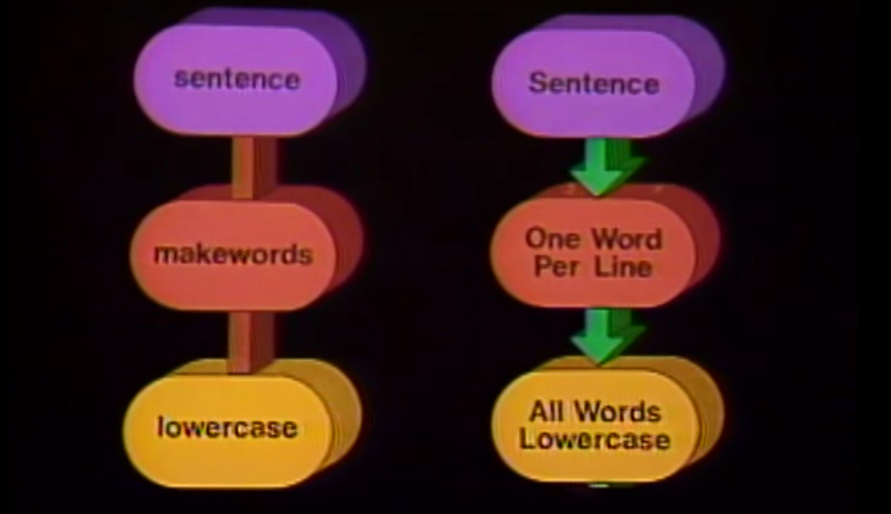

*******************************************************************
Overview of Unix's standard input/output, redirection, and the pipe
*******************************************************************

The Unix Pipe
=============

This 27-minute film from Bell Labs, titled `"The UNIX System: Making Computers More Productive" <https://www.youtube.com/watch?v=tc4ROCJYbm0>`_, is really worth watching if you enjoy 1980s-nostalgia. But here is a key excerpt about what made Unix significantly unique back then, explained by Bell Labs programmer Brian Kernighan (`starts at 4:58 <https://youtu.be/tc4ROCJYbm0?t=4m58s>`_):

What Kernighan said back in 1982 still applies today:

    What you can do is to think of these Unix system programs as...building blocks with which you can create things. And the thing that distinguishes Unix system from many other systems is the degree to which those building blocks can be glued together in a variety of different ways. Not just obvious ways but in many cases, very unobvious ways to get different jobs done. The system is very flexible in that respect.

When he talks about how Unix works -- as a framework that lets programs operate in *igornance* of each other -- that's how we should think of our own programs:

    I think the notion of pipelining is the fundamental contribution...You can take a bunch of programs and stick them together end-to-end so that the data simply flows from the one on the left to the one on the right. And the system itself looks after all of the connections, all of the synchronization, making sure that the data goes from the one [program] into the other.

    **The programs themselves don't know anything about the connection as far as they're concerned. They're just talking to the terminal.**

Examples of programs that use stdout
------------------------------------

The ``curl`` program will spit

Examples of programs that use stdin
-----------------------------------

Most modern command-line programs will take a filename as an **argument**

Examples of programs that don't use stdin/stdout
------------------------------------------------

