************************************
Regex and Find-and-Replace with Atom
************************************

This is meant to be a short tutorial on how to enable searching by regex in Atom. There's nothing hard about it, you only need to be aware of what checkbox to check. Here's the relevant screenshot:

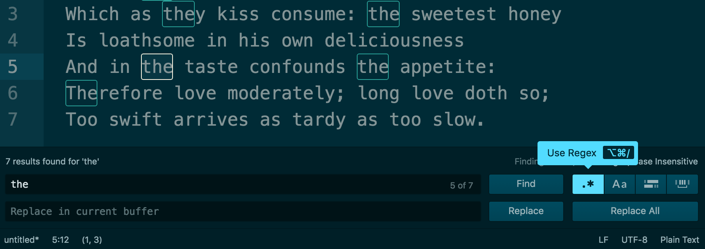

Keep reading if you need more details.

Find functionality
==================

Open the Atom Text Editor and paste the following text `from Romeo and Juliet, Act II, Scene VI`_

.. _from Romeo and Juliet, Act II, Scene VI: http://shakespeare-navigators.com/romeo/T26.html

.. code-block:: text

    FRIAR LAURENCE  These violent delights have violent ends
        And in their triumph die, like fire and powder,
        Which as they kiss consume: the sweetest honey
        Is loathsome in his own deliciousness
        And in the taste confounds the appetite:
        Therefore love moderately; long love doth so;
        Too swift arrives as tardy as too slow.

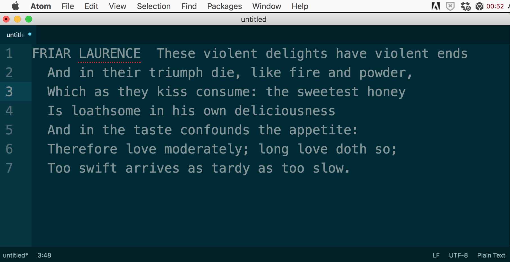

Find in Buffer (Command-F)
--------------------------

The keyboard shortcut is: :kbd:`Command-F`

The menu is :guilabel:`Find > Find in Buffer`

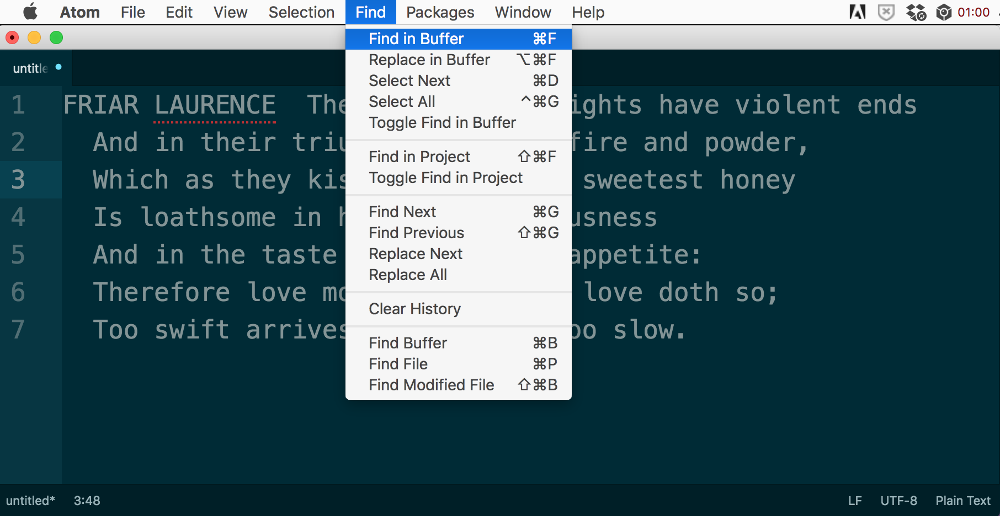

This opens a bottom panel:

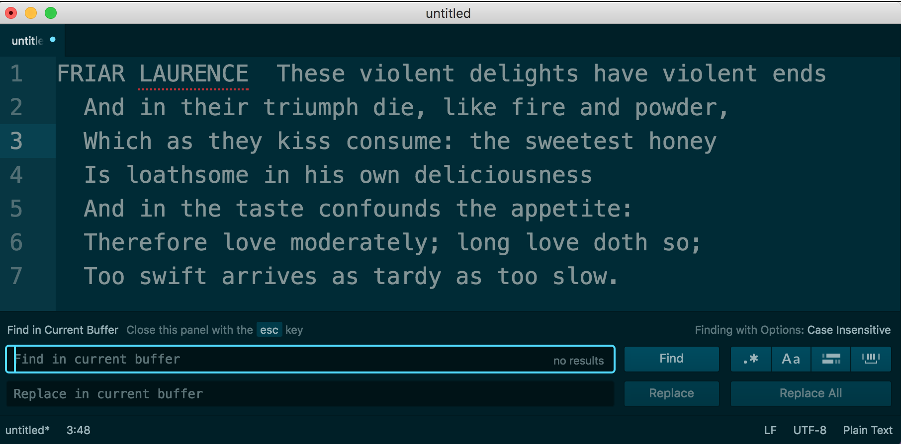

Type in a term to search for, such as ``the``:

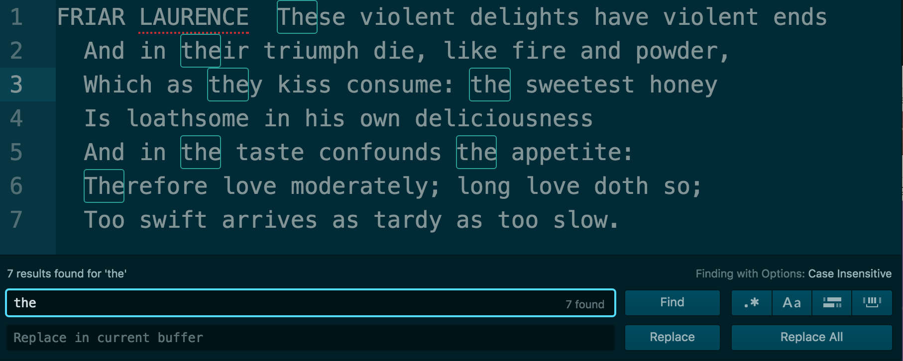

Enable regex mode
-----------------

The button looks like this: :guilabel:`.*` labeled :guilabel:`Use Regex`.

The keyboard shortcut is: :kbd:`Command-Alt-/` (only works if the :guilabel:`Find` panel is highlighted).

Notice the fine print in the top-right of the :guilabel:`Find` panel:

    :guilabel:`Finding with Options: Regex, Case Insensitive`

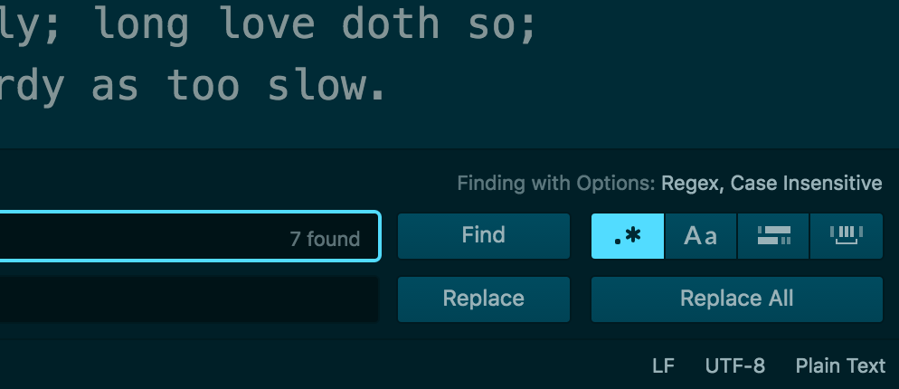

Now, let's use a proper regular expression -- instead of finding all instances of :regexp:`the`, including "**the**\ ir" and "**the**\ y", let's limit it to *just* "the".

:regexp:`the\\b`

That `\b`, i.e. *backslash-b* is a :doc:`word boundary </regular-expressions/anchors-boundaries>`.

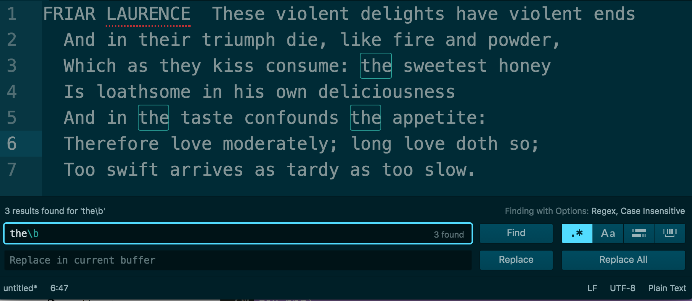

Replace in Buffer
=================

Now let's try replacing the patterns we've found. Here is the action item in the **Find** menu:

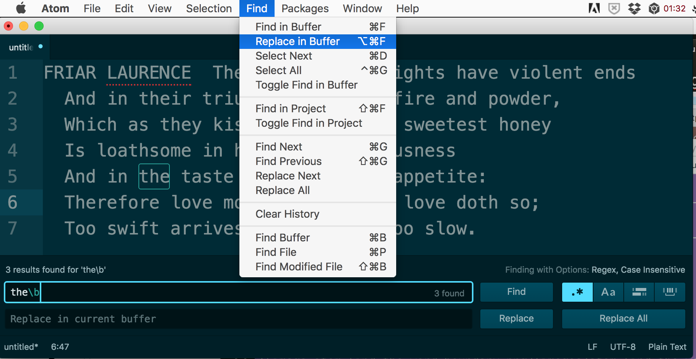

This is the keyboard  shorcut: :kbd:`Command-Alt-F`

But it seems the **Replace** field, i.e. :guilabel:`Replace in current buffer`, is already ready to go after opening up the Find buffer in the first place.

So you could just hit :kbd:`Command-F` and then :kbd:`Tab`. Or just click the **Replace** field.

Let's replace :regexp:`the\\b` with ``thy`` -- even though we found a regular expression, we can replace it with a literal pattern.

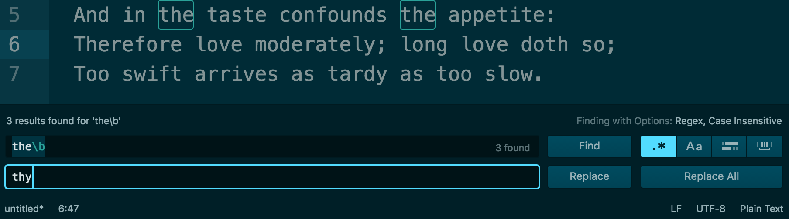

Capturing groups and Replace
----------------------------

Now we get to the fun part of regexes. I won't review the concept or syntax of a capturing group -- `regular-expressions.info is the clear expert on that <http://www.regular-expressions.info/tutorial.html>`_.

The relevant point for using regex+capturing groups in Atom is knowing how to refer to the captured group in the **Replace** field.

So let's use an example: the pattern below matches and captures a 2-character-word followed by a 3-character-word.

This is the pattern:

:regexp:`\\b(\\w{2}) (\\w{3})\\b`

Here is the result of the Find:

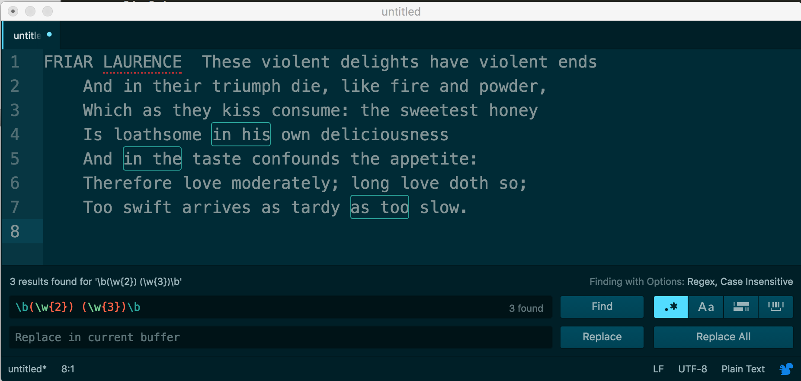

For the **Replace** action, let's just switch the two captured groups around. Here's the expression to use:

:regexp:`$2 $1`

The result:

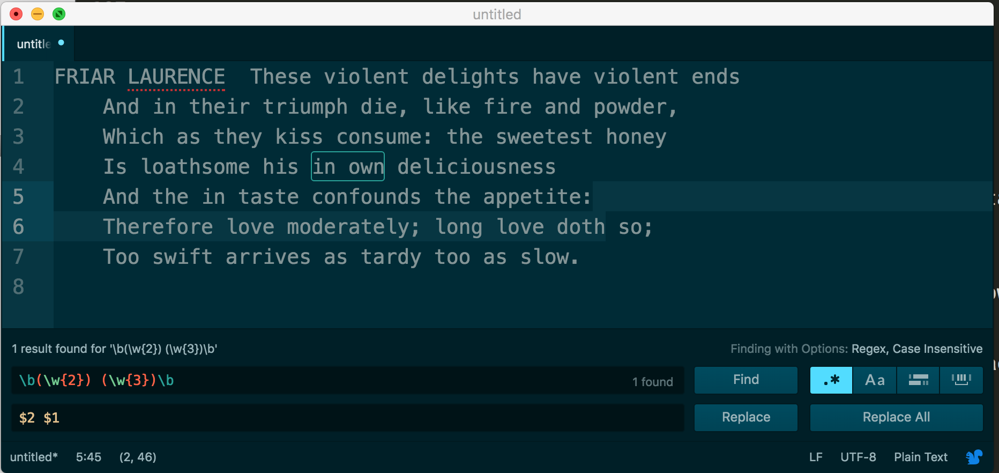

There's not much else specific to Atom and regular expressions. And I believe once the regex option has been enabled, it'll be enabled at startup. Now you just have to worry about`Atom's extremely slow performance <https://github.com/atom/find-and-replace/issues/145>`...

