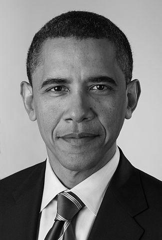
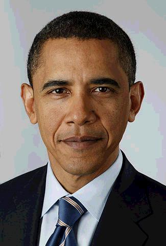
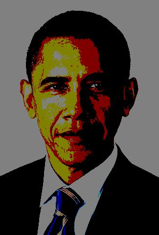
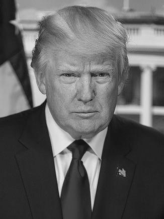
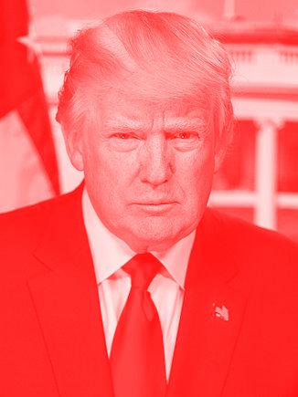

*****************************************
Pillow - Python Imaging Library (aka PIL)
*****************************************

Pillow is a popular Python library used for handling and transforming image files. It comes with the Anaconda distribution. Or you can install it manually via ``pip``:

.. code-block:: shell

    $ pip install Pillow

Official documentation
======================

The official documentation and handbook: http://pillow.readthedocs.io/en/latest/handbook/overview.html

Official tutorial: http://pillow.readthedocs.io/en/latest/handbook/tutorial.html

Overview of image data concepts: http://pillow.readthedocs.io/en/latest/handbook/concepts.html

Reference of Pillow's modules and classes: http://pillow.readthedocs.io/en/latest/handbook/concepts.html

The ``Image`` class, and its methods and attributes: http://pillow.readthedocs.io/en/latest/reference/Image.html#the-image-class

The ``ImageOps`` module: http://pillow.readthedocs.io/en/latest/reference/ImageOps.html

Github repo: https://github.com/python-pillow/Pillow

Useful recipes
==============

To test out these recipes on your own, you may find it convenient to download the following URLs and save them locally as ``trump.jpg`` and ``obama.jpg``:

.. code-block:: python

    import requests
    for pname in ['trump', 'obama']:
        url = 'http://stash.compciv.org/2017/{x}.jpg'.format(x=pname)
        dest = '{x}.jpg'.format(x=pname)
        resp = requests.get(url)
        with open(dest, 'wb') as f:
            f.write(resp.content)

The recipes below assume you have downloaded ``trump.jpg`` and ``obama.jpg`` into the working directory.

How to load an image file given a path to an existing image file
-----------------------------------------------------------------

Import the ``Image`` module from the ``PIL`` package. Then invoke its ``open()`` function and pass in a filename of an image file:

.. code-block:: python

    from PIL import Image
    fname = 'trump.jpg'
    img = Image.open(fname)

.. rubric:: More reading:

- `Tutorial - Using the Image Class <http://pillow.readthedocs.io/en/latest/handbook/tutorial.html#using-the-image-class>`_
- `Image module documentation <http://pillow.readthedocs.io/en/latest/reference/Image.html#image-module>`_
- `Image.open() function <http://pillow.readthedocs.io/en/latest/reference/Image.html#PIL.Image.open>`_

How to save an image to a file path
-----------------------------------

Use the ``save()`` method from the ``Image`` class:

.. code-block:: python

    from PIL import Image
    fname = 'trump.jpg'
    img = Image.open(fname)
    destname = 'trump-copy.jpg'
    img.save(destname)

.. rubric:: More reading

- ``Image.save()`` documentation: http://pillow.readthedocs.io/en/latest/reference/Image.html#PIL.Image.Image.save

How to get an image file's dimensions
-------------------------------------

Use the ``size`` attribute to get both the width and height as a tuple pair.

.. code-block:: python

    >>> from PIL import Image
    >>> trump_img = Image.open('trump.jpg')
    >>> trump_img.size
    (326, 435)
    >>> obama_img = Image.open('obama.jpg')
    >>> w, h = obama_img.size
    >>> w
    325
    >>> h
    480

Or you could individually get the ``width`` and ``height`` attributes:

.. code-block:: python

    >>> trump_img.width
    326
    >>> trum_img.height
    435

.. rubric:: More reading:

- Image attributes, including ``size``: http://pillow.readthedocs.io/en/latest/reference/Image.html#PIL.Image.size

How to resize an image to a specific width and height
-----------------------------------------------------

Use the ``resize()`` method, which takes a 2-tuple of integers representing width and height in pixels. The following snippet sets the ``obama_img`` image to a width of 200 pixels by 100 pixels high (i.e. a wide ratio).

.. code-block:: python

    from PIL import Image
    img = Image.open('obama.jpg')
    dim = (400, 200)
    newimg = img.resize(dim)
    # save the new image to a new filename
    newimg.save('obama-wide.jpg')

As you can see, resizing to an arbitrary ratio results in a skewed, stretched-out image:

How to scale an image to a specific aspect ratio
------------------------------------------------

Usually, we want to resize an image but keep its aspect ratio intact, i.e. its width relative to its height.

Scaling the old-fashioned way with grade-school math
^^^^^^^^^^^^^^^^^^^^^^^^^^^^^^^^^^^^^^^^^^^^^^^^^^^^

If all we know is the ``resize`` method, then we can fall always back `on grade-school arithmetic and solve a ratio equation using cross-multiplication <http://www.wikihow.com/Cross-Multiply>`_:

.. code-block:: python

    >>> from PIL import Image
    >>> img = Image.open('obama.jpg')
    >>> img.width
    325
    >>> img.height
    480
    >>> new_width = 200
    >>> new_height = int(img.height * (new_width / img.width))
    >>> new_height
    295
    >> newimg = img.resize((new_width, new_height))

Using the ``thumbnail()`` method to set a max width/height
^^^^^^^^^^^^^^^^^^^^^^^^^^^^^^^^^^^^^^^^^^^^^^^^^^^^^^^^^^

The ``Image`` object has a ``thumbnail()`` method that takes a 2-tuple as argument, for width and height. The new ``Image`` object will be resized so that the neither the width nor height is bigger than the biggest of the 2 given dimensions, while keeping the aspect ratio.

In other words, the following snippet will make sure that neither the width nor height of the ``newimg`` object will be greater than 100 pixels. Since the original ``img`` from ``obama.jpg`` is taller than it is wide, this means that the height of ``newimg`` will be capped to 100 pixels, with the height rescaled accordingly:

.. code-block:: python

    >>> from PIL import Image
    >>> img = Image.open('obama.jpg')
    >>> newsize = (100, 100)
    >>> img.thumbnail(newsize)
    >>> img.size
    (68, 100)

Note that the ``thumbnail()`` method, unlike ``resize()``, **mutates** its ``Image`` object, i.e. the ``img`` object itself is *modified*. If you still want to keep the data in the ``img`` object around, make a copy, *then* call ``thumbnail()`` on the copy:

.. code-block:: python

    img = Image.open('obama.jpg')
    thumb_img = img.copy()
    thumb_img.thumbnail((100, 100))

.. rubric:: More reading

- StackOverflow question, "How do I resize an image using PIL and maintain its aspect ratio?":  http://stackoverflow.com/questions/273946/how-do-i-resize-an-image-using-pil-and-maintain-its-aspect-ratio
- ``Image.thumbnail()`` http://pillow.readthedocs.io/en/latest/reference/Image.html#PIL.Image.Image.thumbnail
- ``Image.resize()`` http://pillow.readthedocs.io/en/latest/reference/Image.html#PIL.Image.Image.resize

Cropping an image
-----------------

The Image's ``crop()`` method takes as argument a 4-tuple for the left-most, upper-most, right-most, and lower-most pixel coordinate of an image, and it returns a new Image object cropped to those coordinates.

The following snippet crops the ``trump.jpg`` thumnbail 35 pixels in from the left, 60 pixels in from the top, 45 pixels in from the right, and 200 pixels from the bottom:

.. code-block:: python

    >>> from PIL import Image
    >>> img = Image.open('trump.jpg')
    >>> img.size
    (326, 435)
    >>> crop_specs = (35, 60, img.width - 45, img.height - 200)
    >>> crop_img = img.crop(crop_specs)
    >>> crop_img.size
    (246, 175)

As you can tell from the ratio, the image represented by ``crop_img`` is more landscape than portrait. Here's what it looks like when you save and then open it in an image browser:

Scaling and cropping an image to a specified aspect ratio
---------------------------------------------------------

Sometimes we want to shrink an image to scale, but also crop it to fit a desired aspect ratio. The most common case is for creating square thumbnails. To do this  using ``resize()`` and ``crop()`` in sequence, I'll leave to you as a "fun" exercise.

In the real-world, I recommend using PIL's ``ImageOps`` module, `which has a convenience function named ``fit()`` <http://pillow.readthedocs.io/en/latest/reference/ImageOps.html#PIL.ImageOps.fit>`_. The first argument is an ``Image`` object, the second is a 2-tuple specifying the width and height of the desired image. ``fit()`` then returns a new Image object scaled and cropped to those dimensions.

To get a 200x200 square thumbnail of ``trump.jpg``:

.. code-block:: python

    from PIL import Image, ImageOps
    img = Image.open('trump.jpg')
    fimg = ImageOps.fit(img, (200, 200))

Result when saved:

The ``fit()`` method also has an optional ``centering`` argument, in which a 2-tuple is passed specifying the ratio to crop from the left and from the top.

The following snippet would create a square 100x100 thumbnail in which 100% of the width-crop comes off the left side, and 0% of the height-crop comes from the top, i.e. 100% from the bottom.

The result is a thumbnail centered around the **top-right corner** of the original image:

.. code-block:: python

    from PIL import Image, ImageOps
    img = Image.open('trump.jpg')
    fimg = ImageOps.fit(img, (100, 100), centering=(1.0, 0.0))

The result:

To center the crop around the middle of the image, both in terms of width and height:

.. code-block:: python

    from PIL import Image, ImageOps
    img = Image.open('trump.jpg')
    fimg = ImageOps.fit(img, (100, 100), centering=(1.0, 0.0))

.. rubric:: More reading

- ImageOps.fit: http://pillow.readthedocs.io/en/latest/reference/ImageOps.html#PIL.ImageOps.fit

Transform the color of an image
-------------------------------

The Pillow library, specifically the ``ImageOps`` module, contains several convenience methods for quickly creating a copy of an image with a different color profile, such as going from color to grayscale, or to black and white, or to a "quantized", limited number of colors.

Convert an image to grayscale
^^^^^^^^^^^^^^^^^^^^^^^^^^^^^

Use the ``ImageOps.grayscale()`` function:

.. code-block:: python

    from PIL import Image
    from PIL.ImageOps import grayscale
    img = Image.open('obama.jpg')
    grayimg = grayscale(img)

The result:

Reduce the numbers of color per channel with posterization
^^^^^^^^^^^^^^^^^^^^^^^^^^^^^^^^^^^^^^^^^^^^^^^^^^^^^^^^^^

In an image that has a `color mode of RGB <https://en.wikipedia.org/wiki/RGB_color_model>`_ -- i.e. the color is created from a combination of red, green and blue -- we can create a *posterized* effect by reducing the number of bits per channel.

The sample ``trump.jpg`` and ``obama.jpg`` have **8-bits** per channel, that is, 256-shades of red, blue, and green.

Using the ``ImageOps.posterize()`` method, here's how to create a new image with just ``4-bits`` per channel. The method's first argument is an Image object; the second is the argument named ``bits``, which takes an integer from 0 to 8. Set ``bits`` to ``4`` to get 4 bits per channel:

.. code-block:: python
    :emphasize-lines: 4

    from PIL import Image
    from PIL.ImageOps import posterize
    img = Image.open('obama.jpg')
    pimg = posterize(img, bits=4)

The result:

To create an "8-bit-color" version of the portrait, i.e. a picture in which there are only 8 possible colors, which includes black and white and every combination of R, G, and B being either a 1 or a 0, we limit the ``bits`` argument to ``1``:

.. code-block:: python
    :emphasize-lines: 4

    from PIL import Image
    from PIL.ImageOps import posterize
    img = Image.open('obama.jpg')
    pimg = posterize(img, bits=1)

The result:

Creating a duotone image
^^^^^^^^^^^^^^^^^^^^^^^^

Think of a `duotone image <https://en.wikipedia.org/wiki/Duotone>`_ in which the colors are reduced to 2 specific colors, specifically, those 2 colors and their *halftones*.

For example, we could think of a *grayscale* image as being a duotone image of the two colors, black and white. Here is a grayscale version of ``trump.jpg``:

.. code-block:: python

    from PIL import Image
    from PIL.ImageOps import colorize, grayscale
    img = Image.open('trump.jpg')
    grayimg = grayscale(img)

The ``grayimg`` image object looks like:

To create a reddish version of that *grayscale* image, we can use the ``colorize`` method and map the black pixels to ``'red'``, and the white pixels to, well, just ``'white``':

.. code-block:: python

    from PIL import Image
    from PIL.ImageOps import colorize, grayscale
    img = Image.open('trump.jpg')
    grayimg = grayscale(img)
    redimg = colorize(grayimg, black='red', white='white')

The result:

.. rubric:: More reading

- ImageOps.posterize() http://pillow.readthedocs.io/en/latest/reference/ImageOps.html#PIL.ImageOps.posterize

