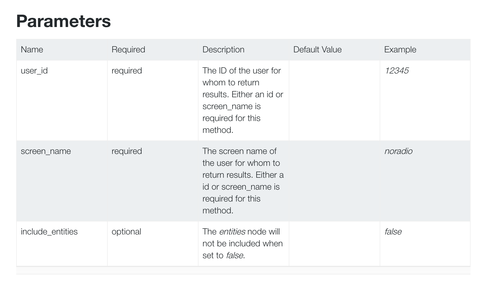
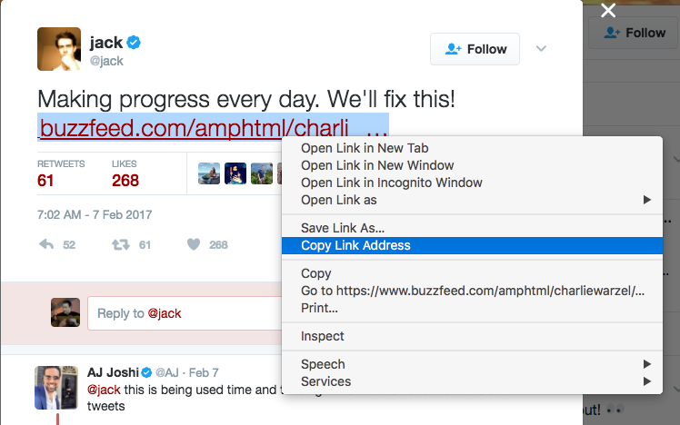

****************************************************
Exploring the basics of the Twitter API with Twython
****************************************************

This guide assumes you've completed the guide on authenticating a Twitter application through Twython:

:doc:`/guide/topics/python-nonstandard-libraries/twython-guide/twitter-twython-app-auth`

However, you may not only be new to Twython, but Twitter in general. So this is a guide walking you through the basics of accessing the Twitter API programmatically through Twython. But it is also an introduction to the concepts of Twitter, like what is a "tweet", why do users have numerical IDs *and* screen names, and what is the difference between a tweet, a retweet, a reply, etc?

More importantly, I show how Twitter data is represented as plain Python objects -- i.e. lists and dictionaries -- and how Twython's methods are inspired by Twitter's own API documentation and naming conventions.

For reference's sake:

- Twython's documentation: https://twython.readthedocs.io
- Twitter's REST API documentation: https://dev.twitter.com/rest/public
- @realDonaldTrump: https://twitter.com/realdonaldtrump

.. contents::

Getting started
===============

Whee

Instantiate an API client in Twython
------------------------------------

Again, this section assumes you've managed to get through the previous guide:

:doc:`/guide/topics/python-nonstandard-libraries/twython-guide/twitter-twython-app-auth`

If you've followed the app creation/authentication steps, then I'm assuming that you can instantiate a Twitter API client in Twython in an interactive Python shell, like this:

.. code-block:: python

    from twython import Twython
    import json

    CREDENTIALS_FILENAME = 'creds-twitter.json'
    jf = open(CREDENTIALS_FILENAME)
    creds = json.load(jf)
    jf.close()

    client = Twython(creds['consumer_key'],
                      creds['consumer_secret'],
                      creds['access_token'],
                      creds['access_token_secret'])

Of course, adjust the above snippet for your own situation, if you don't happen to have saved your user/app credentials in a text file named ``creds-twitter.json``, the contents of which look like:

.. code-block:: json

    {
       "screen_name": 'yoursecondaryaccount',
       "consumer_key": "abcYOURCONSUMERKEY",
       "consumer_secret": "abcYOURCONSUMERSECRET",
       "access_token": "abcYOURACCESSTOKEN",
       "access_token_secret": "abcYOURACCESSTOKENSECRET"
    }

Check Twitter with your web browser
-----------------------------------

As with everything that is programmatic, there is an "old-fashioned" way to do things. Open up a web browser and visit Twitter. At the very least, we can confirm that your Internet is working and that Twitter is operating normally.

While we're here, let's reflect why web pages exist: to display information in a (hopefully) universally attractive and accessible way. This means that no matter how dense the Twitter data objects get, we can always refer to the *view* created by Twitter's talented web designers to know what are the most *important* parts of the data. Those web designers aren't cheap.

Let's focus on an instance of a Twitter data object that, in the year 2017, is well known: the profile page and tweets of @realDonaldTrump.

The profile page is accessible at:

https://twitter.com/realDonaldTrump

It is also accessible at:

https://twitter.com/realdonaldtrump

That both URLs resolve to the same user gives us some insight to how Twitter tracks Twitter names -- specifically, that they are **case-insensitive**. But that is a relatively minor detail compared to how @realdonaldtrump's information is rendered for your web browser.

Here is a screenshot:

Keep your browser window open. The rest of this guide is an investigation to how Twitter "objectifies" -- aka **serializes** -- the real-world force-of-nature known to the world as **@realDonaldTrump**.

Twitter users and Twython's ``show_user`` method
================================================

Switch back to your interactive Python session, with a variable named ``client`` that points to a Twython object ready to access Twitter's API.

Let's start out by doing the Python/Twython version of viewing a user's profile. The Twython client object has a method named ``show_user``. This method, for all we care right now, has one required argument named ``screen_name``. You can guess what that refers to:

.. code-block:: python

    result = client.show_user(screen_name='realdonaldtrump')

The ``show_user`` method has 2 characteristics common to most of the Twython API client methods:

- Returns a dictionary
- Directly maps to a documented Twitter API endpoint

Twython API methods return dictionaries
---------------------------------------

Again, we want to know: how does Twitter [data-]objectify the real-world entity of @realDonaldTrump? Or, to put it another way, in what *form* does @realDonaldTrump exist as Twitter transmits it to the millions/billions of applications, i.e. web browsers and Twitter phone apps?

Like most modern APIs, the Twitter API uses the JSON format to serialize and transmit data. Twython API methods -- such as ``show_user`` -- contact the Twitter API, receive the data as JSON, and automatically, for our convenience, deserialize it as a Python dictionary.

So, in the previous snippet, the ``result`` variable points to a Python dict, which encapsulates all the information Twitter chooses to reveal about @realdonaldtrump.

It's a pretty big dictionary, because ``show_user`` returns not just data about the user, but data about the user's latest tweet.

Exploring the @realdonaldtrump Twitter user object
^^^^^^^^^^^^^^^^^^^^^^^^^^^^^^^^^^^^^^^^^^^^^^^^^^

The full ``result`` for @realdonaldtrump, as JSON, can be seen in the appendix: :ref:`twitter_users_show_realdonaldtrump`

Here are the key/values that are most prominently reflected in the web presentation of @realdonaldtrump's profile:

.. code-block:: json

      "description": "45th President of the United States of America",
      "friends_count": 43,
      "statuses_count": 34549,
      "created_at": "Wed Mar 18 13:46:38 +0000 2009",
      "screen_name": "realDonaldTrump",
      "listed_count": 65579,
      "name": "Donald J. Trump",
      "id": 25073877,
      "location": "Washington, DC",
      "profile_image_url_https": "https://pbs.twimg.com/profile_images/1980294624/DJT_Headshot_V2_normal.jpg",
      "favourites_count": 45,
      "followers_count": 25812629,
      "protected": false,
      "verified": true

And here are a few attributes that aren't shown or emphasized for the average Twitter web user, but are nonetheless relevant to application developers:

.. code-block:: json

      "id": 25073877,
      "notifications": false,
      "following": false,

The "id" is the account's unique identifier, as used by Twitter's internal data systems (see following section: :ref:`twitter_user_id_explained`). The ``false`` values for the fields ``"following"`` and ``"notifications"`` indicate that the user represented by the authenticating ``client`` is not following @realdonaldtrump nor has requested a notification from Twitter when @realdonaldtrump tweets.

Exploring @realdonaldtrump latest Tweet object
^^^^^^^^^^^^^^^^^^^^^^^^^^^^^^^^^^^^^^^^^^^^^^

The latest tweet by @realdonaldtrump is itself a dictionary object, accessed by the user object's ``"status"`` key.

Here is the direct URL to that status (i.e. tweet):

https://twitter.com/realDonaldTrump/status/836933725602656256

A screenshot:

Here is an excerpt of its most important key/value pairs:

.. code-block:: json

      "status": {
        "favorite_count": 156827,
        "favorited": false,
        "text": "THANK YOU!",
        "is_quote_status": false,
        "lang": "en",
        "source": "<a href=\"http://twitter.com/download/android\" rel=\"nofollow\">Twitter for Android</a>",
        "retweeted": false,
        "created_at": "Wed Mar 01 13:38:44 +0000 2017",
        "truncated": false,
        "retweet_count": 24172,
        "in_reply_to_screen_name": null,
        "in_reply_to_status_id": null,
        "id": 836933725602656256,
        "in_reply_to_user_id": null,
        "geo": null
      },

Again, some of the fields are confusing without knowing the context of how we're accessing the API on behalf of the authenticated user. Though this tweet has been *retweeted* more than 24,000 times, the ``'retweeted'`` value is ``false``, because the user represented by ``client`` has not yet retweeted (or ``favorited``) this tweet.

To reiterate the concept of data-as-Python-dict, step through the data object using Python expressions:

.. code-block:: python

    >>> result['name']
    'Donald J. Trump'
    >>> result['screen_name']
    'realDonaldTrump'
    >>> result['description']
    '45th President of the United States of America'
    >>> result['created_at']
    'Wed Mar 18 13:46:38 +0000 2009'
    >>> result['status']['text']
    'THANK YOU!'
    >>> result['status']['created_at']
    'Wed Mar 01 13:38:44 +0000 2017'

And might as well try some calculations. What is the ratio of favorites on that tweet versus retweets?

.. code-block:: python

    >>> tweet = result['status']
    >>> tweet['favorite_count'] / tweet['retweet_count']
    6.48796127751117

How many tweets per day, on average, has @realdonaldtrump tweeted since its inception? The ``'created_at'`` field is a human-readable datetime **string** -- ``'Wed Mar 18 13:46:38 +0000 2009'`` -- so we need to convert it to a datetime object before doing the arithmetic:

.. code-block:: python

     >>> from datetime import datetime
     >>> from dateutil import parser
     >>> xtime = parser.parse(result['created_at']).timestamp()
     >>> tsecs = datetime.now().timestamp() - xtime
     >>> tdays = tsecs / (60 * 60 * 24)
     >>> result['statuses_count'] / tdays
     11.889841748974751

Twython API methods map to documented Twitter API endpoints
-----------------------------------------------------------

The Twython library is meant to be a convenience. Rather than having to know exactly the name of the Twitter API endpoint that gets us user profile information, and then accessing that endpoint (e.g. using the **Requests** library) we just have to know about Twython's ``show_user`` method, which executes the HTTP requests, receives the data as raw text, and deserializes it for us.

The Twython authors have decided to make their methods follow very closely to the actual names and conventions of Twitter's documented API endpoints.

In the case of ``show_user``, the corresponding Twitter endpoint is known as ``users/show``.

Its documentation is at:

https://dev.twitter.com/docs/api/1.1/get/users/show

For each Twython method in Twython's source code, the authors conveniently list the corresponding Twitter API URL.

Twython's documentation for the ``show_user`` method can be viewed in your web browser at this URL:

https://twython.readthedocs.io/en/latest/api.html#twython.Twython.show_user

But if you're trying Twython out in **ipython** (which you *should* be), add a **question mark** after a method name to quickly see this info:

.. code-block:: python

    ::emphasize-lines: 1,4

    >>> client.show_user?
    Signature: client.show_user(**params)
    Docstring:
    Returns a variety of information about the user specified by the
    required user_id or screen_name parameter.

    Docs: https://dev.twitter.com/docs/api/1.1/get/users/show
    File:      ~/.pyenv/versions/anaconda3-4.1.1/lib/python3.5/site-packages/twython/endpoints.py
    Type:      method

When I say that the **arguments** of a Twython method map to the **parameters** of API endpoint, I mean that the Twython methods have been designed to use arguments named like the parameters as defined by Twitter.

For the ``users/show`` endpoint, look at the **Parameters** section:

https://dev.twitter.com/rest/reference/get/users/show#parameters

There are 3 documented parameters: ``screen_name``, which we just used, and ``user_id`` and ``show_entities``.

.. _twitter_user_id_explained:

What is the difference between a user's ID and screen name?
^^^^^^^^^^^^^^^^^^^^^^^^^^^^^^^^^^^^^^^^^^^^^^^^^^^^^^^^^^^

Like most modern data systems, such as the Social Security Administration or 4chan, data objects in Twitter are tracked internally with unique numbers, independent of their real-world human-readable identifiers (i.e. your "name").

Each Twitter account is assigned a unique integer that never changes no matter how often a Twitter user changes their **screen name**, so that an account's history can be consistently tracked no matter how it changes its human-readable name .

For example, part of the presidential transition from Obama to Trump involved creating new social media accounts for the Trump administration. Before January 20, 2017, the Twitter account known as **@whitehouse** was renamed to **@obamawhitehouse**. And a new account, with an empty Twitter history (but an auto-following of the Obama @whitehouse 13+ million followers) was created and given the screen name of **@whitehouse**.

Additional reading from Recode: `Donald Trump is getting a second Twitter account and 13 million new followers Friday <http://www.recode.net/2017/1/18/14314312/donald-trump-president-tweeting-potus-twitter-obama>`_

Don't take my word for it, use Twython and ``show_user`` to confirm it for yourself:

.. code-block:: python

    >>> w44 = client.show_user(screen_name='obamawhitehouse')
    >>> w45 = client.show_user(screen_name='whitehouse')
    >>> w44['created_at']
    'Fri Apr 10 21:10:30 +0000 2009'
    >>> w45['created_at']
    'Thu Jan 19 22:54:27 +0000 2017'

Remember when we retrieved the data for the @realdonaldtrump user? That data object contains the user ID for @realdonaldtrump:

.. code-block:: python

    >>> u = client.show_user(screen_name='realdonaldtrump')
    >>> u['id']
    25073877

The easiest test of the ``user_id`` parameter for the ``show_user`` method is to see if we can get the @realdonaldtrump data object by referring to its ID: ``25073877``

.. code-block:: python

    >>> v = client.show_user(user_id=25073877)
    >>> v['screen_name']
    'realDonaldTrump'

OK, that was boring. Let's try an arbitrary user ID:

.. code-block:: python

    >>> x = client.show_user(user_id=1000)
    >>> x['screen_name']
    'curiousjordy'
    >>> x['created_at']
    'Sat Jul 15 08:41:38 +0000 2006'

Wow, user ID of ``1000`` was created substantially earlier than @realdonaldtrump, i.e. user ``25073877``. It seems logical that ID ``1`` corresponds to Twitter's first user...

.. code-block:: python

    >>> client.show_user(user_id=1)
    TwythonError: Twitter API returned a 404 (Not Found), User not found.

A TwythonError -- get used to seeing these. We'll see them when Twitter is down. When we've surpassed or API access rate limits. Or when we ask for nonsensical or non-existent values.

I'm going to hand-wave past the very complex concept of `"error handling" <https://docs.python.org/3/tutorial/errors.html>`_ for now (i.e. not by the end of the typical quarter in "learning how to program for the first time")

But for those of you familiar with the concept, if we wanted to find the smallest Twitter user ID that belongs to a retrievable Twitter user, here's one approach using error handling:

.. code-block:: python

    from twython import TwythonError
    xcount = 0

    while True: # don't stop till we get a valid user!
      try:
        xcount += 1
        user = client.show_user(user_id=xcount)
      except TwythonError:
        print("No user for ID of:", xcount)
        continue
      else:
        # successful query
        tmptxt = "User ID of {id} belongs to user named {sname}"
        print(tmptxt.format(id=user['id'], sname=user['screen_name']))
        # must get out of the infinite while loop
        break

The result of that routine:

.. code-block:: text

    No user for ID of: 1
    No user for ID of: 2
    No user for ID of: 3
    No user for ID of: 4
    No user for ID of: 5
    No user for ID of: 6
    No user for ID of: 7
    No user for ID of: 8
    No user for ID of: 9
    No user for ID of: 10
    No user for ID of: 11
    User ID of 12 belongs to user named jack

Who is @jack? The co-founder and a CEO of Twitter:

https://en.wikipedia.org/wiki/Jack_Dorsey

https://twitter.com/jack

A screenshot of his profile:

.. image:: images/twitter-jack-profile.jpg

Exploring tweets with Twython's show_status method
==================================================

Let's now explore the data behind each Tweet object.

The Twython client object has a method named ``show_status``. Invoking the help-operator in the interactive Python shell reveals the basics of the method:

.. code-block:: python

    >>> client.show_status?
    Signature: client.show_status(**params)
    Docstring:
    Returns a single Tweet, specified by the id parameter

    Docs: https://dev.twitter.com/docs/api/1.1/get/statuses/show/%3Aid
    File:      ~/.pyenv/versions/anaconda3-4.1.1/lib/python3.5/site-packages/twython/endpoints.py
    Type:      method

We see that the URL for the corresponding Twitter API endpoint is:

https://dev.twitter.com/docs/api/1.1/get/statuses/show/%3Aid

You can read the docs yourself, the main takeaway is that the API endpoint of ``statuses/show`` -- and, by extension, the ``show_status`` method -- has one required argument: the ID of the tweet to be retrieved.

Tweets, like Twitter users, have numbers for their unique identifiers. Instead of trying to guess a Twitter ID out of thin air, just visit a Twitter profile, click on one of the Tweets, and get the ID from the URL.

For example, here is a tweet from @jack:

https://twitter.com/jack/status/828982363610755073

The tweet's ID is, well, the only number in that URL: ``828982363610755073``

Here is a screenshot of that Tweet on Twitter's website:

Note that the Twitter's website is itself an application. One of its features is to seamlessly integrate the replies to a tweet on the tweet's "homepage". But that doesn't mean the reply data is part of the tweet data object, which we can see for ourselves:

.. code-block:: python

    tweet = client.show_status(id=828982363610755073)

The full Tweet object, as JSON, can be seen in the appendix below:

:ref:`twitter_statuses_show_single_tweet`

You might notice that the tweet dictionary has a ``'user'`` key, which points a nested dictionary representing the Twitter user. This is handy when fetching a bunch of tweets without knowing anything about their respective authors. You might guess that this is a common usecase by the fact that the ``show_status`` method requires only an ID of a tweet, and nothing about a user. Or, in more practical terms, each tweet has a unique ID that is unique across every tweet in existence -- thus, a given tweet ID refers to one and only one tweet. And, since each tweet has exactly one and only one author -- there is no need to know the Twitter user when you have the tweet's unique ID.

Tweeted URLs vs. shortened URLs
-------------------------------

If you look at the screenshot of @jack's tweet, you'll notice that the text is rendered as:

    Making progress every day. We'll fix this! https://www.buzzfeed.com/amphtml/charlie …

But what we see is not what we get -- clicking that link will take you to the fully-resolved URL:

    https://www.buzzfeed.com/amphtml/charliewarzel/twitter-tackles-trolls-with-three-new-anti-harassment-featur

But try **right-clicking** the link in your browser, and selecting the **"Copy link address"** action:

Check your clipboard to see the copied value. It is the URL:

https://t.co/wRiFAsjmbN

Long story short, everytime you include a URL in a tweet, Twitter automatically passes it through its URL shortening service. Back in the old days, URL shorteners were used so that really long URLs wouldn't completely eat up Twitter's 140-character-per-Tweet limit. That is, users would have to visit a site like https://bit.ly, paste in a long URL, copy the shortened URL, and include use that in their tweet. The URL shortening service -- in this case, bit.ly -- does the work of translating the short URL to its intended destination.

Twitter's ``t.co`` service was created to cut out the middleman. And also, for Twitter to have more analytics. Everytime someone clicks on a ``t.co`` link, Twitter is able to count the total times that short link has been clicked, and information about each individual "click".

In terms of programmatic access, reading the tweet object's ``text`` value will only get you the shortened version of a URL:

.. code-block:: python

    >>> tweet = client.show_status(id=828982363610755073)
    >>> tweet['text']
    "Making progress every day. We'll fix this! https://t.co/wRiFAsjmbN"

Thus, if you want to do an analysis of what sites a Twitter user tweets -- like the analysis done by BuzzFeed on `Here’s Where Donald Trump Gets His News <https://www.buzzfeed.com/charliewarzel/trumps-information-universe>`_ -- you'll have to do one of two things:

1. Access the ``"entities"`` data of a tweet

  The tweet object has several nested dictionaries; ``"entities"`` is where metadata for the tweeted URLs is stored:

  .. code-block:: json

    "entities": {
          "symbols": [],
          "urls": [
            {
              "expanded_url": "https://www.buzzfeed.com/amphtml/charliewarzel/twitter-tackles-trolls-with-three-new-anti-harassment-featur",
              "display_url": "buzzfeed.com/amphtml/charli\u2026",
              "url": "https://t.co/wRiFAsjmbN",
              "indices": [
                43,
                66
              ]
            }
          ],
          "hashtags": [],
          "user_mentions": []
        },

  For any given tweet, here's how to print the expanded URLs (if any) of each URL, as far as Twitter is concerned:

  .. code-block:: python

      for url in tweet['entities']['urls']:
          print(url['expanded_url'])

2. Expand the URL using good-old fashioned HTTP principles

In Twitter's older data, however, there aren't "expanded" tweets. Or, even today, people will tweet a shortened-link, and Twitter will still apply its own ``t.co`` shortening. For example, take a look at this Trump tweet:

https://twitter.com/realDonaldTrump/status/829451566000242688

Trump tweeted a pre-shortened link, which Twitter shortened to:

https://t.co/6LmsR5JOSW

The "expanded" version of that Tweet is what Trump originally tweeted:

  ``http://bit.ly/2k4b0imEmersonPoll``

  .. code-block:: python

    >>> xt = client.show_status(id=829451566000242688)
    >>> xt['entities']['urls'][0]

    {'display_url': 'bit.ly/2k4b0imEmerson…',
     'expanded_url': 'http://bit.ly/2k4b0imEmersonPoll',
     'indices': [61, 84],
     'url': 'https://t.co/6LmsR5JOSW'}

What we really want is what ``http://bit.ly/2k4b0imEmersonPoll`` redirects to:

http://thehill.com/homenews/media/318514-trump-admin-seen-as-more-truthful-than-news-media-poll

Handling URL redirects is all part of the plain, HTTP spec. Which means we can use a general web-requesting library, like Requests, to get the final URL:

http://docs.python-requests.org/en/master/user/quickstart/#redirection-and-history

.. code-block:: python

    >>> import requests
    >>> resp = requests.get('http://bit.ly/2k4b0imEmersonPoll')
    >>> resp.url
    'http://thehill.com/homenews/media/318514-trump-admin-seen-as-more-truthful-than-news-media-poll'

I highly recommend reading that BuzzFeed story -- `Here’s Where Donald Trump Gets His News <https://www.buzzfeed.com/charliewarzel/trumps-information-universe>`_ -- it's an interesting example of what you can do when mining Twitter for data is not just an end to itself, but as a proxy into more data sources and a bigger story.

.. _twython_tweet_that_is_a_reply:

A tweet that is a reply
-----------------------

How does Twitter serialize the tweets that are attached as "replies"?

Only one way to find out. Find a tweet that has been replied to, and get that reply-tweet's ID. Let's refer to another tweet by @jack at the following URL:

https://twitter.com/jack/status/836959185220710402

Screenshot of that tweet, which includes the rendering of its most direct/prominent reply:

You might have noticed that this tweet by @jack is itself a reply to a previous tweet by @jack. What's that about? It's a common convention for Twitter users to reply to their own tweets when they have a stream-of-consciousness/rant that requires more than 140 characters. Because the Twitter web (and phone) client stiches the original tweet and replies into a single page, it's a good workaround for Twitter's individual tweet limit.

But let's look at the first shown reply by a non-@jack user -- the tweet-reply by @HilzFuld has this direct URL:

https://twitter.com/HilzFuld/status/836964090245447680

Let's get @HilzFuld's reply as a data object in Twython:

.. code-block:: python

    replytweet = client.show_status(id=836964090245447680)

I've included the full object as JSON in the appendix below:

:doc:`twitter_hilzfuld_reply_to_jack_tweet`

For our purposes, it's worth noting that the reply-related fields have values instead of ``null``:

.. code-block:: python

    >>> replytweet['in_reply_to_screen_name']
    'jack'
    >>> replytweet['in_reply_to_status_id']
    836959185220710402
    >>> replytweet['in_reply_to_user_id']
    12

Worth noting when trying to figure out how to send a reply tweet via Twython.

Batch work
==========

(to be expanded upon later)

For the most part, you won't want to be fetching tweets or users one at a time.

For fetching a list of tweets -- 20 by default, and up to 200 at a time -- tweeted by a single user, i.e. the "user timeline", use the ``get_user_timeline`` method, which corresponds to the API endpoint of ``statuses/user_timeline``, which is documented here:

https://dev.twitter.com/docs/api/1.1/get/statuses/user_timeline

For fetching a list of tweets *seen* by the authenticated user, i.e. what you would see when logged in and visiting https://twitter.com, use the ``get_home_timeline`` method, which corresponds to the endpoint of ``statuses/home_timeline``, documented at:

https://dev.twitter.com/docs/api/1.1/get/statuses/home_timeline

If you have a list of tweet IDs, you can get their corresponding data objects in batches of 100 at a time using the ``lookup_status`` method, which refers to the ``statuses/lookup`` endpoint, documented here:

https://dev.twitter.com/docs/api/1.1/get/statuses/lookup

To get a list of up to 5,000 IDs for a user's followers, use the ``get_followers_ids``, which maps to the ``followers/ids`` endpoint, documented here:

https://dev.twitter.com/docs/api/1.1/get/followers/ids

To fetch the data objects for 100 user IDs at a time, use the ``lookup_user`` method, which maps to ``users/lookup``, documented here:

https://dev.twitter.com/rest/reference/get/users/lookup

(section to be expanded on later)

IDs, objects, and resource and rate limits
==========================================

If you have 5,000 or so followers, and you want to find my followers with the most "influence", you'd want to use the ``get_followers_ids`` method:

.. code-block:: python

    result = client.get_followers_ids(screen_name='jack', count=5000)

Because ``get_followers_ids`` is a method that, at a 5000 count limit, won't get all of the data all of the time for every user, it is designed to be run in batches. The most immediate upshot is that ``result`` is **not** a list, but a dictionary:

.. code-block:: python

    >>> result.keys()
    >>> dict_keys(['previous_cursor', 'previous_cursor_str', 'next_cursor_str', 'ids', 'next_cursor'])

Ignoring the concept of "cursor", we see that the ``"ids"`` key points to a list of numbers, presumably user ids. But a list of integers doesn't tell us what we want to know -- **who** each user is, and the attributes, e.g. ``"followers_count"``, for sorting that list of users.

We can "hydrate" those numbers, i.e. transform those IDs into Python dictionaries, by calling another Twython method/Twitter API endpoint: ``lookup_user``, which has a limit of 100 users at a time:

(this is not the most Pythonic way, but whatever)

.. code-block:: python

    result = client.get_followers_ids(screen_name='jack', count=5000)
    fids = result['ids']
    followers = []

    for a in range(0, 5000, 100):
        b = a + 100
        print("On batch:", a, ' to ', b)
        fdata = client.get_followers_ids(user_id=fids[a:b])
        followers.extend(fdata)

If you run the above loop, you'll probably get this:

.. code-block:: python

    On batch: 0  to  100
    On batch: 100  to  200
    On batch: 200  to  300
    On batch: 300  to  400
    On batch: 400  to  500
    On batch: 500  to  600
    On batch: 600  to  700
    On batch: 700  to  800
    On batch: 800  to  900
    On batch: 900  to  1000
    On batch: 1000  to  1100
    On batch: 1100  to  1200
    On batch: 1200  to  1300
    ...
    TwythonRateLimitError: Twitter API returned a 429 (Too Many Requests), Rate limit exceeded

What's a rate limit?

Here's Twitter's documentation:

https://dev.twitter.com/rest/public/rate-limiting

And here's Twython's documentation:

https://twython.readthedocs.io/en/latest/usage/advanced_usage.html#access-headers-of-previous-call

Which basically tells you to do this to figure out how long you can wait before you hammer the Twitter API again.

.. code-block:: python

    client.get_lastfunction_header('x-rate-limit-remaining')
    client.get_lastfunction_header('x-rate-limit-reset')

Welcome to the real world of limited resources!

(section to be expanded on later)

Cursors
-------

(for advanced users)

Twitter limits the maximum number of tweets you can get from a user timeline in a single request: 200. However, it allows you to go back to the past 3,200 tweets. This requires understanding the concept of a Twitter "cursor", or pagination:

https://twython.readthedocs.io/en/latest/usage/advanced_usage.html#search-generator

https://twython.readthedocs.io/en/latest/usage/special_functions.html#cursor

Sending tweets with Twython
===========================

Wouldn't be a complete Twitter guide if we didn't send out a few tweets.

Sending a tweet uses the ``update_status`` method in Twython, which corresponds to the ``statuses/update`` endpoint, documented here:

https://dev.twitter.com/rest/reference/post/statuses/update

.. code-block:: python

    client.update_status(status='hello world from twython')

Like most of Twython's methods, a dictionary is returned; in this case, the dictionary representing the Tweet object.

Replying to a tweet
-------------------

Tweets that are meant to be a **reply** to another tweet are serialized and rendered differently than plain tweets, as we saw in a previous section: :ref:`twython_tweet_that_is_a_reply`.

Sending a tweet meant as a reply uses the ``update_status`` endpoint, but requires the filling out an additional argument, and adding something to the ``status`` argument.

- We must provide the ``in_reply_to_status_id`` argument, which is the ``id`` number of the tweet to which we're replying.
- The ``status`` argument, which is the content of our reply, must include the screen name of the user to whom we are replying.

Given this tweet: https://twitter.com/realDonaldTrump/status/836933725602656256

Our ``update_status`` call looks like this:

.. code-block:: python

    client.update_status(status="You are SOOOO welcome @realdonaldtrump!",
                         in_reply_to_status_id=836933725602656256)

What happens when you don't follow Twitter's requirements for a "reply"? According to the ``statuses/update`` documentation, the ``in_reply_to_status_id`` parameter is "ignored unless the author of the Tweet this parameter references is mentioned within the status text."

Test it out for yourself: you'll see that the tweet will be posted, but it will not be considered as a **reply** to any tweet:

.. code-block:: python

        client.update_status(status="okey dokey annie oakley",
                         in_reply_to_status_id=836933725602656256)

        client.update_status(status="<3 u @realdonaldtrump",
                             in_reply_to_status_id=1)

Making a reply function
^^^^^^^^^^^^^^^^^^^^^^^

Twython's a nice wrapper, but nothing wrong with making a wrapper for the wrapper.

In the previous section, we saw that doing a proper Tweet reply requires a number of cumbersome steps:

- Get the ID of the tweet we're replying to.
- Get the username of that tweet's author
- Add those values to the ``update_status`` call.

Repeating those steps everytime we want to shoot off a quick reply is madness, so let's create the Twython version of what happens when we normally press the **Reply** button in the Twitter web/phone app:

(admittedly, this is an example of where object-oriented design would help...)

.. code-block:: python

    def reply_to_tweet(client, tweet, reply_text="OK"):
        tweet_id = tweet['id']
        author_name = tweet['user']['screen_name']
        reply = "Hey @{}: {}".format(author_name, reply_text)
        r = client.update_status(status=reply, in_reply_to_status_id=tweet_id)
        return r

    sometweet = client.show_status(id=836794907855552518)

    reply_to_tweet(client, sometweet, 'Loved that! MOAR plz')

(ugh that's ugly code!)

Appendix
========

.. _twitter_users_show_realdonaldtrump:

Full JSON result for users/show, @realdonaldtrump
-------------------------------------------------

.. code-block:: json

    {
      "id_str": "25073877",
      "profile_background_image_url": "http://pbs.twimg.com/profile_background_images/530021613/trump_scotland__43_of_70_cc.jpg",
      "profile_text_color": "333333",
      "description": "45th President of the United States of America",
      "utc_offset": -18000,
      "is_translator": false,
      "friends_count": 43,
      "url": null,
      "profile_sidebar_fill_color": "C5CEC0",
      "translator_type": "regular",
      "statuses_count": 34549,
      "created_at": "Wed Mar 18 13:46:38 +0000 2009",
      "has_extended_profile": false,
      "profile_background_image_url_https": "https://pbs.twimg.com/profile_background_images/530021613/trump_scotland__43_of_70_cc.jpg",
      "screen_name": "realDonaldTrump",
      "contributors_enabled": false,
      "status": {
        "id_str": "836933725602656256",
        "place": null,
        "favorite_count": 156827,
        "coordinates": null,
        "entities": {
          "symbols": [],
          "urls": [],
          "hashtags": [],
          "user_mentions": []
        },
        "in_reply_to_user_id_str": null,
        "favorited": false,
        "text": "THANK YOU!",
        "contributors": null,
        "is_quote_status": false,
        "lang": "en",
        "source": "<a href=\"http://twitter.com/download/android\" rel=\"nofollow\">Twitter for Android</a>",
        "retweeted": false,
        "created_at": "Wed Mar 01 13:38:44 +0000 2017",
        "truncated": false,
        "in_reply_to_status_id_str": null,
        "retweet_count": 24172,
        "in_reply_to_screen_name": null,
        "in_reply_to_status_id": null,
        "id": 836933725602656256,
        "in_reply_to_user_id": null,
        "geo": null
      },
      "follow_request_sent": false,
      "profile_background_color": "6D5C18",
      "default_profile": false,
      "profile_location": null,
      "following": false,
      "listed_count": 65579,
      "name": "Donald J. Trump",
      "id": 25073877,
      "entities": {
        "description": {
          "urls": []
        }
      },
      "location": "Washington, DC",
      "profile_image_url_https": "https://pbs.twimg.com/profile_images/1980294624/DJT_Headshot_V2_normal.jpg",
      "is_translation_enabled": true,
      "notifications": false,
      "lang": "en",
      "profile_use_background_image": true,
      "geo_enabled": true,
      "favourites_count": 45,
      "profile_sidebar_border_color": "BDDCAD",
      "followers_count": 25812629,
      "time_zone": "Eastern Time (US & Canada)",
      "profile_image_url": "http://pbs.twimg.com/profile_images/1980294624/DJT_Headshot_V2_normal.jpg",
      "profile_banner_url": "https://pbs.twimg.com/profile_banners/25073877/1485301108",
      "profile_background_tile": true,
      "protected": false,
      "profile_link_color": "0D5B73",
      "default_profile_image": false,
      "verified": true
    }

.. _twitter_statuses_show_single_tweet:

Full JSON result for show/statuses/828982363610755073
-----------------------------------------------------

.. code-block:: json

    {
      "id_str": "828982363610755073",
      "place": null,
      "favorite_count": 268,
      "user": {
        "following": true,
        "statuses_count": 21453,
        "id_str": "12",
        "listed_count": 27171,
        "name": "jack",
        "default_profile_image": false,
        "is_translator": false,
        "profile_background_color": "EBEBEB",
        "entities": {
          "description": {
            "urls": []
          }
        },
        "translator_type": "regular",
        "description": "",
        "utc_offset": -28800,
        "profile_image_url_https": "https://pbs.twimg.com/profile_images/768529565966667776/WScYY_cq_normal.jpg",
        "protected": false,
        "is_translation_enabled": false,
        "friends_count": 2538,
        "notifications": false,
        "lang": "en",
        "url": null,
        "profile_sidebar_fill_color": "F3F3F3",
        "profile_use_background_image": true,
        "geo_enabled": true,
        "favourites_count": 16257,
        "location": "California, USA",
        "created_at": "Tue Mar 21 20:50:14 +0000 2006",
        "profile_sidebar_border_color": "DFDFDF",
        "has_extended_profile": true,
        "followers_count": 3986061,
        "profile_background_image_url_https": "https://abs.twimg.com/images/themes/theme7/bg.gif",
        "screen_name": "jack",
        "time_zone": "Pacific Time (US & Canada)",
        "contributors_enabled": false,
        "profile_image_url": "http://pbs.twimg.com/profile_images/768529565966667776/WScYY_cq_normal.jpg",
        "profile_banner_url": "https://pbs.twimg.com/profile_banners/12/1483046077",
        "profile_background_tile": false,
        "follow_request_sent": false,
        "id": 12,
        "profile_link_color": "990000",
        "profile_background_image_url": "http://abs.twimg.com/images/themes/theme7/bg.gif",
        "profile_text_color": "333333",
        "default_profile": false,
        "verified": true
      },
      "coordinates": null,
      "entities": {
        "symbols": [],
        "urls": [
          {
            "expanded_url": "https://www.buzzfeed.com/amphtml/charliewarzel/twitter-tackles-trolls-with-three-new-anti-harassment-featur",
            "display_url": "buzzfeed.com/amphtml/charli\u2026",
            "url": "https://t.co/wRiFAsjmbN",
            "indices": [
              43,
              66
            ]
          }
        ],
        "hashtags": [],
        "user_mentions": []
      },
      "in_reply_to_user_id_str": null,
      "favorited": false,
      "text": "Making progress every day. We'll fix this! https://t.co/wRiFAsjmbN",
      "contributors": null,
      "is_quote_status": false,
      "lang": "en",
      "source": "<a href=\"http://twitter.com/download/iphone\" rel=\"nofollow\">Twitter for iPhone</a>",
      "retweeted": false,
      "possibly_sensitive": false,
      "created_at": "Tue Feb 07 15:02:51 +0000 2017",
      "truncated": false,
      "in_reply_to_status_id_str": null,
      "retweet_count": 61,
      "in_reply_to_screen_name": null,
      "possibly_sensitive_appealable": false,
      "in_reply_to_status_id": null,
      "id": 828982363610755073,
      "in_reply_to_user_id": null,
      "geo": null
    }

.. _twitter_hilzfuld_reply_to_jack_tweet:

Full JSON result for @HilzFuld reply, statuses/show/836964090245447680
----------------------------------------------------------------------

.. code-block:: json

    {
      "id_str": "836964090245447680",
      "place": null,
      "favorite_count": 20,
      "user": {
        "following": false,
        "statuses_count": 164112,
        "id_str": "15930061",
        "listed_count": 2322,
        "name": "Hillel Fuld",
        "default_profile_image": false,
        "is_translator": false,
        "profile_background_color": "010C12",
        "entities": {
          "description": {
            "urls": []
          },
          "url": {
            "urls": [
              {
                "expanded_url": "http://HillelFuld.com",
                "display_url": "HillelFuld.com",
                "url": "https://t.co/1jWZiUGsAw",
                "indices": [
                  0,
                  23
                ]
              }
            ]
          }
        },
        "translator_type": "none",
        "description": "Co-Founder @ZCastApp; Blogger TechCrunch | Venturebeat | The Next Web | Huffpo | SAI | Mashable; Mentor Google | MSFT; Startup Advisor; Family Man, Carnivore",
        "utc_offset": 7200,
        "profile_image_url_https": "https://pbs.twimg.com/profile_images/804023141290962946/c5OUZUoG_normal.jpg",
        "protected": false,
        "is_translation_enabled": false,
        "friends_count": 1630,
        "notifications": false,
        "lang": "en",
        "url": "https://t.co/1jWZiUGsAw",
        "profile_sidebar_fill_color": "252429",
        "profile_use_background_image": true,
        "geo_enabled": true,
        "favourites_count": 4692,
        "location": "Israel",
        "created_at": "Thu Aug 21 11:21:02 +0000 2008",
        "profile_sidebar_border_color": "181A1E",
        "has_extended_profile": true,
        "followers_count": 31984,
        "profile_background_image_url_https": "https://pbs.twimg.com/profile_background_images/614764377/e7odsyn7mzlhbi33yvtl.jpeg",
        "screen_name": "HilzFuld",
        "time_zone": "Jerusalem",
        "contributors_enabled": false,
        "profile_image_url": "http://pbs.twimg.com/profile_images/804023141290962946/c5OUZUoG_normal.jpg",
        "profile_banner_url": "https://pbs.twimg.com/profile_banners/15930061/1373391596",
        "profile_background_tile": false,
        "follow_request_sent": false,
        "id": 15930061,
        "profile_link_color": "2FC2EF",
        "profile_background_image_url": "http://pbs.twimg.com/profile_background_images/614764377/e7odsyn7mzlhbi33yvtl.jpeg",
        "profile_text_color": "666666",
        "default_profile": false,
        "verified": true
      },
      "coordinates": null,
      "entities": {
        "symbols": [],
        "urls": [],
        "hashtags": [],
        "user_mentions": [
          {
            "screen_name": "jack",
            "indices": [
              0,
              5
            ],
            "id": 12,
            "id_str": "12",
            "name": "jack"
          }
        ]
      },
      "in_reply_to_user_id_str": "12",
      "favorited": false,
      "text": "@jack How can someone who's been on the platform from pretty much day one give you serious feedback privately?",
      "contributors": null,
      "is_quote_status": false,
      "lang": "en",
      "source": "<a href=\"http://tapbots.com/tweetbot\" rel=\"nofollow\">Tweetbot for i\u039fS</a>",
      "retweeted": false,
      "created_at": "Wed Mar 01 15:39:23 +0000 2017",
      "truncated": false,
      "in_reply_to_status_id_str": "836959185220710402",
      "retweet_count": 2,
      "in_reply_to_screen_name": "jack",
      "in_reply_to_status_id": 836959185220710402,
      "id": 836964090245447680,
      "in_reply_to_user_id": 12,
      "geo": null
    }
