*******************************************************************
Creating a Twitter Application for Programmatic Access with Twython
*******************************************************************

This very long guide walks you through the process of creating a **Twitter application**, which is the mechanism used to do Twitter-things (like tweet, or search for users) programmatically. This is more generally known as: accessing Twitter's API.

I assume at this point that you've created a Twitter account and have used it for normal things, like tweeting. In order to create a "Twitter Application", you'll have to have a verified phone number for your Twitter account.

In this guide, you'll learn how to:

- Create and register a new Twitter Application
- Get tokens/credentials that allow that application to act on behalf of your primary Twitter account.
- Use Twython, a Twitter-API-wrapper in Python, to programmatically access your primary Twitter account.
- Create a secondary Twitter account.
- Use Twython to authorize your Twitter app to act on behalf of your secondary Twitter account.
- Securely save and access your authentication credentials in future scripting.

If you succeed, you can move on to learning how to Tweet from a Python script:

:doc:`/guide/topics/python-nonstandard-libraries/twython-guide/twitter-twython-api-basics`

.. contents::

Registering a new Twitter Application
=====================================

Assuming you have a normal Twitter account -- which I will refer to throughout this guide as your **primary Twitter account** -- which has a real phone number associated with it, becoming a Twitter developer is as easy as pushing a button.

Visit this URL in your browser:

https://apps.twitter.com/

It's empty now, but it's where you can find a list of all the applications you've registered with Twitter.

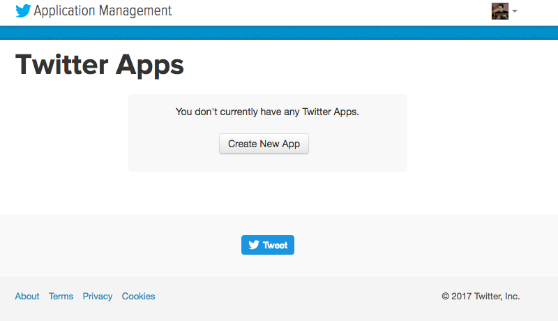

Clicking on that **Create New App** button is the same as directly viewing this URL:

https://apps.twitter.com/app/new

The "Create an application" page looks like this; fill out at least the 3 required fields. The **Name** field has to be something *unique*:

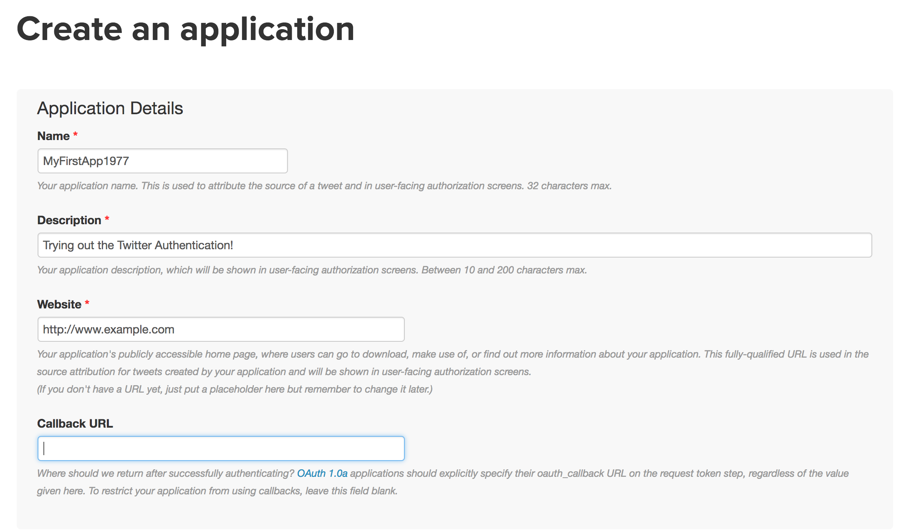

If the application is successfully created (i.e. you've named it something valid and agreed to the terms of service, etc), you'll be taken to your new application's homepage:

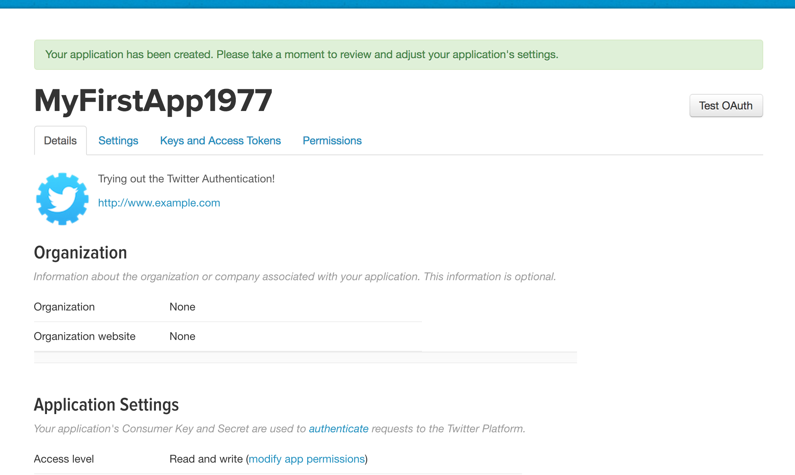

.. _twitter_application_settings_page:

Your application's settings/details
-----------------------------------

If you need to alter the settings to your application , click on the **Settings** tab which will take you to a page titled **Application Details**:

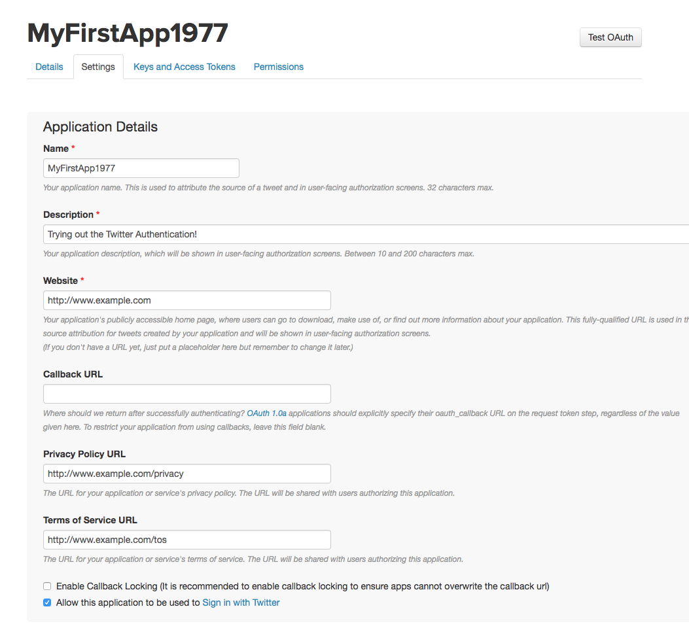

So, if you only filled out the required fields, your application won't be able to do **write**-type actions (e.g. send a tweet) on behalf of users other than your current Twitter account, i.e. the one you used to create the application. Not a seemingly relevant deal now, but if you follow this guide all the way through, you'll need to fill out a couple of optional fields.

Enabling your app to read/write for any Twitter account
^^^^^^^^^^^^^^^^^^^^^^^^^^^^^^^^^^^^^^^^^^^^^^^^^^^^^^^

By default, your application should already have its **Access level** as: **Read and write**.

If you want your application to have this access for *other* users, including any **secondary Twitter accounts** you create (a process detailed later in this guide), you'll have to fill out the non-required fields of:

- **Privacy Policy URL**
- **Terms of Service URL**

Here's a screenshot for reference's sake:

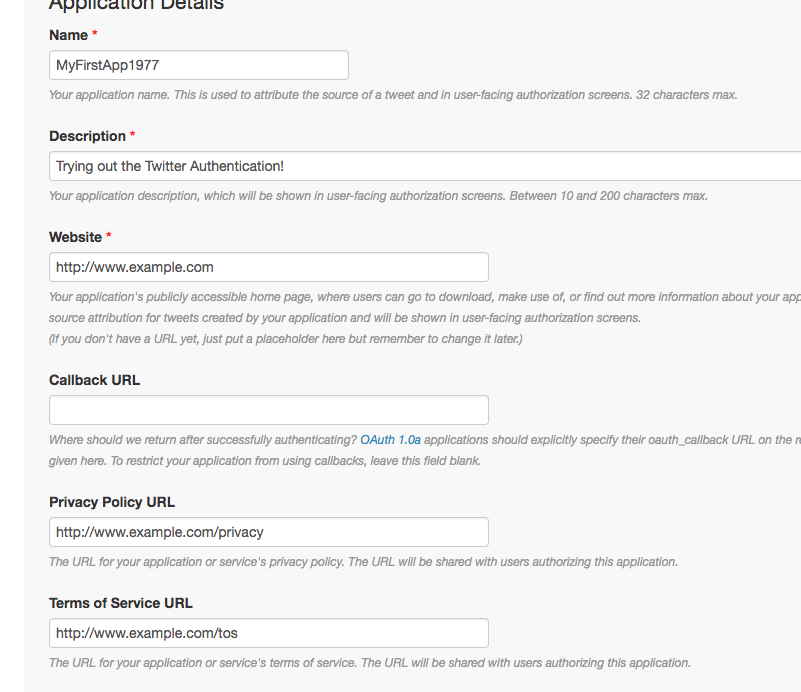

If you don't know what to do or what you want -- basically, you *do* want an app with read/write access for all users. So fill out the aforementioned optional fields with placeholder URLs and get back to it later.

Managing keys and tokens
------------------------

On your application's homepage, click the **Keys and Access Tokens** tab, which will take you to the following page, confusingly headlined as "Application Settings":

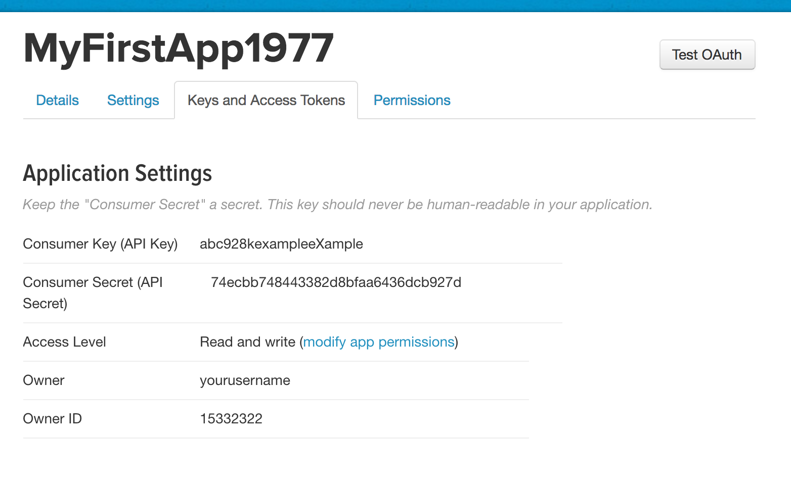

This is where you find your application's **Consumer Key (API Key)** and **Consumer Secret (API Secret)**. You'll need these anytime you want to authorize your application to act on behalf of a user. In other words, either keep this page open or copy-paste these values into a text file in order to complete the rest of this guide.

Creating an access token for your primary account
^^^^^^^^^^^^^^^^^^^^^^^^^^^^^^^^^^^^^^^^^^^^^^^^^

Again, **primary account** refers to the Twitter account used to create and manage this Twitter application.

Not only does the app have credentials (the consumer key and consumer secret), it needs credentials for each user that authorizes the app -- this is referred to as the **access token** and **access token secret**, or more technically later on, ``oauth_token`` and ``oauth_token_secret``.

The bottom half of the "Keys and Access Tokens"/"Application Settings" page should be a subhead named, **Your Access Token**.

Click on the button labeled, **Create my access token**:

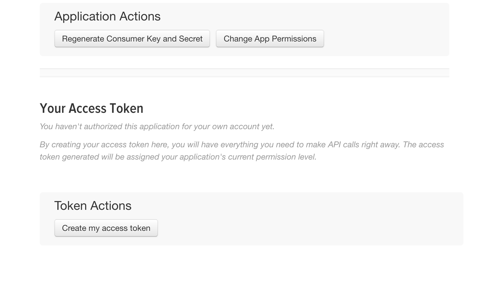

The page should refresh with this notification of success:

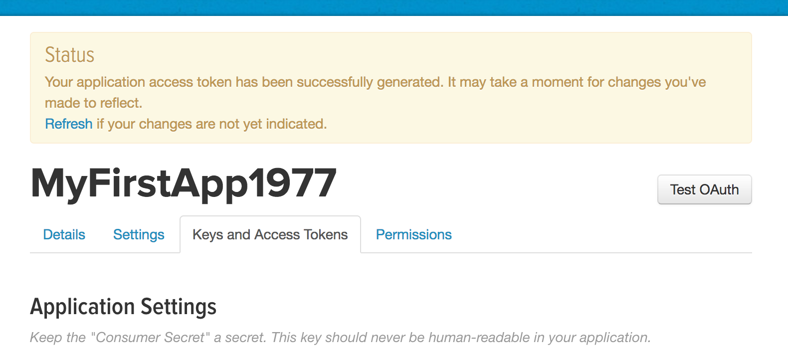

And under the **Your Access Token** page should be two new values for you to track: **Access Token** and **Access Token Secret**:

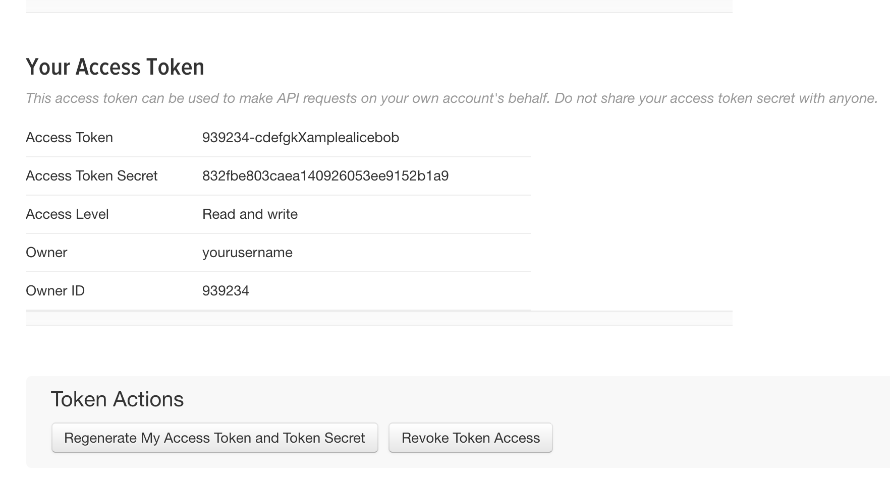

Exploring Twitter with Twython
==============================

OK, now that you have your **API Key**, your **API Secret**, and your OAuth **Access Token** and **Access Secret**, you can now sign into and access Twitter via the Twython (or any Twitter wrapper) library.

Twython is a Python library that makes it more convenient to access the Twitter API. Like all Python libraries, you install it via the ``pip`` installer from your system command line:

.. code-block:: shell

    $ pip install twython

In your Python scripts and/or interactive shell, importing Twython is as easy as:

.. code-block:: python

    import twython

Twython's homepage and documentation is here, but the rest of this guide will summarize the details for you:

https://twython.readthedocs.io

Authenticating with Twython
---------------------------

Open up an interactive Python shell. And set up some constants:

.. code-block:: python

    CONSUMER_KEY = 'whateveryourappconsumerkeyis'
    CONSUMER_SECRET = 'whateverthe-appconsumersecretis'
    OAUTH_ACCESS_TOKEN = 'whatever-your-access-token-is'
    OAUTH_ACCESS_TOKEN_SECRET = 'whatever-your-access-token-secret-may-be'

.. warning::

    Just to be clear, the above Python code for assigning variables is a **bad practice** when it comes to sensitive data (i.e. secret credentials**. Later on in this guide, I explain why it is a bad practice, and what you should do instead for a real-world app. But I'm assuming you just want to get to the action -- luckily, it's easy to revoke/reset/recreate the credentials.

Now, instantiate a client object via the Twython library

.. code-block:: python

    >>> from twython import Twython
    >>> client = Twython(CONSUMER_KEY, CONSUMER_SECRET,
                            OAUTH_ACCESS_TOKEN, OAUTH_ACCESS_TOKEN_SECRET)

This instantiation of an API client won't give any indication that ``client`` has successfully authorized.

So in Twython, an easy check is to call the ``get_account_settings`` method. If you get an error message, it means you need to doublecheck those credential strings you assigned to the constants/arguments above.

If successful, the ``get_account_settings`` method will return a dictionary representing the settings for the authorized account:

.. code-block:: python

    >>> client.get_account_settings()
    {'allow_contributor_request': 'following',
     'allow_dm_groups_from': 'following',
     'allow_dms_from': 'following',
     'always_use_https': True,
     'discoverable_by_email': True,
     'discoverable_by_mobile_phone': False,
     'display_sensitive_media': True,
     'geo_enabled': True,
     'language': 'en',
     'protected': False,
     'screen_name': 'yourusername',
     'sleep_time': {'enabled': False, 'end_time': None, 'start_time': None},
     'time_zone': {'name': 'Pacific Time (US & Canada)',
      'tzinfo_name': 'America/Los_Angeles',
      'utc_offset': -28800},
     'translator_type': 'regular'}

And of course, the real test of existentialism -- I tweet therefore I am:

.. code-block:: python

    >>> mytweet = client.update_status(status='hello world?')

The ``update_status`` method returns a dictionary, which I've assigned in the above snippet to the ``mytweet`` variable. Every status (i.e. **tweet**) has an ``id`` value:

    >>> mytweet['id']
    837215046291730432

The corresponding URL for any tweet, given its **id**, takes this format:

``https://twitter.com/YOUR_USERNAME/statuses/TWEET_ID``

Using Twython like a Secure Professional
----------------------------------------

For the sake of brevity in the previous section, I omitted my usual warning about copying-pasting sensitive data into your scripts and shell:

.. warning:: Don't expose your info

    Generally, **never** type sensitive information (such as passwords) directly into your code, either at the interactive shell or in a saved script. Remember how ipython and most shells have a **history** feature? If you're reasonably sure that no one else will ever touch your computer, sure, go ahead (but of course you usually can't be "reasonably" sure).

    On the other hand, you can always regenerate the key and access token. So I'm going to pretend you'll do just that soon after you practice playing with Twython for the first time.

So what **is** the best practice for making sensitive data, such as passwords and keys, accessible to a program at run-time?

One popular, straightforward strategy is to store these credentials in a **separate** file. In the case of Twitter, you might have noticed that the values for the API (aka **consumer**) key and secret, as well as the access token and access token secret, are all just text characters:

The ``Twython`` function for instantiating an API client, by default, assumes the first 4 arguments are, in this order:

- consumer/API key
- consumer/API secret
- OAuth access token
- OAuth access token secret

So the simple -- but insecure and totally not recommended for professionals -- way to get started looks like this:

.. code-block:: python

    from twython import Twython
    client = Twython('abcYOURCONSUMERKEY',
        'abcYOURCONSUMERSECRET',
        'abcYOURACCESSTOKEN',
        'abcYOURACCESSTOKENSECRET')

The *more* professional way is to store those values in a text file and have your Twitter-accessing script open that file and read in its values.

It can be as simple as having a 4-line file named ``creds-twitter``:

.. code-block:: text

    abcYOURCONSUMERKEY
    abcYOURCONSUMERSECRET
    abcYOURACCESSTOKEN
    abcYOURACCESSTOKENSECRET

And then, opening, reading, and deserializing the values as we do in Python:

.. code-block:: python

    from twython import Twython
    with open('creds-twitter') as f:
        lines = f.read().splitlines()

    client = Twython(lines[0], lines[1], lines[2], lines[3])

Or, if you like being stylish in the Pythonic way and want to use fancy variable/argument unpacking:

.. code-block:: python

    from twython import Twython
    with open('creds-twitter') as f:
        lines = f.read().splitlines()

    client = Twython(*lines)

Or, even fancier with Python's `pathlib <https://docs.python.org/3/library/pathlib.html>`_ and its object-oriented way of specifying file paths:

.. code-block:: python

    from twython import Twython
    from pathlib import Path
    client = Twython(*Path('creds-twitter').read_text().splitlines())

Whatever floats your boat, it's all just text.

But if it is wrong to put sensitive data as plaintext in your code, why is it more secure to put sensitive data as plaintext in a separate file? Good question; that ``creds-twitter`` file is not magically secure. But think of the situation in which you want to share your code with someone: typically, you email them your script as an attachment, or just copy-and-paste the contents of the script.

If sensitive data is hard-coded into the script, then it gets copy-pasted along with all the other text in that script, often accidentally. At least when sensitive data is in another file, you have to intentionally send that separate file along, too.

In real-world development, we "share" a script by sending it to multiple computers in an automated process. When the credentials data is *not* hard-coded into the script, it allows for more flexibility for the actual use of the script. For example, if each separate computer needs to authenticate as a different user. In that case, each computer with the copy of the script just needs to have its own ``creds-twitter``.

The power of careful serialization
^^^^^^^^^^^^^^^^^^^^^^^^^^^^^^^^^^

Saving sensitive data/credentials as a separate file is the **main** takeaway. But I recommend going one-step further and not just creating a simple 4-line file, but serializing the credentials as a **JSON**. For example, make ``creds-twitter`` look like this:

.. code-block:: json

    {
       "consumer_key": "abcYOURCONSUMERKEY",
       "consumer_secret": "abcYOURCONSUMERSECRET",
       "access_token": "abcYOURACCESSTOKEN",
       "access_token_secret": "abcYOURACCESSTOKENSECRET"
    }

And reference it in your Python script like this:

.. code-block:: python

    import json
    from twython import Twython
    with open('creds-twitter') as f:
        creds = json.load(f)

    client = Twython(creds['consumer_key'], creds['consumer_secret'],
                     creds['access_token'], creds['access_token_secret'])

Why the verbosity? Remember that we spend more time reading our code than writing it. A week from now, are you going to remember what the 4 plaintext lines of ``creds-twitter`` are? Probably not. And in a month, if you decide to switch from Twython to another Python library, such as `Tweepy <http://www.tweepy.org/>`_, which has its own function (and argument list) for connecting to the Twitter API, you'll find that you need to write new code for turning that ``creds-twitter`` into something usable. Which will inevitably mean re-learning how the ``Twython`` client function works...

So it ends up being easier to just take the time to properly label things the JSON way and accepting the inevitable fact that code is meant to be understood by humans.

But properly serializing data is not just about the humans. Why do we serialize data in the first place?

To put it another way, what if we decide to make a program that manages multiple Twitter accounts, and we want to manage the credentials in that single ``creds-file``? One obvious solution is to serialize the multiple credentials as a list of dictionaries:

.. code-block:: json

    [
        {
           "consumer_key": "abcYOURCONSUMERKEY"
           "consumer_secret": "abcYOURCONSUMERSECRET"
           "access_token": "abcYOURACCESSTOKEN"
           "access_token_secret": "abcYOURACCESSTOKENSECRET"
        },
        {
           "consumer_key": "xyzYOURCONSUMERKEY"
           "consumer_secret": "xyzYOURCONSUMERSECRET"
           "access_token": "xyzYOURACCESSTOKEN"
           "access_token_secret": "xyzYOURACCESSTOKENSECRET"
        }
    ]

And now it's just a minor modification to your script to make it something that scales across 1 to ``n``-number of accounts:

.. code-block:: python

    import json
    from twython import Twython
    with open('creds-twitter') as f:
        credlist = json.load(f)

    for creds in credlist:
        client = Twython(creds['consumer_key'], creds['consumer_secret'],
                        creds['access_token'], creds['access_token_secret'])

        client.update_status(status='hello world')

Using your Twitter Application from a secondary account
=======================================================

After playing around with Twitter via your primary account, i.e. the Twitter account you used to make the Twitter application, you might want to make another Twitter account if your intent is to enact some automated behavior that you don't want necessarily to come from your primary account.

For example, **Rob Dubbin**, who wrote a New Yorker piece titled, `The Rise of the Twitter Bots <http://www.newyorker.com/tech/elements/the-rise-of-twitter-bots>`_ uses @robdubbin as his *primary* Twitter account, e.g. to tweet about things that he wants the world to associate with "Rob Dubbin, the human".

However, when making a bot that would automate the praising of FOX News personalities, Dubbin created a separate account, `@RealHumanPraise <https://twitter.com/RealHumanPraise>`_, from which those FOX-praising tweets -- 842,000 and counting -- could emanate:

https://twitter.com/RealHumanPraise

So this next section deals with maintaining multiple Twitter identities. Of course, be mindful of the Twitter Terms of Service, and read up on Twitter's help page for "Automation rules and best practices":

https://support.twitter.com/articles/76915

    Users: you are ultimately responsible for the actions of your account, which means you shouldn't let a third-party application access or use your account unless you've thoroughly investigated the application. Automation may result in your content being filtered from search results. In addition, if your account automation violates the Twitter Rules (by Retweeting spam updates, repeatedly posting duplicate links, etc.), your account may be suspended. For more information on third-party applications, please see our help page on Connecting or revoking third-party applications.

Creating a secondary Twitter account with a secondary browser
-------------------------------------------------------------

I'll assume you know how to create a new Twitter account. I will refer to this new account as your **secondary Twitter account**.

In contrast, when I refer to your **primary Twitter account**, I mean the one that you used to create the Twitter application in the previous steps.

But you should create your **secondary Twitter account** using a **secondary browser**, i.e. a new browser application/instance that is  **not** the one you use for everything else in your life, e.g. logging into your primary Twitter account.

To create this **secondary browser**, you can either:

- Open up a new browser (e.g. Safari, if Chrome is your main browser)
- Create a new user profile in your main browser (if you just can't handle operating a new browser program)

I prefer the latter option, which is available in Chrome or Firefox:

- Share Chrome with others or add a profile https://support.google.com/chrome/answer/2364824?co=GENIE.Platform%3DDesktop&hl=en
- Multiple Firefox profiles https://developer.mozilla.org/en-US/Firefox/Multiple_profiles

In Chrome, after creating another profile, there should be a button in the top-right corner of the browser window indicating the current user. **Right-click** on it to bring up a list of user profiles, and select the one you want for handling your secondary Twitter account:

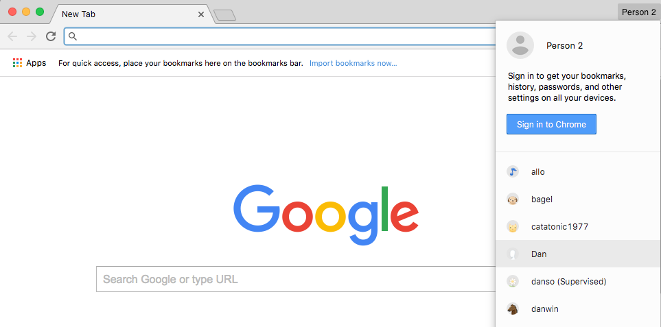

I **highly** recommend customizing this secondary browser profile to have a different **theme**, i.e. color scheme, because it's possible (and common) to have Chrome open for multiple "users", and you don't want to mix things up, i.e Tweet something from your main account that you intended to tweet from your secondary account.

Chrome has the "Chrome Web Store" from which you can select from an array of free and colorful themes:

https://chrome.google.com/webstore/category/themes

Got your **secondary browser** nice and open? Then go ahead and create that **secondary Twitter account**. Unless you have a secondary phone number, you'll probably have to skip the step where Twitter asks for that. But you can get by by supplying a secondary email address. Which, if you don't have one, you might as well make a new one in your secondary browser.

Before moving on, let's make sure you have these things ready:

- The consumer key and consumer secret for your Twitter application. If you don't have it on hand (e.g. in a text file), log into your **primary Twitter account** (presumably, using your main web browser) and visit your apps listing at:

    https://apps.twitter.com/

    Then click on the app you created; the consumer key and consumer secret are listed in the **Application Settings**:

    .. image:: images/twitter-app-manage-keys.png

    At this point, you can close your primary browser as you won't need to do anything from your primary Twitter account.

- Your **secondary browser** should be logged into your new **secondary Twitter account**. The authorization process involves clicking a couple links on the Twitter website while logged in as the **secondary Twitter account**, hence, the need for a **secondary browser**.

- Pop open an interactive **ipython** shell, because we'll have to run some Python code to generate the URL needed to authenticate.

Use Twython to start the OAuth1 authentication process
------------------------------------------------------

This section describes the process known as **OAuth 1** authentication. OAuth is something that many other services and APIs use for their authentication. And, it's a process that can be accomplished through different clients/steps.

To keep things simple, we'll just use **Twython** to do the authentication. The instructions in this section are adapted from what you can find in the Twython docs on "OAuth 1 (User Authentication)":

https://twython.readthedocs.io/en/latest/usage/starting_out.html#oauth-1-user-authentication

Start up an interactive Python shell. For the snippets below, I'll assume that the variables ``CONSUMER_KEY`` and ``CONSUMER_SECRET`` hold the string values that correspond to your **application**.

.. code-block:: python

    from twython import Twython

    tempclient = Twython(YOUR_CONSUMER_KEY, YOUR_CONSUMER_SECRET)
    tcreds = tempclient.get_authentication_tokens()

The ``tcreds`` variable points to a dictionary that looks like this:

.. code-block:: python

    {'auth_url': 'https://api.twitter.com/oauth/authenticate?oauth_token=AKAFFA',
     'oauth_callback_confirmed': 'true',
     'oauth_token': '361a164fa60d60',
     'oauth_token_secret': '553b6021e7360d07d5d91ff5e'}

Initialize a new client object using the values for the ``'oauth_token'`` and ``'oauth_token_secret'`` keys. We'll call this new client object, ``authclient``:

.. code-block:: python

    authclient = Twython(YOUR_CONSUMER_KEY, YOUR_CONSUMER_SECRET,
                         tcreds['oauth_token'],
                         tcreds['oauth_token_secret'])

That ``tcreds`` object also has a ``'auth_url'`` key, the value of which is a URL that you need to visit via your **secondary web browser**, i.e. whatever browser is currently logged in as your **secondary Twitter account**.

That authentication URL will take you to a webpage asking you -- more specifically, the secondary Twitter user -- if you trust this Twitter application to act on your behalf:

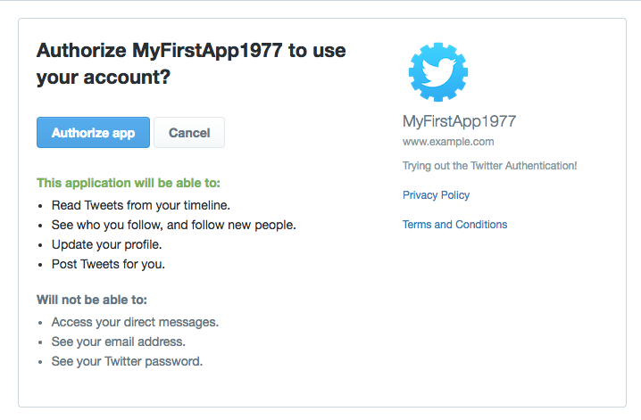

Allowing the authorization will take you to a new page in which a PIN code is printed in big numbers:

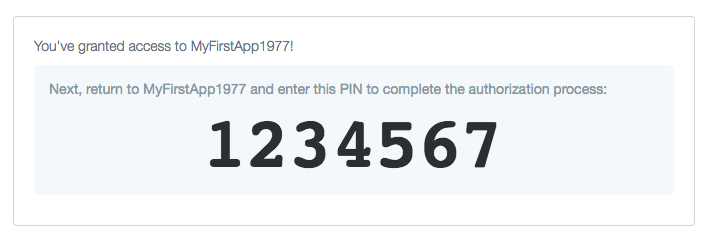

Switch back to your Python shell. Your ``authclient`` object has a ``get_authorized_tokens`` method. Into this method, we pass the PIN number:

.. code-block:: python

    realcreds = authclient.get_authorized_tokens(9823954)

And if that method is successful, it returns a new dictionary (which I use the variable ``realcreds`` to refer to) which has the final values for ``oauth_token`` and ``oauth_token_secret`` -- among a few other key/value pairs that you can ignore:

.. code-block:: python

    {'oauth_token': '888-your-access-token',
     'oauth_token_secret': '888-your-access-token-secret',
     'screen_name': 'your_secondary_account',
     'user_id': '931657239872432861',
     'x_auth_expires': '0'}

.. note:: Naming things is hard

    The dictionary as returned by Twitter's auth process has keys named ``'oauth_token'`` and ``'oauth_token_secret'``. In examples throughout this guide, such as the this-is-how-you-should-serialize-these-values examples, I label these, respectively, as ``'access_token'`` and ``'access_token_secret'``.

    Name them whatever you like. It's up to you, you just have to be consistent.

To instantiate a client to act on your **secondary account's** behalf, combine the consumer key and consumer secret of your Twitter application, with the values for ``oauth_token`` and ``oauth_token_secret``:

.. code-block:: python

    second_user = Twython(CONSUMER_KEY, CONSUMER_SECRET,
                         realcreds['oauth_token'],
                         realcreds['oauth_token_secret'])
    second_user

If your application is authorized to Tweet (i.e. **write**) on a user's behalf, try tweeting:

.. code-block:: python

    second_user.update_status(status='I am alive!')

Note: if you get the following error relating to being "Unauthorized":

    TwythonAuthError: Twitter API returned a 401 (Unauthorized), An error occurred processing your request.

This means you probably didn't follow the earlier steps :ref:`twitter_application_settings_page` for configuring your application -- specifically, filling out the fields for Privacy Policy URL and Terms of Service URL. So pop open your **primary browser** and go into the Application Settings and fill in those fields. Then, start the authentication process for the secondary user **all over again**.

If, things work out and you're able to tweet via Twython from your secondary account, that means you've successfully authorized the Twitter application -- which was created by your **primary account**  -- to act on behalf of your **secondary Twitter account**.

You can confirm this further by -- using your secondary browser for your secondary user -- and visit this URL:

https://twitter.com/settings/applications

You should see the name of your app, with the detail that it's been approved for **read-and-write** permissions:

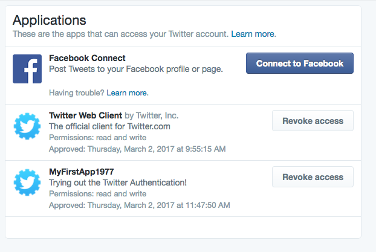

This is where you copy-paste the values that are in ``realcreds`` (or whatever you named that dict) corresponding to ``'oauth_token'`` and ``'oauth_token_secret'``, and save them in your own text file with the values you have for ``CONSUMER_KEY`` and ``CONSUMER_SECRET``.

Again, I recommend a serialized JSON file for easier, future reference:

.. code-block:: json

    {
       "consumer_key": "abcYOURCONSUMERKEY",
       "consumer_secret": "abcYOURCONSUMERSECRET",
       "access_token": "abcYOURACCESSTOKEN",
       "access_token_secret": "abcYOURACCESSTOKENSECRET"
    }

All the code for the auth process in one chunk
^^^^^^^^^^^^^^^^^^^^^^^^^^^^^^^^^^^^^^^^^^^^^^

Here's all the code in the previous section, in one unbroken script. I've also made it less "bad practicey" by not hard coding the literal ``CONSUMER_KEY`` and ``CONSUMER_SECRET`` variables.

However, you can't just *run* this script -- remember there is a part where you have to manually visit a URL in a web browser.

.. code-block:: python

    from twython import Twython
    import json

    CREDS_FILENAME = 'creds-twitter-fun.json'
    with open(CREDS_FILENAME, 'r') as f:
        creds = json.load(f)

    tempclient = Twython(creds['consumer_key'], creds['consumer_secret'])
    tcreds = tempclient.get_authentication_tokens()

    authclient = Twython(creds['consumer_key'], creds['consumer_secret'],
                        tcreds['oauth_token'],
                        tcreds['oauth_token_secret'])

    # print out the URL for the authorization page:
    print(tcreds['auth_url'])

    ##################################
    # MANUAL STEP
    # visit that page in your browser
    # ...hit the button to "Authorize app"
    # ...then copy and paste the pin number into your code

    the_pin_number = 1234567

    ## END MANUAL STEP
    ##################################

    realcreds = authclient.get_authorized_tokens(the_pin_number)

    # Create a client that acts on behalf of your secondary user
    second_user = Twython(creds['consumer_key'], creds['consumer_secret'],
                            realcreds['oauth_token'],
                            realcreds['oauth_token_secret'])

    # Check its read-access
    second_user.get_account_settings()

    # Check its write-access
    second_user.update_status(status='hello world for the second time')

Conclusion
==========

Whew.

If you've followed all the steps up to this point, you should have credentials for both your primary and secondary Twitter account. Since we only made one application, and hence, *authorized* that one application, the **consumer key** and **consumer secret** will be the same for both Twitter accounts. The **oauth_token** and **oauth_token_secret**, however, are unique to each user.

Again, I recommend storing them in separate text files, serialized as JSON. When maintaining credential files for multiple users, it's worth throwing in an extra key/value pair for the **screen_name** of the account:

.. code-block:: python

    {
       "screen_name": 'yoursecondaryaccount',
       "consumer_key": "abcYOURCONSUMERKEY",
       "consumer_secret": "abcYOURCONSUMERSECRET",
       "access_token": "abcYOURACCESSTOKEN",
       "access_token_secret": "abcYOURACCESSTOKENSECRET"
    }

Either way, you're ready to learn how to Tweet and navigate the Twitter API with Twython:

:doc:`/guide/topics/python-nonstandard-libraries/twython-guide/twitter-twython-api-basics`

