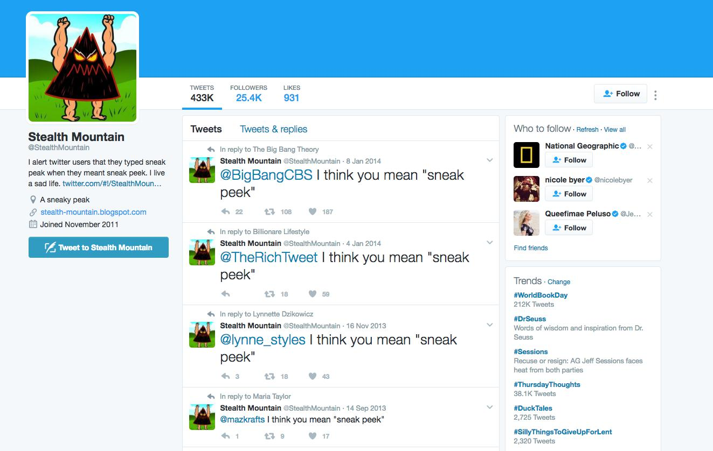
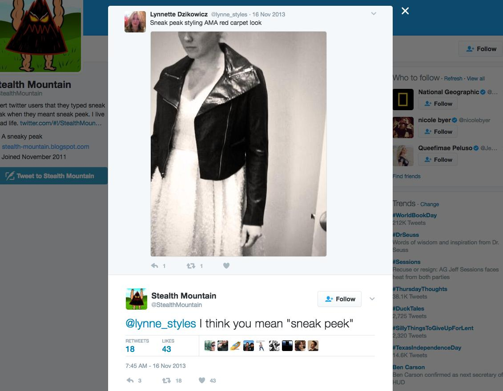
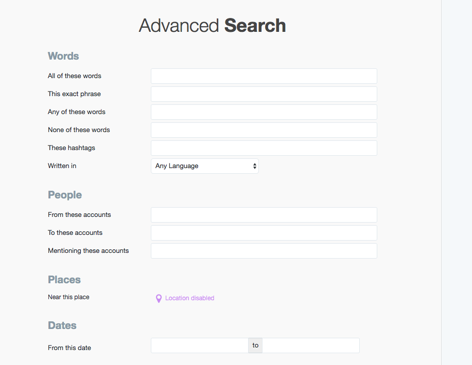

*****************************************
A Peak of Grammar Correction with Twython
*****************************************

A simple example of filtering Twitter data and responding to Twitter users. By this point, you should have:

Authenticated a Twitter application and made it accessible via Twython:

:doc:`/guide/topics/python-nonstandard-libraries/twython-guide/twitter-twython-app-auth`

Have familiarity with how Twython and the Twitter API works, including handling Twython's responses, and sending out tweets:

:doc:`/guide/topics/python-nonstandard-libraries/twython-guide/twitter-twython-api-basics`

.. contents::

Once you've learned how to send a tweet via a programming script, a world of bot-making possibilities seems to open up. But even the world's top artificial-intelligence engineers screw up and unleash a misbehaving Nazi bot.

.. note:: Related reading

    .. raw:: html

        <blockquote class="twitter-tweet" data-lang="en">
&quot;Tay&quot; went from &quot;humans are super cool&quot; to full nazi in &lt;24 hrs and I&#39;m not at all concerned about the future of AI <a href="https://t.co/xuGi1u9S1A">pic.twitter.com/xuGi1u9S1A</a>
&mdash; gerry (@geraldmellor) <a href="https://twitter.com/geraldmellor/status/712880710328139776">March 24, 2016</a></blockquote>
        

    - `Twitter taught Microsoft’s AI chatbot to be a racist asshole in less than a day <http://www.theverge.com/2016/3/24/11297050/tay-microsoft-chatbot-racist>`_
    - `Microsoft Had to Suspend Its AI Chatbot After It Veered Into White Supremacy <https://motherboard.vice.com/en_us/article/microsoft-suspends-ai-chatbot-after-it-veers-into-white-supremacy-tay-and-you>`_
    - `How to Make a Bot That Isn't Racist <https://motherboard.vice.com/en_us/article/how-to-make-a-not-racist-bot>`_

Nothing wrong with starting small. Let's make a bot that has a very predictable trigger and a very predictable reaction. We'll also get acquainted with the Twitter API endpoint for searching, and some practice filtering our common friend: data deserialized as a list of dictionaries.

The @stealthmountain bot
========================

The @stealthmountain Twitter bot, currently dormant, had a pretty predictable trigger and response. You can probably figure it out from this screenshot:

https://twitter.com/stealthmountain

Most of the tweets @stealtmountain responded to seem to have been since deleted. Here's a surviving tweet:

https://twitter.com/StealthMountain/status/401737750442803202

The trigger: a tweet that contains the exact string, ``"sneak peak"``

The response: a tweet in the form of:

    @[user screen name] I think you mean "sneak peek"

This simple bot attracted a healthy amount of press and more than 25,000 users:

http://www.slate.com/blogs/browbeat/2012/01/20/stealth_mountain_the_twitter_bot_devoted_to_a_single_grammatical_error.html

    Taking the time to build a bot solely to chastise Twitter users who have fallen into this clearly common error would at first blush seem to be the work of a very annoying person indeed. Yet there’s something charming about Stealth Mountain’s approach. In the account’s bio line, its creator speaks self-deprecatingly of his project: “I alert twitter users that they typed sneak peak when they meant sneak peek. I live a sad life.” And the account’s automatically generated replies take care not to assume too much. “I think you mean ‘sneak peek,’” they read, allowing for the possibility that the Twitterer was in fact referring to a mountain peak that somehow behaved surreptitiously. (“We thought there was a lot more hiking left to do, but Mt. Aerie had one of those sneak peaks; we were already at the summit!”)

@stealthmountainbot seems to have gone dormant since 2014. Have people stopped tweeting "sneak peak"? Only one way to find out.

Searching for terms on Twitter via the website
==============================================

Performing a search via Twitter's search bar takes you to this URL:

https://twitter.com/search?q=SEARCH_TERM&src=typd

For the words "sneak" and "peak", the URL is:

https://twitter.com/search?q=sneak%20peak&src=typd

Looks like the error is still common:

Before moving to the programming part, let's get some more context into how Twitter search works. As seen in the above screenshot, Twitter allows us to specify what kind of search results we want. By default, the facet is **"Top"** -- i.e. the tweets and users that Twitter, via some algorithm, considers to be the most relevant.

The other search option, in terms of Tweet results, is **Latest**, and that returns a straight-up chronological list of tweets with "sneak" and "peak" in the text (or user name).

And then there's the option to search for just Twitter profiles with the terms, i.e. **People**.

Twitter's Advanced Search
-------------------------

If we poke around a bit, we can find an **Advanced Search** option:

https://twitter.com/search-advanced

Which reveals even more specific ways of searching, such as the ability to look for "This exact phrase".

Here's Twitter's official help:

https://support.twitter.com/articles/71577

And here's a helpful guide from social-media startup Buffer:

https://blog.bufferapp.com/twitter-advanced-search

Searching for an exact phrase
^^^^^^^^^^^^^^^^^^^^^^^^^^^^

For our basic bot, we have specific phrases we want to search for. As it turns out, just about any tweet that has "sneak" and "peak" is using it as "sneak peak". But if we want to be sure, Twitter says to put quotes around an exact phrase when doing a search.

The URL for a search of ``"sneak peak"`` is this:

https://twitter.com/search?q=%22sneak%20peak%22&src=typd

The results are even more pronounced if we want to catch ``"take a peak"``, versus any tweet that has the words "take", "a", and "peak" in its text:

https://twitter.com/search?q=%22take%20a%20peak%22&src=typd

Searching for multiple phrases/terms
^^^^^^^^^^^^^^^^^^^^^^^^^^^^^^^^^^^^

We can imagine writing a program that does multiple searches for each phrase we want to find. But it seems more graceful to do a search for both terms, and Twitter's search functionality allows for this.

Just use the term ``OR`` -- here, the case **is** important -- between terms:

``"take a peak" OR "sneak peak" OR "sneak a peak"``

Here's the URL for that Twitter search, with the results being listed by most recent:

https://twitter.com/search?f=tweets&vertical=default&q=%22take%20a%20peak%22%20OR%20%22sneak%20peak%22%20OR%20%22sneak%20a%20peak%22&src=typd

Searching via the Twitter API with Twython
==========================================

If you know how to web scrape, you may be thinking that this is the time to do it. But when we have an API has extensive and generous as Twitter's -- well, the point of providing that API is to provide a way to get data that *doesn't* require dealing with HTML. This ends up easing the work of the user and the load on Twitter's servers (ideally).

Here's Twitter's landing page for the Search API:

https://dev.twitter.com/rest/public/search

There are multiple ways to search Twitter. For now, we care about its ``search/tweets`` endpoint, documented here:

https://dev.twitter.com/rest/reference/get/search/tweets

The corresponding method for the Twython client object is simply named, ``search``. The parameters/arguments we care about are:

- ``q``: the only required parameter -- this is the text we're searching for.
- ``result_type``: We want the most "recent" tweets, rather than the default of "mixed"
- ``count``: By default, the number of results returned is ``15``. Let's get the max of ``100``

I'll assume that you know how to authenticate a Twython client object from this guide:

:doc:`/guide/topics/python-nonstandard-libraries/twython-guide/twitter-twython-app-auth`

Let's start easy:

.. code-block:: python

    from twython import Twython
    # yada yada yada, make a client

    results = client.search(q='"sneak peak"', count=100, result_type="recent")

As with most Twython responses, ``results`` is a dictionary:

    >>> results.keys()
    dict_keys(['statuses', 'search_metadata'])

We'll save the lesson on what ``'search_metadata'`` refers to for another time. But the ``'statuses'`` key points to a list of tweet objects:

.. code-block:: python

    tweets = results['statuses']
    for t in tweets[0:5]:
        print(t['text'])

Results of the first 5 tweets:

.. code-block:: python

    Sneak peak rainbow silver glitter crown frame from your glitter holics @PRabbitDesigns and… https://t.co/3uB0nzgijZ
    Sneak Peak of Spawn Area https://t.co/A7G0k8M6Qz
    RT @ChicoDread__: If U Missed Our Show Last Friday Here's A Lil Sneak Peak Me &amp; Brother @LordRockwell305 Had That Shit Litty Visuals By : @…
    Selena adams is taking over! @selenaadams69 Follow us on snapchat for a sneak peak 👻 Bangbrosdotcom https://t.co/ALU81kjve4
    A sneak peek at baby boy's nursery is now live! https://t.co/AzyaKXHK9N #nursery #homedecor https://t.co/e9RXqNRHFx

Formulating a correction
------------------------

Now it seems the next logical step is to jump right into sending out corrections. But in computing, we prefer to handle the steps in order of most predictable/deterministic.

The most deterministic part of this process is the text of the reply tweet. In fact, we should have started with that string template first.

    Hey @[[some_screen_name]], I think you meant "sneak peek" 🏔

(mountain emoji added for further confusion)

The function to create this text is just a couple of lines. Let's make the function somewhat "smart" in that it can handle the dictionary that represents a tweet. But keep it simple in that it just returns a string, i.e. doesn't actually send the tweet:

.. code-block:: python

    def make_reply_text(tweet):
        tmptxt = """Hey @{sname}, I think you meant "sneak peek" 🏔"""
        screen_name = tweet['user']['screen_name']
        return tmptxt.format(sname=screen_name)

Run this through what was captured in the search results. Instead of sending a tweet, just print out the expected result of ``make_messsage_text``:

.. code-block:: python

    results = client.search(q='"sneak peak"', count=100, result_type="recent")
    tweets = results['statuses']
    for tweet in tweets:
        rtext = make_reply_text(tweet)
        print(rtext)

The output looks like this:

.. code-block:: text

    Hey @PRabbitDesigns, I think you meant "sneak peek" 🏔
    Hey @FireGoneComplex, I think you meant "sneak peek" 🏔
    Hey @ChicoDread__, I think you meant "sneak peek" 🏔
    Hey @BangBrosDotCom, I think you meant "sneak peek" 🏔
    Hey @jordanstumbo, I think you meant "sneak peek" 🏔
    Hey @W_Tania_, I think you meant "sneak peek" 🏔
    Hey @Clexa_Potteries, I think you meant "sneak peek" 🏔

I think we're ready to send some tweets!

Replying with a correction
--------------------------

What is a Twitter reply? Refresh your memory with the Twitter docs for the ``statuses/update`` endpoint:

https://dev.twitter.com/rest/reference/post/statuses/update

And review the examples in this guide: :doc:`/guide/topics/python-nonstandard-libraries/twython-guide/twitter-twython-api-basics`

To send a tweet with Twython, we use the ``update_status`` method:

.. code-block:: python

    client.update_status(status='hi')

To send a proper reply, we fill out the ``in_reply_to_status_id`` and make sure the target user's screen name is in the text of the ``status`` string. Our ``make_reply_text`` function handles that latter part.

Assuming ``tweet`` is some dictionary, here's how to send a single reply tweet:

.. code-block:: python

    tweet_id = tweet['id']
    rtext = make_reply_text(tweet)
    client.update_status(status=rtext, in_reply_to_status_id=tweet_id)

And here's the code all together, assuming there's an authenticated Twython client object, for searching for the latest 100 instances of the grammar error, formulating a reply tweet, and then sending that tweet out. I've also added a call to ``sleep`` so that we're not hammering the Twitter API:

.. code-block:: python

    from time import sleep
    from twython import Twython

    def make_reply_text(tweet):
        tmptxt = """Hey @{sname}, I think you meant "sneak peek" 🏔"""
        return tmptxt.format(sname=tweet['user']['screen_name'])

    # do your own authentication code here
    client = Twython("etc", "etc")

    results = client.search(q='"sneak peak"', count=100, result_type="recent")
    tweets = results['statuses']

    for tweet in tweets:
        rtext = make_reply_text(tweet)
        tweet_id = tweet['id']
        print("Replying to:", tweet_id)
        print("\t", tweet['text'])
        print('\twith:', rtext)
        print("\n\n")
        # pause...
        sleep(1)
        # actually send the reply
        client.update_status(status=rtext, in_reply_to_status_id=tweet_id)

And because programming with real-world data is always harder than expected, we're already running into exceptions:

.. raw::html

    <blockquote class="twitter-tweet" data-lang="en">
My pet peeve is when people type &quot;sneak peak&quot;. It&#39;s Snake Peak, and it&#39;s the most dangerous mountain on the continent.
&mdash; good sports doer (@malt_skull) <a href="https://twitter.com/malt_skull/status/795274655116496896">November 6, 2016</a></blockquote>
    

The complex things
==================

So much of the bot behavior is pretty straightforward, here are where things get complicated:

We probably need at least a regular expression to filter out cases when someone *else* is tweeting a correction to ``"sneak peak"``, i.e. https://twitter.com/malt_skull/status/795274655116496896

If we want to respond to more than just "sneak peak", our response either has to be more vague, e.g. "I think you meant 'peek'" in response to a tweet containing, "Have a peak at this!". Or, we use a regular expression to capture the "error" in a tweet, for the purposes of retweeting the exact error. Tougher than it sounds.

We can only come up with so many exceptions. For example, "Have a peak at my cooking" is clearly wrong. But what about "Have a peak."? This is where we may need to bring in a natural language processing library to help identify **parts of speech**.

(Hope to cover this next week. If you're curious about what I like using, I like spaCy: https://spacy.io/)

The other big problem has little to do with grammar but designing the bot so that it repeatedly does the Twitter search for new tweets. And more importantly, making sure that the bot doesn't correct a tweet more than once. The solutions to these problems have their own problems, and soon you'll understand why databases were involved.

But in regards to the Twitter API, it helps to understand why their API limits the number of results, and the option of using "cursors" to navigate collections:

https://dev.twitter.com/overview/api/cursoring

(to be dealt with later!)

