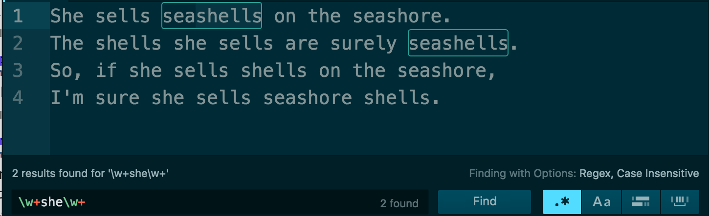

************************************
A Quick Intro to Regular Expressions
************************************

This course's first technical concept is one I've rarely ever seen anywhere in most college comsci courses, nor talked about by non-technical folks. But I agree with author Cory Doctorow, when `he wrote in The Guardian in 2012 <https://www.theguardian.com/technology/2012/dec/04/ict-teach-kids-regular-expressions>`_ that regular expressions "are part of the fundamental makeup of modern software and can make everyday people's lives much easier."

Regular expressions -- sometimes referred to as **regexps** or **regexes** -- are accessible enough that it's just easier to show what they *do*.

A regular expression is a *string of text*. We use it to describe a pattern we want to find, or replace.

Have you ever used Find/Replace in a word-processor? Then you have used regular expressions.

For example, given the following poem:

.. code-block:: text

    She sells seashells on the seashore.
    The shells she sells are surely seashells.
    So, if she sells shells on the seashore,
    I'm sure she sells seashore shells.

If you were asked to find all instances of the *pattern*, "she", you know how to activate the **Find** function of your word processor to look for the word "she":

What if I asked you to match *only* the word "she", and not "shells" nor "seashells"? That's easy enough to fix. Look for the word "she", followed by a space, i.e. "she ":

So both of those examples qualify as regular expressions, as plain as they seam. That's because the core concept of a regular expression is to express a *pattern* to search for. Sometimes, the patterns we want are just *literally* the characters "she" or "she ".

Going beyond the literal
========================

But what if I asked you to find all words that *include* "she", but not just "she" itself?

Now you're in a bind if all you know is how to look for *literal* patterns, i.e. exactly the characters you punch into your keyboard. But you *do* know the pattern that you want -- the characters "she", followed by *any* character that is a letter.

This is where the special regular expression syntax comes in. To match any **word** character -- i.e. alphanumeric characters and the underscore --- we use the following token, which is a **backslash** followed by a lowercase ``w`` character:

:regexp:`\\w`

To match all instances of "she", followed by a word character, we use this regex pattern:

:regexp:`she\\w`

A proper plaintext editor like Atom allows us to Find by a regex pattern. Here's a screenshot of the result:

Right now, the pattern matches "she" plus any following letter, i.e. "l", for "shel". If we want to extend the match to match "shells", we use the **plus sign**. The plus sign, like the backslash, is one of several of regexes **special characters**. The plus sign *modifies* the token that precedes it -- i.e. :regexp:`\\w`.

Instead of looking for a single word character, we are now looking to match **one or more word characters**:

:regexp:`she\\w+`

We're now matching "shells", but what if we wanted to match "seashells" as well?

The obvious solution would seem to be to add the :regexp:`\\w+` pattern at the front of "she":

:regexp:`\\w+she\\w+`

If we attempted to describe that pattern in plain English, it might go like this:

- Match one or more word characters
- Then match the pattern "she"
- Then match one or more word characters

Here's the result:

Oops. We got the "seashells", but we lost the standalone "shells". Which makes sense in retrospect, as the word "shells" does not have any word characters before "she".

So let's learn another special character: the **asterisk**. Unlike the **plus sign**, the asterisk modifies its preceding token with the attribute of: *zero or more of this token*

:regexp:`\\w*she\\w+`

The result:

See more patterns, think more in patterns
=========================================

By now, you're probably tired of looking at this tongue-twister and matching such simple patterns -- even though there are so many more we could do, including:

:regexp:`\\bshe\\b`
    Match just "she" and *only* "she"

:regexp:`\\bs\\w+`
    Match all words that begin with "s"

:regexp:`\\b[a-rt-z]+\\b`
    Match all words that have *no* "s" characters at all

:regexp:`^\w+`
    Match only the words at the beginning of each line

And here's a few more examples as described by Cory Doctorow in his Guardian op-ed:

        For example, if you had a list of names and you wanted to find all the michaels, Michaels, Mikes and mikes, you could use a simple regular expression inside of a search-box to locate all of them at once. You can use regular expressions to find all the files in a directory that end with jpg (or jpeg, or JPG or JPEG). You can use them to find all the street addresses (every string beginning with a number, followed by a space, followed by one or more words, followed by Street, or St, or Road or Rd, etc).

We can cover all the syntax and special characters in a separate lesson. Our main takeaway is that we can use regular expressions to describe in *abstract* terms what we want to find, specifically: what we *know* we want to find even if we don't know *exactly what it is*.

What are the kinds of patterns we *know* we want, without knowing exactly what they *are*?

- Given a list, you know that there's a "John Smith", you just don't know if his name is listed with a middle initial. So you want the pattern "John ", optionally followed by an uppercase initial letter and dot, followed by " Smith".
- Given an audit report, you're looking for big money amounts, i.e. a literal dollar sign, followed by a sequence of digits (and comma-separators) that is at least 10 characters long.
- Or maybe you're just a spammer and given the raw HTML of a webpage, you want to extract all of the

If you're a programmer, then you've probably seen how regular expressions are vital for the processing of dirty real-world text data, such as when users all have different ways of inputting phone numbers, e.g. `(555)-867-5309`` and `555.867.6309``.

If you're not a programmer, you have a tool that works wherever plaintext exists -- which is most modern data formats today and into the future, including CSV. And we haven't even discussed the power of **capturing groups**, which can be used to transform data far more flexibly than any spreadsheet formula.

A powerful beginning
====================

.. epigraph::

    Knowing regexp can mean the difference between solving a problem in three steps and solving it in 3,000 steps. When you're a nerd, you forget that the problems you solve with a couple keystrokes can take other people days of tedious, error-prone work to slog through.

    -- Cory Doctorow

Even as an experienced programmer, when I finally understood and got to using regular expressions on a regular basis, it was an epiphany. Why write tedious, clunky web-scraping scripts when I could describe exactly what I wanted. I've of course always known that HTML is just text, but it's a different thing to really treat it as just plain, dumb text, using the direct elegance of regex.

If you're new to programming, regular expressions have a double-upside. You get a powerful tool that can be used *daily* in data and document searching. At the same time, you also get hands-on experience with how obstinate computers are with a formal syntax.

The Google search engine may fix up your typos. But if you want to succeed in programming, then you have to get used to being absolutely *precise* when it comes to telling a computer -- that dumb box that can only think in 1s and 0s -- how to do the real-world things that interest us.

I've put together a collection of lessons to help expand what you know regexes can do. There's not much point in cramming in the syntax; we'll be using regexes in virtually every programming environment goign forward.

