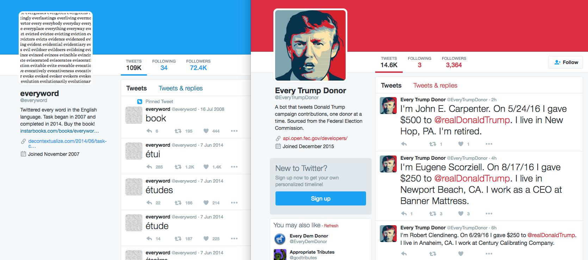

**************************************************
Day 3: Tuesday, January 17, 2017 - Practical Pipes
**************************************************

.. warning:: Pre-Class instructions

    - Login to an iMac
    - Open the Terminal
    - Run this command, which will install the ``libav`` and ``sox`` software on the iMac ``brew install sox libav``.
    - Then, follow the instructions on installing some software tools on your Stanford FarmShare space: :ref:`installing_compciv_2017_software_on_farmshare`

This is the last week that we focus specifically on the Nix command-line environment. It's not so much as memorizing the commands/intricacies of the Unix-like shell, but rather, understanding how programs -- of *any* language -- work together, particularly through the interface of text.

For Tuesday, we'll focus on the **learning by doing**. On Thursday, we'll take a slightly deeper dive into the concepts before we slowly dip into the Python programming language.

Take a quick look at this guide, which I will be fleshing out on a need-to-know basis: :doc:`/guide/topics/command-line/abridged-bash`

Homework
========

Just a quickie data-text problem

- :doc:`/syllabus/assignments/homework/quake-mags`

Connecting programs through text
================================

Big programs are just small programs neatly tied together. And it's a natural consequence of following the `Unix Philosophy <https://en.wikipedia.org/wiki/Unix_philosophy>`_:

    This is the Unix philosophy: Write programs that do one thing and do it well. Write programs to work together. Write programs to handle text streams, because that is a universal interface.

Though this is not a class about Unix/Bash programming, designing programs to be **simple** and to **communicate through text** are the principles we will carry into Python programming, and computing in general.

Computers are dumb and simple. So we make our programs dumb and simple.

The Unix Pipe
=============

This 27-minute film from Bell Labs, titled `"The UNIX System: Making Computers More Productive" <https://www.youtube.com/watch?v=tc4ROCJYbm0>`_, is really worth watching if you enjoy 1980s-nostalgia. But here is a key excerpt about what made Unix significantly unique back then, explained by Bell Labs programmer Brian Kernighan (`starts at 4:58 <https://youtu.be/tc4ROCJYbm0?t=4m58s>`_):

What Kernighan said back in 1982 still applies today:

    What you can do is to think of these Unix system programs as...building blocks with which you can create things. And the thing that distinguishes Unix system from many other systems is the degree to which those building blocks can be glued together in a variety of different ways. Not just obvious ways but in many cases, very unobvious ways to get different jobs done. The system is very flexible in that respect.

When he talks about how Unix works -- as a framework that lets programs operate in *igornance* of each other -- that's how we should think of our own programs:

    I think the notion of pipelining is the fundamental contribution...You can take a bunch of programs and stick them together end-to-end so that the data simply flows from the one on the left to the one on the right. And the system itself looks after all of the connections, all of the synchronization, making sure that the data goes from the one [program] into the other.

    **The programs themselves don't know anything about the connection as far as they're concerned. They're just talking to the terminal.**

Writing shell scripts
=====================

From that same Bell Labs video, programmer Lorinda Cherry discussing how Kernighan's example of a spellcheck can be written as a script (starts at `15:37 <https://youtu.be/tc4ROCJYbm0?t=15m37s>`_).

Understanding structured text as data
=====================================

Regular expressions and ``grep`` is so much fun, why not use it for all kinds of data parsing?

The csvkit suite of tools
-------------------------

No more parsing structured text through regular expressions.

Trump bots
==========

One of our projects down the road is to write a bot: :doc:`/syllabus/assignments/projects/remote-bot`

In honor of this week's Inauguration Day, let's look at bots built around our new President, or specifically, his Twitter account.

In the wake of Trump's electoral upset, a lot of words have been written on the bots that purportedly boosted him:

- Automated Pro-Trump Bots Overwhelmed Pro-Clinton Messages, Researchers Say: https://www.nytimes.com/2016/11/18/technology/automated-pro-trump-bots-overwhelmed-pro-clinton-messages-researchers-say.html
- On Twitter, Trump bots are out-tweeting Clinton bots 7 to 1: http://www.recode.net/2016/11/1/13488020/trump-bots-clinton-twitter-third-debate-twitterbots-election
- Inside Donald Trump’s Twitter-Bot Fan Club <http://nymag.com/selectall/2016/06/inside-donald-trumps-twitter-bot-fan-club.html

But let's look beyond politics and popularity. Let's look at money:

The "Every Trump Donor" (`@EveryTrumpDonor <https://twitter.com/everytrumpdonor>`_) account reads through FEC data to create automated mini-stories/facts, not much different than what `@everyword <https://twitter.com/everyword>`_ did for dictionaries:

via The Atlantic: `The First Reply to a Trump Tweet Is Prime Media Space <https://www.theatlantic.com/technology/archive/2016/12/weird-media-ecosystem/510911/>`_:

    Notching the first-reply spot for any Trump tweet—let alone several of them—takes a combination of super-speed and luck. You’re up against countless people and bots—and the bots are programmed to reply automatically to Trump as a way of leveraging his reach.

    This bot activity includes an entire cottage industry of internet-designed T-shirts and mugs, with bots advertising slogans like “enjoying my hot cup of liberal tears,” all within replies to Trump tweets.

Here's an example Tweet purportedly targeted at people who read Trump's tweets:

via Motherboard/VICE, Twitter has made some attempt to shut down these spambots: `Twitter Has Suspended the TrumpBots <http://motherboard.vice.com/read/twitter-has-suspended-the-trumpbots-patriotic-pepe>`_

But there's real money to be made beyond coffee mugs:

- `This App Wants to Help You Trade Stocks Based on Trump Tweets <http://fortune.com/2017/01/05/stocks-trump-tweets/>`_
- `Traders scheme to cash in on Trump tweets <http://www.politico.com/story/2016/12/trump-tweets-traders-scheme-232534>`_
- `Trump's tweet about Lockheed-Martin cuts $4bn in value as share prices fall <https://www.theguardian.com/business/2016/dec/12/lockheed-martin-share-prices-donald-trump-tweet>`_

.. raw:: html

    <blockquote class="twitter-tweet" data-lang="en">
The F-35 program and cost is out of control. Billions of dollars can and will be saved on military (and other) purchases after January 20th.
&mdash; Donald J. Trump (@realDonaldTrump) <a href="https://twitter.com/realDonaldTrump/status/808301935728230404">December 12, 2016</a></blockquote>
    

Thoughts on tracking the Trump Administration
=============================================

Bots are fun to program. But there are many other (mostly manual and mundane) ways to track the incoming Trump Administration, and more useful ways to display and present the information than via the tweets of a bot (i.e. a web application, which is the final project)

This TrumpTracker project is a built off of a spreadsheet of collected promises: https://trumptracker.github.io/

BuzzFeed is making a spreadsheet of connections: `Help Us Map TrumpWorld <https://www.buzzfeed.com/johntemplon/help-us-map-trumpworld?utm_term=.fw6KgXQVY#.wj1j5MXlm>`_

The Washington Post has a fantastic list of all the nominations made and the ones to be made: `Tracking how many key positions Trump has filled so far
<https://www.washingtonpost.com/graphics/politics/trump-administration-appointee-tracker/database/>`_

Some examples from the other side of the aisle:

- `Tracking Obama’s Promises <https://www.propublica.org/article/tracking-obamas-promises-120>`_
- `Clinton gave State Department appointments to 194 donors <http://www.washingtonexaminer.com/clinton-gave-state-department-appointments-to-194-donors/article/2602272>`_

