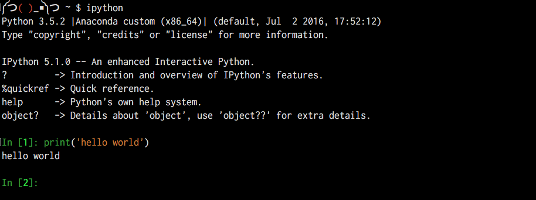
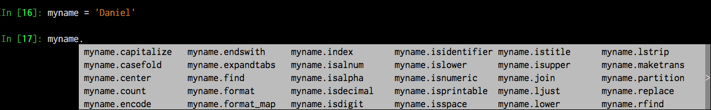

**************************************************************
Day 5: Tuesday, January 24, 2017 - Introductory Python, Part 1
**************************************************************

Put aside your anxieties over the command-line for now. We're going to do a crash course in the fundamentals of Python and programming in general.

Before starting, make sure you have `Anaconda <https://www.continuum.io/downloads>` installed on your machine:

- OSX installer: https://repo.continuum.io/archive/Anaconda3-4.2.0-MacOSX-x86_64.sh
- Windows installer: https://repo.continuum.io/archive/Anaconda3-4.2.0-Windows-x86_64.exe

Make absolutely sure you're installing the Anaconda **3** version. Not Anaconda **2**. Once it's done installing, open up your Terminal/command-line and run ``python`` with ``--version``. You should see something like this:

.. code-block:: shell

     $ python --version
     Python 3.5.2 :: Anaconda custom (x86_64)

The important thing to see is ``Python 3.5.2 :: Anaconda``. Please contact me if you have any issues; this is not something to fix via random Internet advice posts.

Readings and Concepts for Thursday
==================================

`Automate the Boring Stuff With Python <https://automatetheboringstuff.com/>`_ is our official textbook. You could read it back to front if you want. But for this first week, I've picked selected chapters from "Automate" and other online guides I like. We're not learning everything about Python, just the parts needed to do certain projects and tasks.

The following sections detail the main concepts that I want you to be familiar with, and the relevant readings.

Getting around Python
---------------------

This topic is a bit tricky. In fact, it's the topic where you will find the least help, as it pertains to our setup. For example, the `Automate book's Introduction <https://automatetheboringstuff.com/chapter0/>`_ does describe the Interactive Shell. But then it talks about installing IDLE, which we aren't using.

There are two main things you need to know, and they are two things you did at the Bash command-line:

How to start the Python interactive shell
^^^^^^^^^^^^^^^^^^^^^^^^^^^^^^^^^^^^^^^^^

At your command-line, type ``ipython``. Now you are in Python land, and everything you type is expected to be Python code. So, ``echo 'Hello world'`` doesn't work, because it's a Bash command. But ``print('hello world')`` *will*.

Early on, you'll accidentally write Bash commands into the ipython shell, and Python code in your system command-line. But you'll quickly learn the difference, as the ipython shell is very colorful:

Be actively introspective
^^^^^^^^^^^^^^^^^^^^^^^^^

As the weeks go on, get into the habit of finding things for yourself. It's not that I mind telling you what to think. But the actual work of interactively inspecting your own code is a good way to practice Python, even just the mechanics of moving around a script or the interactive console.

Getting into the mentality of, "I don't know what is going on and that bothers me", is essential to being a confident programmer. And it's kind of the point of being a reporter, so...

Don't know what an object is? Use the ``type()`` function to find out:

.. code-block:: python

    >>> import requests
    >>> resp = requests.get('http://www.example.com')
    >>> type(resp)
    requests.models.Response

And, as always, **Tab or Die**. Tab works in the Python shell as it does in the Bash shell: type a partial name of a variable or object to auto-complete it. Don't remember all of the dot-methods attached to a string object? Hit Tab to bring up the entire menu:

The **ipython** shell (not regular ``python``) comes with a few magic methods that work only in the ipython shell. The ``help()`` function will bring up the documentation for any given object:

.. code-block:: python

    >>> x = 'hello'
    >>> help(x.upper)

Additional readings
"""""""""""""""""""

- `Getting started with ipython and command-line basics <http://www.compjour.org/lessons/hello-ipython/hello-goodbye-ipython/>`_: How to run Python interactively and as a shell script

Data types
----------

Unlike the Bash command-line, where everything byte is to be sorted and filtered as raw text. This isn't the case in Python; we can specify both ``42`` as an integer, and ``'42'`` as a string. What's the difference? All strings in Python have to be wrapped in quotes.

Second, integers and strings just aren't the same, just as sorting numerical characters as numbers is different than when using the command-line's ``sort`` without the ``-n`` flag.

Make sure you know the results of the following expressions:

.. code-block:: python

    >>> 2 + 3

    >>> '2' + '3'

    >>> '2' + 3

Additional readings
^^^^^^^^^^^^^^^^^^^

Strings and numbers are just two of Python types. But honestly, we'll be using strings *far* more than numbers:

- `Text as String Objects <http://www.compciv.org/guides/python/fundamentals/text-as-strings/>`_ (specifically, the first two sections describe the string object and operations)
- `Python Documentation on Data Types <https://docs.python.org/3/library/datatypes.html>`_ - This reference contains far more detail than you need at this point. But just in case you're curious about what the other datatypes could be.

Variables
---------

Variables are labels for data objects. During the lifetime of a program, it becomes cumbersome to keep typing the literal value on which we need to operate. So assign it to a variable and let the rest of the program interact with the variable:

.. code-block:: python

    x = 1.5
    y = 6.7
    z = x / y

    print("The ultimate ratio is", z)

Recommended reading
^^^^^^^^^^^^^^^^^^^

- In  *Automate the Boring Stuff with Python*, go to Chapter 1 and read from the headline of Storing Values in Variables_, through *Assignment Statements* and *Variable Names*.

- Try `Exercise 4: Variables And Names <https://learnpythonthehardway.org/python3/ex4.html>`_ from *Learn Python the Hard Way*

- `learnpython.org has a chapter on Variable and Types <http://learnpython.org/en/Variables_and_Types>`_ with interactive exercises. Besides variables, it covers the simple Python data types (strings and numbers).

Methods
-------

Python is noted as an **object-oriented-language**, and that "almost everything is an object"...aaaand that's about the only time you'll hear me explicitly mention the concept of "object-oriented programming" during this course.

But there is one aspect of object-oriented programming that we will frequently use: objects have a dot-operator, and we use that to bring up the object type's specific methods.

Sorry, can't think of a less jargony way of stating things.

Basically, an object of string type, such as ``"hello"``, has methods specific to producing a transformed version of the string. For example:

.. code-block:: python

    >>> x = 'hello'
    >>> y = x.upper()
    >>> print(x, y)
    hello HELLO

Methods will seem very much like **functions**. But there is one key difference: methods belong to their object. Another way to put it, does the integer ``9`` have its own ``upper()`` method? Think about how irrelevant/confusing that would be. Objects of different types have different methods. Don't be shy about hitting the Tab key to see the methods and attributes of a given method.

Additional readings
^^^^^^^^^^^^^^^^^^^

- `Text as String Objects <http://www.compciv.org/guides/python/fundamentals/text-as-strings/>`_ (specifically, the "String Methods" section)

Functions/Modules/Imports
^^^^^^^^^^^^^^^^^^^^^^^^^

Variables, as simple as they seem, are absolutely fundamental to doing programming. I like to think of **functions** as an extension of the concept of variables: instead of representing a single value, a function represents an entire block of code.

This is a monumental concept. And it brings with it additional complexities. Start with something simple so that you at least understand the basic structure and the indentation of the code that is to be executed:

.. code-block:: python

    def hi():
        print('hello world!')

And then prove to yourself what the ``return`` keyword does:

.. code-block:: python
    def hi():
        return 'hello world!'

And take note of how functions can accept **arguments**, and how these argument variables fit into the function body:

.. code-block:: python

    def hey(x):
        return 'hello ' + y.upper()

Additional reading
^^^^^^^^^^^^^^^^^^

- `Function fundamentals in Python <http://www.compciv.org/guides/python/fundamentals/function-definitions/>`_: Think of functions as shortcuts for executing blocks of code.

- `Downloading files with the Requests library <http://www.compciv.org/guides/python/how-tos/downloading-files-with-requests/>`_: Using the Requests library for the 95% of the kinds of files that we want to download.

To be continued
===============

That's a lot of concepts to cover. Just make sure know enough about Python to copy-paste the following code into interactive Python and test each piece out:

.. code-block:: python

    import requests
    url = 'http://www.example.com'
    response = requests.get(url)
    text = response.text

    print(text)
