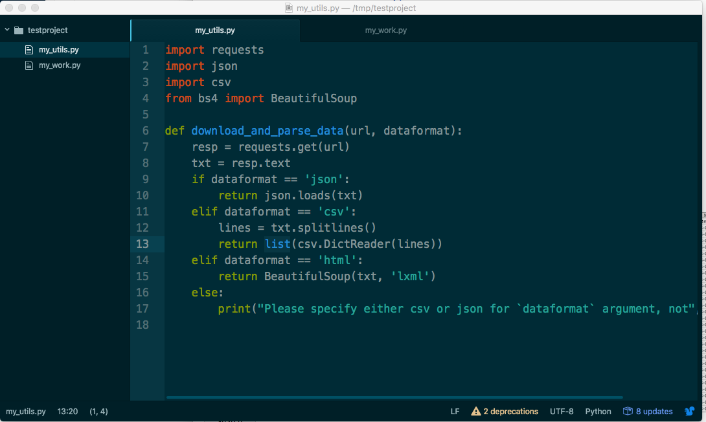
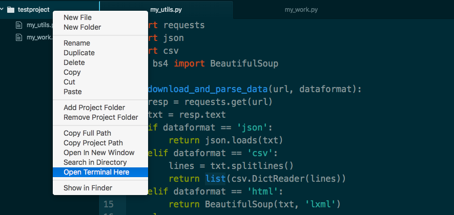

****************************************************
Day 12: Thursday, February 16, 2017 - Geocoding Fun!
****************************************************

No new assignment for today...still working on correcting past homework and compiling a help-guide.

Also, rewriting some of my answers.

Case in point: :doc:`/syllabus/assignments/homework/serials/chicago-homicides`

Preview of using the Twitter API / bots
=======================================

Leaving this here for now, will complete the details next week...

:doc:`/guide/topics/python-nonstandard-libraries/twython`

Some of you who have the time to set up your Twitter and a Twitter Application, feel free to ask me about going through the steps and getting your OAuth tokens/keys...it's theoretically straightforward, but there's a lot of jargon that's easy to get lost on.

Imports and modules and organization
====================================

Going forward, our work will involve separating code into multiple files.

Generally, this is the sequence of steps:

- Create a subfolder that will hold all the files for your project.
- Open that folder in your text editor (Atom)
- Add files to that folder via Atom
- From your command-line, be able to navigate/change into that project directory

Please try this, and let me know if you run into issues:

Make a subdirectory named "testproject" -- it can be anywhere that's comfortable for you.

In that subdirectory, make a file named ``my_utils.py`` and add this function definition and import statements:

.. code-block:: python

    import requests
    import json
    import csv
    from bs4 import BeautifulSoup

    def download_and_parse_data(url, dataformat):
        resp = requests.get(url)
        txt = resp.text
        if dataformat == 'json':
            return json.loads(txt)
        elif dataformat == 'csv':
            lines = txt.splitlines()
            return list(csv.DictReader(lines))
        elif dataformat == 'html':
            return BeautifulSoup(txt, 'lxml')
        else:
            print("Please specify either csv or json for `dataformat` argument, not", dataformat)

Then, make another file named ``my_work.py`` in the same directory, with this code:

.. code-block:: python

    from my_utils import download_and_parse_data

    QUAKES_URL = 'http://earthquake.usgs.gov/earthquakes/feed/v1.0/summary/significant_month.csv'

    def get_quakes():
        return download_and_parse_data(QUAKES_URL, 'csv')

    if __name__ == '__main__':
        print("Hello world")
        quakes = get_quakes()

        print("There were", len(quakes), "major quakes in the past 30 days")

This is what your text editor should look like:

Now, go into your system shell, and try to change into the ``testproject`` subdirectory you created, e.g.

.. code-block:: shell

    $ cd testproject

If you're on a Mac/Unix, you might be able to jump to the folder by right-clicking the ``testproject`` directory and selecting "Open Terminal Here":

If you're having problems with navigating around your file system, please tell me.

If you can get to your ``testproject`` directory, try these steps:

.. rubric:: 1. Run ``my_utils.py`` from the command-line:

.. code-block:: shell

    $ python my_utils.py

If nothing happened, or appeared on screen, why was that? Did you expect anything to show up?

.. rubric:: 2. Run ``my_work.py`` from the command-line:

.. code-block:: shell

    $ python my_work.py

What output did you see? You should have seen something, and it should be obvious where in ``my_work.py`` the output came from. We haven't talked a lot about this construct:

.. code-block:: python

    if __name__ == '__main__':
        print("Hello world")

That conditional branch lets us specify code to be run when the entire script is executed/interpreted. What's the other option?

.. rubric:: 3. Import ``my_work.py`` into the interactive shell

Go into ipython:

.. code-block:: shell

    $ ipython

And then import the ``my_work.py`` script with this:

.. code-block:: python

    >>> import my_work

Did any output go to screen? Nothing in the ``if __name__`` conditional branch should have executed, because that condition isn't satisfied when the script is imported, hence, we don't see ``print("Hello world")`` executing.

Finally, try these commands at the interactive shell. Before you run them, try to predict what they'll do, and then try to explain to yourself why they "worked":

.. code-block:: python

    >>> my_work.QUAKES_URL

    >>> my_work.get_quakes()

    >>> import my_utils

    >>> my_utils.download_and_parse_data('http://stash.compciv.org/2017/helloworld.json', 'json')

Basically, we'll be splitting our code into more and more separate files to help enforce the separation of concerns and conflicting behavior. For starters, it's harder to accidentally re-use/overwrite a variable name when your code is split into functions in different scripts. This means fewer frustrating bugs.

But the tradeoff is that there's a little more cognitive overhead in figuring out which script contains what. I advise getting used to the idea of memorizing keyboard shortcuts for the text-editor, such as Command-T to pop up a quick-nav. You won't get very far clicking from place to place.

Using geocoding (and other APIS) in the real world
==================================================

If you haven't signed up for the Mapzen API, please do so:

https://mapzen.com/developers/sign_up

https://mapzen.com/documentation/search/

When you've signed in and gotten your developer key, you should be able to visit this URL:

https://search.mapzen.com/v1/search?text=Stanford+University&api_key=YOUR_API_KEY

Which should look similar to this stashed copy:

http://stash.compciv.org/2017/mapzen-search-stanford-university-multiple.json

It's hard to see in the raw data, but deep inside those nested dictionaries are geocoded results that take our human-readable input -- 'Stanford University' -- and give us latitude and longitude (and some helpful geopolitical metadata)

Wrapping the geocoder
---------------------

The Mapzen Geocoder API is one example of how we get a huge amount of functionality without having to know the complexity of geospatial analysis.

We just have to know how to interact with data objects -- including reading from files, converting text into data, iterating through a list.

So we don't write our own geocoder -- instead. we write a wrapper around Mapzen's API to make it easier for us to use.

Take a look at the following script:

:doc:`geocoder.py </code/answers/geocoder_cli_example/geocoder.py>`

You should be able to copy-paste it into your own text-editor and then load the script as a module, like so:

.. code-block:: python

    >>> import geocoder
    >>> geocoder.geocode('YOUR_API_KEY', 'The Empire State Building')
    {'confidence': 0.919,
     'country': 'United States',
     'county': 'New York County',
     'label': 'NY SKYRIDE at the Empire State Building, Manhattan, New York, NY, USA',
     'latitude': 40.74813,
     'layer': 'venue',
     'longitude': -73.98495,
     'region': 'New York'}

Making your own geocoder won't be an assignment -- I'll give you my code, and then give you 5 variations on it to show you how things can be simplified and done in self-contained steps.

At this point, we're not doing a lot of "new" things in terms of programming concepts. Most everything cool and exciting will involve systematically taking advantage of APIs and other external, structured resources.

So when you look at the Mapzen API, this is the level you should be thinking at:

We have an API key and a thing we want to geocode ("The Empire State Building", "Timbuktu") -- what are all the steps in between that starting point, and the desired end result: an easy to use data object with geolocation data?

.. code-block:: python

    >>> import geocoder
    >>> geocoder.geocode('YOUR_API_KEY', 'The Empire State Building')
    {'confidence': 0.919,
     'country': 'United States',
     'county': 'New York County',
     'label': 'NY SKYRIDE at the Empire State Building, Manhattan, New York, NY, USA',
     'latitude': 40.74813,
     'layer': 'venue',
     'longitude': -73.98495,
     'region': 'New York'}

It's not at all a bad idea to figure out the manual way of getting from your API key and the string, "The Empire State Building" to the above result.

Another way to think of this -- how confident are you that you can turn your API key and 'The Empire State Building' into this URL:

https://search.mapzen.com/v1/search?api_key=search-YsQY7rE&text=The+Empire+State+Building

And how confident are you that you know how to take the serialized data at that URL (or this `cached version <stash.compciv.org/2017/mapzen-search-empire-state-building.json>`_), and turn it into this object:

.. code-block:: python

    {'confidence': 0.919,
     'country': 'United States',
     'county': 'New York County',
     'label': 'NY SKYRIDE at the Empire State Building, Manhattan, New York, NY, USA',
     'latitude': 40.74813,
     'layer': 'venue',
     'longitude': -73.98495,
     'region': 'New York'}

