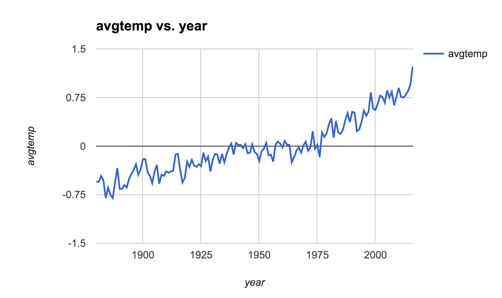
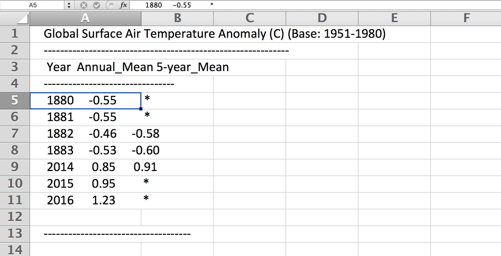

**********************************************
Contrived Clueless Command Line Data Crunching
**********************************************

Remember the assignment :doc:`/syllabus/assignments/homework/quake-mags`? Here's that same exercise, **repeated 12 times across 12 different datasets**.

I won't even bother to explain the context or provenance of the datasets. But if you like context, I include links to where the landing pages of the data that offer some documentation. Whatever helps you get from the starting point of the raw data to the expected output.

**These exercises are called "contrived"** because I don't assume that you can do "real" programming yet -- because we haven't really learned programming -- and are limited to the "crude" but powerful command-line tools of ``ack``, ``sort``, etc. When we get into programming with Python, knowing the limitations of the powerful command-line tools will help you appreciate the additional flexibility and power that "real" programming provides.

This homework is not just more practice, but a way to give you first-hand insight into how the hard work of programming is to get something to work *just once*.

But once you've got something working, applying that solution to 10 or even 100,000 similar problems requires superficial effort. Even if the previous assignment took you 4 hours, that does not mean this one will take you 48 hours.

Understanding the exponential effect of programming is key to understanding how to apply it to journalism and to do scalable work in journalism.

.. contents:: :local:

Rubric
======

Due date:
    1:00 PM, 2017-01-24

.. csv-table::
    :header: "Points", "Metric"
    :widths: 10, 90

    1,"Having a correct subject headline of ``compciv-2017::your_sunet_id::cccldc``"
    1,"Your email contains 12 attachments, named ``1.sh`` through ``12.sh`` for each of the exercises"
    10,"Your scripts produce the expected output"

Delivery format
===============

Send an email to dun@stanford.edu with the subject:

``compciv-2017::your_sunet_id::cccldc``

Where ``your_sunet_id`` is your Stanford student ID, all-lowercase.

The email should include 12 attachments, e.g. ``1.sh`` for exercise 1, and so forth.

The body of the email should read:

``please make it stop``

Our dev server
--------------

It's highly recommended that you use the ``dev.thrill.haus`` server that I've set up (and, hopefully, emailed you with a login and password). It has the exact software needed to do the exercises, including `csvkit <http://csvkit.readthedocs.io/>`_ and ``ack``.

The McClatchy Lab computers will work. The Stanford shared computing may or may not -- it's not even worth trying.

If you do the homework on ``dev.thrill.haus``, move your answers to the ``public`` folder. Every file in that directory is accessible to the web at:

http://dev.thrill.haus/your_username/thatfilename.sh

I highly recommend using ``mutt`` to email the files to me. The problem, of course, is that to use ``mutt``, you need to run ``mutt`` from ``cardinal.stanford.edu``. No problem:

1. Do your work on ``dev.thrill.haus``
2. Put all your answer files in your ``public/`` directory.
3. Log in to ``cardinal.stanford.edu``
4. Download the files from ``dev.thrill.haus`` onto cardinal using ``curl``:

   .. code-block:: shell

        $ curl http://dev.thrill.haus/your_username/1.sh > 1.sh

5. Attach those files as a batch and send them to me with ``mutt``:

    .. code-block:: shell

        $ echo 'please make it stop' \
            | mutt -s 'compciv-2017::your_sunet_id::cccldc' \
              -a  1.sh 2.sh 3.sh 4.sh 5.sh 6.sh 7.sh 8.sh 9.sh 10.sh \
                  11.sh 12.sh \
              -- dun@stanford.edu

The Work
========

The only tools you'll need for this assignment:

- :doc:`/guide/topics/command-line/nonstandard-commands/ack`
- :doc:`/guide/topics/command-line/standard-commands/sort`
- `uniq <http://www.compciv.org/unix-tools/#uniq>`_
- `curl <http://www.compciv.org/unix-tools/#curl>`_
- `csvcut <https://csvkit.readthedocs.io/en/749/scripts/csvcut.html>`_

And, where mentioned:

- `csvsort <https://csvkit.readthedocs.io/en/749/scripts/csvsort.html>`_
- `csvgrep <https://csvkit.readthedocs.io/en/749/scripts/csvgrep.html>`_
- `csvstack <https://csvkit.readthedocs.io/en/749/scripts/csvstack.html>`_

1. NASA annual global temperature averages
------------------------------------------

Prompt:
    The script ``1.sh`` should read the raw data text file of NASA temperature measurements and transform it into a two-column CSV, with the year and annual mean.

Landing page:
    https://data.giss.nasa.gov/modelforce/

Direct download URL:
    https://data.giss.nasa.gov/gistemp/graphs_v3/Fig.A.txt

Mirror URL:
    http://stash.compciv.org/2017/nasa-gistemp.txt

Expected output
"""""""""""""""

When I execute your script like this:

.. code-block:: shell

    $ bash 1.sh | head -n 5

I expect to see:

.. code-block:: text

    year,avgtemp
    1880,-0.55
    1881,-0.55
    1882,-0.46
    1883,-0.53

When I execute your script like this:

.. code-block:: shell

    $ bash 1.sh | csvsort -c avgtemp -r | head -n 5

I expect to see:

.. code-block:: text

    year,avgtemp
    2016,1.23
    2015,0.95
    2010,0.9
    2005,0.86

If you save the output of your ``1.sh`` script to a CSV file and open it in a modern spreadsheet (such as Google Sheets, and not the piece of crap that is Excel 2011), the result will look like this:

Hints
^^^^^

The NASA data is unstructured text that *looks* like structured data.

Here is what the first 8 lines and the bottom 5 lines look like:

http://stash.compciv.org/2017/nasa-gistemp-sample.txt

.. code-block:: text

    Global Surface Air Temperature Anomaly (C) (Base: 1951-1980)
    ------------------------------------------------------------
     Year  Annual_Mean 5-year_Mean
    --------------------------------
     1880     -0.55         *
     1881     -0.55         *
     1882     -0.46     -0.58
     1883     -0.53     -0.60
     2014      0.85      0.91
     2015      0.95         *
     2016      1.23         *

    ------------------------------------

We want the first two columns (``Year`` and ``Annual_Mean``) and none of the boilerplate, such as the headers or the ``----------`` lines.

As further evidence that this isn't structured data, paste the above text into any spreadsheet:

We have to use a regex to bend it to our desired format. We want the **Year** and the **Annual_Mean**. What's that as a regex pattern?

- A 4 digit number (the year)
- Followed by one-or-more spaces
- Followed by an optional negative sign (remember when the Earth's temperature *dropped* annually? I don't)
- Followed by one or more digits
- Followed by a literal dot character
- Followed by one or more digits

Here's one way to do that pattern; finish it up with a capturing group and the use of ``ack`` with ``--output``:

.. code-block:: shell

    $ curl -s http://stash.compciv.org/2017/nasa-gistemp.txt \
        | ack -o '\d{4} +-?\d+\.\d+'

Useful regular expression techniques:

- optionality with ``?`` http://www.regular-expressions.info/alternation.html
- limited repetition with ``{n}`` http://www.regular-expressions.info/repeat.html
- one-or-more matching with ``+`` http://www.regular-expressions.info/repeat.html
- Capturing groups with ``( )`` http://www.regular-expressions.info/brackets.html

Because the data file is 100+ lines, you may want to test against this 13-line version just so it's easier to predict what you want to see as the answer:

http://stash.compciv.org/2017/nasa-gistemp-sample.txt

To see an example of how I iteratively create the regex pattern, step-by-step, check out this animated demo:

https://asciinema.org/a/100135

**Remember your UP key!**

2. NASA annual global greenhouse gas measurements
-------------------------------------------------

Prompt:
    The script ``2.sh`` should read the NASA file of unstructured data and output a two-column CSV of annual CO2 measurements by year and parts per million. Collect only the data under the ``Observations`` table, and **not** the ``Future Scenarios``.

Landing page:
    https://data.giss.nasa.gov/modelforce/

Direct download URL:
   https://data.giss.nasa.gov/modelforce/ghgases/Fig1A.ext.txt

Mirror URL:
    http://stash.compciv.org/2017/nasa-ghgases.txt

Expected output
"""""""""""""""

When I execute your script like this:

.. code-block:: shell

    $ bash 2.sh | head -n 5

I expect to see:

.. code-block:: text

    year,co2ppm
    1850,285.2
    1851,285.1
    1852,285.0
    1853,285.0

When I execute your script like this:

.. code-block:: shell

    $ bash 2.sh | csvsort -r -c 2 | head -n 5

I expect to see:

.. code-block:: text

    year,co2ppm
    2011,391.15
    2010,389.21
    2009,386.95
    2008,385.46

Hints
^^^^^

This is similar to the previous problem of unstructured text data from NASA. But you have to write a pattern that matches only the numbers in the top half of a file. Easiest way to do that: just get the first 57 lines of the file, and you don't have to worry about the "Future Scenarios" data at all.

This is a good use for the ``head`` program:

.. code-block:: shell

    $ curl -s http://stash.compciv.org/2017/nasa-ghgases.txt \
        | head -n 57

3. San Francisco evictions by year due to "Breach" or "Nuisance"
----------------------------------------------------------------

Landing page:
    https://data.sfgov.org/Housing-and-Buildings/Eviction-Notices/5cei-gny5/data

Direct download URL:
    http://stash.compciv.org/2017/sf-evictions.csv

Expected output
"""""""""""""""

When I execute your script like this:

.. code-block:: shell

    $ bash 3.sh

I expect to see:

.. code-block:: text

    year,evictions
    1997,582
    1998,549
    1999,543
    2000,625
    2001,627
    2002,486
    2003,559
    2004,438
    2005,589
    2006,550
    2007,663
    2008,670
    2009,640
    2010,717
    2011,748
    2012,752
    2013,910
    2014,1073
    2015,981
    2016,715

Hints
^^^^^

Use ``csvcut -n`` to first figure out which columns correspond to the eviction reasons of "Breach" or "Nuisance". You also need to use the "File Date" column in order to extract the year of the eviction.

.. code-block:: shell

    curl -s http://stash.compciv.org/2017/sf-evictions.csv | csvcut -n

4. Marijuana Pending Applications in the City of Denver
-------------------------------------------------------

Prompt:
    Do a group count of the currently pending applications by license type.

Landing page:
    https://www.denvergov.org/opendata/dataset/city-and-county-of-denver-marijuana-pending-applications

Direct download URL:
    http://stash.compciv.org/2017/denver_marijuana_pending_applications.csv

Expected output
"""""""""""""""

When I execute your script like this:

.. code-block:: shell

    $ bash 4.sh

I expect to see:

.. code-block:: text

       6 Medical Marijuana Center
      19 Retail Marijuana Store

Hints
"""""

Use ``csvcut`` and then ``sort`` and ``uniq`` to do the group count. Note that in the expected output, I don't require that you add headers or make the data comma-delimited. Not every data task has to result in structured data, sometimes we just want to get a quick look-see.

5. Menlo Park Building Permit Applications valued at $100 million+
------------------------------------------------------------------

Prompt:
    Print the data row for each Menlo Park building permit application valued at $100M+

Landing page:
    https://data.menlopark.org/Building-and-Planning/Building-Permit-Applications/aac9-hxa9/data

Direct download URL:
    http://stash.compciv.org/2017/menlo-park-building-permits.csv

Expected output
"""""""""""""""

When I execute your script like this:

.. code-block:: shell

    $ bash 5.sh

I expect to see:

.. code-block:: text

    Date Received,Date Issued,# of Days,Permit #,Work Type,Use Type,Project Description,Project Valuation,Permit Fee,Location 1
    08/23/2016 12:00:00 AM,,,BLD2016-01295,NEW,COM,"MPK21- Structural steel and foundations, including underground utilities for building pad",$118000000.00,$878258.81,"1 FACEBOOK WAY
    Menlo Park, CA 94025
    (37.432111, -122.219302)"

Hints
^^^^^

This is a situation where ``ack``, or any other line-by-line pattern matcher won't work. CSV data can have multiple lines if a column has newline characters in it, and ack only works on one line at a time.

The csvkit suite of tools has a tool named ``csvgrep`` for exactly this occasion. Use the ``-c`` flag to specify which column you want to match against, and ``-r`` to specify the regex pattern.

"$100,000,000" is a nine-digit number:

.. code-block:: shell

    $ curl -s http://stash.compciv.org/2017/menlo-park-building-permits.csv \
        | csvgrep -c 8 -r '\d{9,}'

.. warning:: A note for Stanford students

    I think the ``csvgrep`` on the McClatchy hall computers is out of date, and the above example may not work. Test it out on the ``dev.thrill.haus`` server.

6. Benford's Law analysis of 2004 U.S. presidential vote tallies by county
--------------------------------------------------------------------------

Prompt:
    See if the county vote totals of the 2004 presidential elections match the predictions of Benford's Law.

Page about Benford's Law:
    http://www.journalofaccountancy.com/issues/1999/may/nigrini.html

Landing/info page for the data:
    https://github.com/helloworlddata/us-presidential-election-county-results

Direct download URL:
    http://stash.compciv.org/2017/us-presidential-election-county-results.csv

Expected output
"""""""""""""""

When I execute your script like this:

.. code-block:: shell

    $ bash 6.sh

I expect to see:

.. code-block:: text

    first_digit,count
    1,959
    2,503
    3,362
    4,322
    5,259
    6,214
    7,196
    8,179
    9,159

Hints
^^^^^

Start off by using csvcut to trim the data to the only columns you need -- year and vote total:

.. code-block:: shell

    $ curl -s http://stash.compciv.org/2017/us-presidential-election-county-results.csv \
        | csvcut -c year,vote_total \
        | ack '^2004'

Benford's Law states that given a set of naturally-incrementing numbers, we should expect 30% of the **first-digits** of the numbers to be ``1``. Use a regex to extract the leading character of every number-string.

7. Number, by race, of 2016 fatal police shootings in which the deceased was unarmed
------------------------------------------------------------------------------------

Prompt:
    Filter the Washington Post police shootings data for 2016 incidents in which the person was unarmed, and do a group count by race.

Landing page:
    https://github.com/washingtonpost/data-police-shootings

Direct download URL:
    http://stash.compciv.org/2017/wapo-police-shootings.csv

Expected output
"""""""""""""""

When I execute your script like this:

.. code-block:: shell

    $ bash 7.sh

I expect to see:

.. code-block:: text

      22 W
      17 B
       8 H
       1 N

Hints
^^^^^

Note that I don't require printing the output as CSV (you probably have memorized the steps to do so by now).

The police shootings data, which the Washington Post collected by hand, was the backbone of their 2015 Pulitzer Award: http://www.pulitzer.org/prize-winners-by-year/2016

Related reading:

`Inside the Washington Post’s police shootings database: An oral history <https://medium.com/thewashingtonpost/inside-the-washington-post-s-police-shootings-database-an-oral-history-413121889529#.fhv2jspa8>`_

8. Number, by race, of 2016 fatal police encounters in which the deceased was unarmed
-------------------------------------------------------------------------------------

Prompt:
    Filter the Guardian's fatal encounter data for 2016 incidents in which the person was unarmed, and do a group count by race.

Landing page:
    https://www.theguardian.com/us-news/ng-interactive/2015/jun/01/about-the-counted

Direct download URL:
    http://stash.compciv.org/2017/the-counted-2015-2016.csv

Expected output
"""""""""""""""

When I execute your script like this:

.. code-block:: shell

    $ bash 8.sh

I expect to see:

.. code-block:: text

      95 White
      42 Black
      27 Hispanic/Latino
       2 Native American
       1 Unknown
       1 Asian/Pacific Islander
       1 Arab-American

Hints
^^^^^

The Guardian is ostensibly keeping track of the same thing as the Washington Post, but the numbers are far different. Consider the difference in scope of "fatal encounters" that the two organizations use. Also, note that both have different ways of labeling race/ethnicity -- in every real-world dataset, data collectors will have varying opinions on the methodology.

Related reading:

- `Inside The Counted: how Guardian US has tracked police killings nationwide <https://www.theguardian.com/membership/2016/apr/11/inside-the-counted-guardian-us-police-killings>`_
- `Reddit AMA with the Guardian reporters <https://www.reddit.com/r/IAmA/comments/3br3j6/were_the_guardian_reporters_behind_the_counted_a/>`_

9. Top 20 highest-paid city employees in Palo Alto, East Palo Alto, and Menlo Park for 2015
-------------------------------------------------------------------------------------------

Prompt:
    Combine the 2015 salary data for the 3 cities (using csvstack) and list the top 20 employees by total pay + benefits. Trim the data to show only the employee name, job title, total pay + benefits, and agency (i.e. city)

Landing page:
    http://transparentcalifornia.com/

Direct download URLS:
    - http://stash.compciv.org/2017/salaries-palo-alto-2015.csv
    - http://stash.compciv.org/2017/salaries-east-palo-alto-2015.csv
    - http://stash.compciv.org/2017/salaries-menlo-park-2015.csv

Expected output
"""""""""""""""

When I execute your script like this:

.. code-block:: shell

    $ bash 9.sh

I expect to see:

.. code-block:: text

    Employee Name,Job Title,Total Pay & Benefits,Agency
    James Keene,City Manager,450501.71,Palo Alto
    Molly Stump,City Attorney,380924.03,Palo Alto
    Dennis Burns,Police Chief-Adv,360317.08,Palo Alto
    Robert Beacom,Assistant Police Chief,349961.47,Palo Alto
    Everardo Perez,Director Administrative S,344541.67,Palo Alto
    Valerie Fong,Director Utilities,343839.22,Palo Alto
    Adrienne Moore,Police Sgt/Adv,321924.54,Palo Alto
    Ron Watson,Police Captain-Adv,312873.40,Palo Alto
    Kathryn Shen,Director Human Resources/,310738.43,Palo Alto
    Eric Nickel,Fire Chief,304790.74,Palo Alto
    Hillary Gitelman,Director Planning/Communi,304181.87,Palo Alto
    James Sartor,Director Public Works/Cit,302483.91,Palo Alto
    Patricia Lum,Police Lieut-Adv,301000.70,Palo Alto
    Cara Silver,Senior Assistant City Att,293843.13,Palo Alto
    Jonathan Reichental,Director Information Tech,293708.03,Palo Alto
    Peter Pirnejad,Development Services Dire,290858.88,Palo Alto
    Robert Bonilla,Police Lieut-Adv,290334.58,Palo Alto
    Jane Ratchye,Asst Dir Ut/Res Mgmt,290286.68,Palo Alto
    Alexander D McIntyre,City Manager,288720.81,Menlo Park

Hints
"""""

You'll want to first download the 3 data files. The ``-O`` flag of ``curl`` can be used when you're too lazy to name the destination file:

.. code-block:: shell

    curl -s -O http://stash.compciv.org/2017/salaries-palo-alto-2015.csv
    curl -s -O http://stash.compciv.org/2017/salaries-east-palo-alto-2015.csv
    curl -s -O http://stash.compciv.org/2017/salaries-menlo-park-2015.csv

Now, combine them into one. This is the kind of thing ``cat`` seems built for. Unfortunately, all 3 files have their own headers, which means that those headers will all be thrown into the combined data.

So this is why `csvstack <http://csvkit.readthedocs.io/en/749/scripts/csvstack.html>`_ was created:

.. code-block:: shell

   $ csvstack salaries-palo-alto-2015.csv salaries-east-palo-alto-2015.csv salaries-menlo-park-2015.csv

In the Bash shell, the ``*`` is interpreted as a wildcard for matching filenames. So instead of writing out all 3 file names, try this:

.. code-block:: shell

   $ csvstack salaries-*.csv

Remember that the standard ``sort`` tool sorts lines, starting with the first character. We don't want that here. We want a reverse-sort of the column corresponding to "Total Pay and Benefits".

Use `csvsort <https://csvkit.readthedocs.io/en/749/scripts/csvsort.html>`_, which allows us to sort this data like the structured data that it is (i.e. by column):

.. code-block:: shell

    $ csvstack salaries-*.csv |  csvsort -r -c 8

10. Fetch the Stanford Daily headlines
--------------------------------------

Prompt:
    Like many news sites, the Stanford Daily has a RSS feed. Extract the text between the ``<title>`` tags as a quick and dirty way of extracting the headlines.

Official feed:
    http://www.stanforddaily.com/feed/

My copy of the feed:
    http://stash.compciv.org/2017/stanforddaily-feed.xml

Expected output
"""""""""""""""

When I execute your script like this:

.. code-block:: shell

    $ bash 10.sh | head -n 5

I expect to see:

.. code-block:: text

    Stanford DailyStanford Daily
    Kim K is back, and so are we
    On solo travel
    Taking the lid off CAPS
    To burn and to love

Hints
"""""

XML, like HTML, is just text, and thus we can use regexes to match patterns. Each story in the Daily's feed is wrapped in ``<item>`` tags. And each "item" has several attributes, including "title", which is wrapped in ``<title>`` tags:

.. code-block:: html

    <item>
            <title>Kim K is back, and so are we</title>
            <link>http://www.stanforddaily.com/2017/01/19/kimkisbackandsoarewe/</link>

In the expected output, that ``Stanford DailyStanford Daily`` is supposed to be there, and is meant as a subtle hint to how regex alone is not enough to parse XML or HTML (or any data format). Hence, why we learn "real" programming.

11. State of Texas executions by year
-------------------------------------

Prompt:
    Download the Texas Executed Offenders list and use a regex to match the necessary text for doing a group count of executions by year.

Direct download URL:
    http://www.tdcj.state.tx.us/death_row/dr_executed_offenders.html

Expected output
"""""""""""""""

When I execute your script like this:

.. code-block:: shell

    $ bash 11.sh | head -n 5

I expect to see:

.. code-block:: text

    year,executions
    1982,1
    1984,3
    1985,6
    1986,10

When I execute your script like this:

.. code-block:: shell

    $ bash 11.sh | tail -n 5

I expect to see:

.. code-block:: text

    2012,15
    2013,16
    2014,10
    2015,12
    2016,7

Hints
^^^^^

Again, another example of extracting data from HTML/XML via regex, which is almost never a good solution...though in this case, the pattern is simple enough. If you know nothing about HTML, at least you know that it is just text.

12. State of Florida executions by race of the executed
-------------------------------------------------------

Direct download URL:
    http://www.dc.state.fl.us/oth/deathrow/execlist.html

Expected output
"""""""""""""""

When I execute your script like this:

.. code-block:: shell

    $ bash 12.sh

I expect to see:

.. code-block:: text

    race,executions
    W,60
    B,29
    O,3
    H,1

Hints
^^^^^

There is no column for just "Race", but there is a column of race *and* gender in which each entry is exactly 2 capital letters. Use a regex to capture that, and then filter for just the letters that refer to race.

