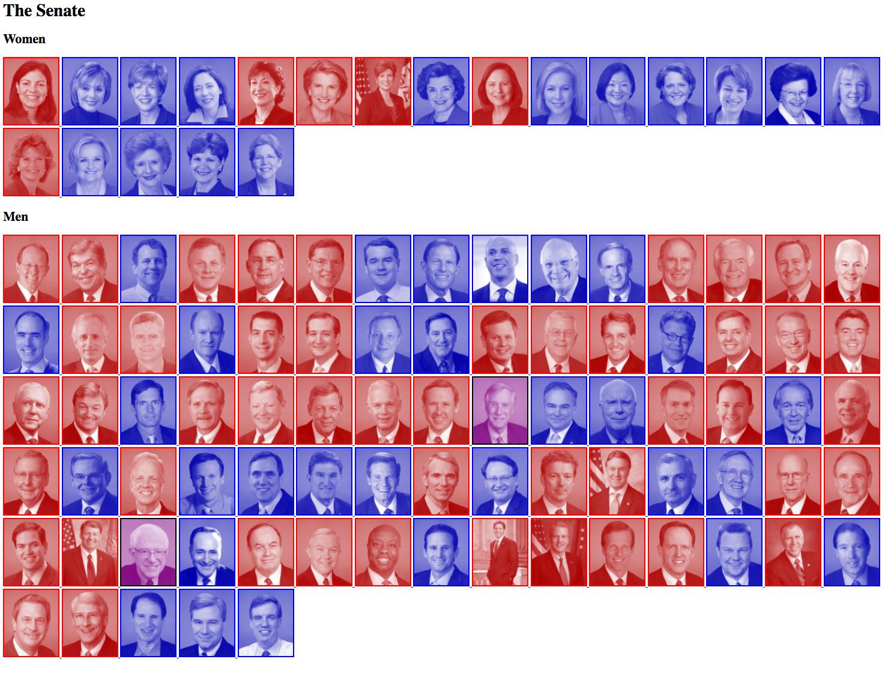

*********************************
Duotone U.S. Senate Photo Gallery
*********************************

Similar to previous exercise, except write a routine that downloads the image files from `unitedstates/congress <https://github.com/unitedstates/images#using-the-photos>`_, and adds a duotone effect to each image.

(mostly an excuse to do something fun with multimedia, beyond just text and data)

Read how to use the Pillow library for image manipulation:

:doc:`/guide/topics/python-nonstandard-libraries/pillow`
