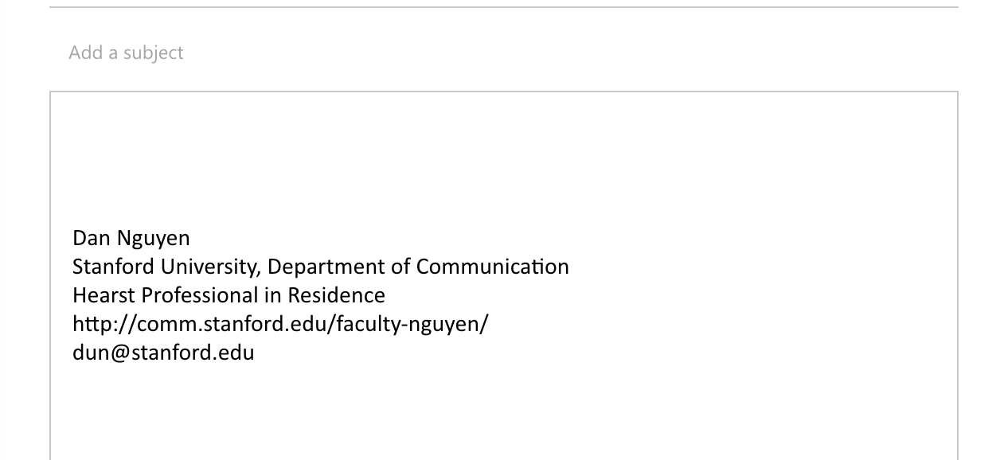

*****************
Hello World Email
*****************

Just making sure we can all send an email, and in plaintext. And that we all have experience creating CSV.

Rubric
======

Due date:
    1:00 PM, :doc:`/syllabus/agendas/2017-01-12`

.. csv-table::
    :header: "Points", "Metric"
    :widths: 10, 90

    1,Having a correct subject headline
    1,Your email is in plaintext
    1,Line 1 of email describes your operating system
    1,Lines 2-11 are Pulitzer story picks in CSV format

Delivery format
===============

Send an email to dun@stanford.edu with the subject:

``your_sunet_id::hello-world-email``

Where ``your_sunet_id`` is your Stanford student ID, all-lowercase. For example, if I were to submit an assignment to myself, the subject line should look like:

``dun::hello-world-email``

.. warning:: Be Exact

    For this assignment, I'll overlook small mistakes. Like not using a double-colon to delimit your Stanford ID from the assignment slug, e.g. `Dun:Helloworld-email`.

    For subsequent homework assignments, though, you will be expected to follow things to the letter, or risk receiving a zero for the assignment.

Milestones
==========

Sending a plaintext email from your @Stanford account
-----------------------------------------------------

Sign into your Stanford email; I recommend using `<webmail.stanford.edu>`_

Assuming you're not emailing me from the Unix command-line (which we'll learn soon enough), you'll have to specify in your email client that you want to send the message in **plaintext** format.

On Stanford's Outlook webmail system, here's the option:

In plaintext mode, note the change in my email signature: my links lose their blue-linkiness:

That's because plaintext has no special colors or hidden features (i.e. click-on-me-and-I-will-take-you-somewhere).

It's just text. And that's all we aim to use, whenever possible.

Line 1: Describe your operating system
--------------------------------------

The first line of your email should simply describe your operating system and version.

- `How to find OSX/macOS version number`  <https://support.apple.com/en-us/HT201260>`_
- `How to find Windows version number <https://support.microsoft.com/en-us/help/13443/windows-which-operating-system>`_

Sample lines:

- ``macOS 10.12.1``

- ``Windows 8.1``

Lines 2-11: The 10 Pulitzer Prize winners with moral, clearcut force
--------------------------------------------------------------------

Look at the following award categories:

- `Public Service <http://www.pulitzer.org/prize-winners-by-category/204>`_
- `Investigative Reporting <http://www.pulitzer.org/prize-winners-by-category/206>`_
- `International Reporting <http://www.pulitzer.org/prize-winners-by-category/210>`_
- `National Reporting <http://www.pulitzer.org/prize-winners-by-category/209>`_
- `Local Reporting <http://www.pulitzer.org/prize-winners-by-category/208>`_
- `Explanatory Reporting <http://www.pulitzer.org/prize-winners-by-category/207>`_
- `Feature Writing <http://www.pulitzer.org/prize-winners-by-category/211>`_

You don't have to read each entry -- their summaries and headlines are just fine, if you want. The purpose of this task is to get acquainted with what is seen as unambiguously important journalism.

From the finalists since 2000 on, pick the 10 stories which you think represent the most clearcut ideals of journalism.

Your email to me should contain your ranked list in comma-delimited format. The first column should be a number 1 through 10, with 1 representing the most ideal journalism project:

.. code-block:: text

    1,http://www.pulitzer.org/winners/associated-press
    2,http://www.pulitzer.org/winners/sheri-fink
    3,http://www.pulitzer.org/winners/alan-miller-and-kevin-sack
    ...etc
    10,http://www.pulitzer.org/finalists/dave-philipps

.. warning:: Check the details!

    Don't forget that your email to me, at dun@stanford.edu, should have the proper subject line, be in plaintext, and have a first line describing your operating system.

