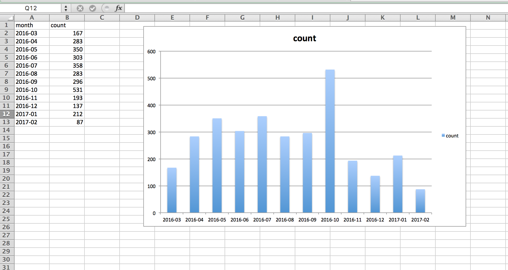

***********************************************
Solid Serialization of: Just Trump Tweets (CSV)
***********************************************

.. contents::

This assignment is part of: :doc`/syllabus/assignments/homework/solid-serialization-skills`

I already provide an example answer. Rewrite it as your own (i.e. use your own structure, function names, variable names) and turn it in.

It is really a warmup for this: :doc:`/syllabus/assignments/homework/serials/multiple-user-tweets-csv`

Deliverables
============

You are expected to deliver a script named: ``just_trump_tweets_csv.py``

The data file to use is:

http://stash.compciv.org/2017/realdonaldtrump-tweets.csv

This script has **5** prompts, which means at the very least, your script will contain 5 separate function definitions, from `foo_1` to `foo_5`.

When I run your script from the command line, I expect to see something like this:

.. code-block:: shell

    $ python just_trump_tweets_csv.py
    Done running assertions!

And I expect your script to have this code at the bottom:

.. code-block:: python

    def foo_assertions():
        assert type(foo_1()) == int
        assert foo_1() == 3200

        assert type(foo_2()) == dict
        assert foo_2() == {'realdonaldtrump': 529}

        assert type(foo_3()) == dict
        assert list(foo_3().keys())[0] == 'realdonaldtrump'
        assert list(foo_3().values())[0] ==  {'after': 20, 'before': 83}

        assert type(foo_4()) == list
        assert type(foo_4()[0]) == tuple
        assert foo_4()[0] == ('month', 'count')
        assert foo_4()[1] == ('2016-03', 167)
        assert foo_4()[-1] == ('2017-02', 87)

        assert type(foo_5()) == list
        assert type(foo_5()[0]) == tuple
        assert foo_5()[0] == ('screen_name', 'month', 'count')
        assert foo_5()[1] == ('realdonaldtrump', '2016-03', 167)
        assert foo_5()[-1] == ('realdonaldtrump','2017-02', 87)

    if __name__ == '__main__':
        foo_assertions()
        print("Done running assertions!")

Prompts
=======

1. Find the number of tweets represented in the data file
---------------------------------------------------------

Basically, just deserialize the CSV text data and return a count of the objects.

Expected result:

.. code-block:: python

    3200

2. Find the number of tweets post-Election Day
----------------------------------------------

Election 2016 was on November 8, 2016, i.e. ``'2016-11-08'

Instead of just returning a count, return a dictionary with a single item, in which the key is the screen name of ``'realdonaldtrump'``, and the value is the number of tweets that match the criteria of post-Election day.

Yes, I could have you return a count, but just do this for the exercise of creating a dictinoary.

Expected result:

.. code-block:: python

    {'realdonaldtrump': 529}

3. Find the number of tweets for the week before and the week after Election Day
--------------------------------------------------------------------------------

The week before Election day includes Nov. 1, 2016 through Nov. 8, 2016.

The week after Election Day includes Nov. 9, 2016 through Nov. 16, 2016.

Return a dictionary of dictionaries. The sub-dictionary contains two keys, 'before' and 'after', with the values being the number of tweets that match the respective criteria.

Expected result:

.. code-block:: python

    {'realdonaldtrump': {'after': 20, 'before': 83}}

4. Count the number of tweets per year-month
--------------------------------------------

Do a group count by the year-month string, e.g. ``'2017-01'`` from ``'2017-01-12 12:01:43'``

Return a list of __tuples__, sorted by the year-month string. Also, the first tuple should contain the headers, i.e.

.. code-block:: python

    ('month', 'count')

Expected result:

.. code-block:: python

    [('month', 'count'),
     ('2016-03', 167),
     ('2016-04', 283),
     ('2016-05', 350),
     ('2016-06', 303),
     ('2016-07', 358),
     ('2016-08', 283),
     ('2016-09', 296),
     ('2016-10', 531),
     ('2016-11', 193),
     ('2016-12', 137),
     ('2017-01', 212),
     ('2017-02', 87)]

Hints
^^^^^

What is a tuple?  A __tuple__ is just a special kind of __list__.

Read more here if you're curious about what a __tuple__ is: http://www.compciv.org/guides/python/fundamentals/tuples-immutable/

Why use tuples? To make your life easier. You'll probably count up tweets per month by aggregating a dictionary. And to convert that dictionary into a list of lists/tuples, you'll start with ``mylist.items()``. Try this out in the interactive console:

.. code-block:: python

    >>> d = {'2017-01': 12, '2017-02': 42}
    >>> d.items()
    dict_items([('2017-02', 42), ('2017-01', 12)])

    # but we don't want a dict_items data type
    # so we convert it to a list

    >>> list(d.items())
    [('2017-02', 42), ('2017-01', 12)]

    # similarly:
    >>> sorted(d.items())
    [('2017-01', 12), ('2017-02', 42)]

5. Count the number of tweets per yearmonth per screen name
-----------------------------------------------------------

This is exactly like the previous prompt, except I want you to include a column for the screen name of the user who tweeted. In this case, every tweet is by "realdonaldtrump". This will make more sense in the next exercise when you're aggregating tweets from multiple users.

The list should have the header-tuple of: ``('screen_name', 'month', 'count')``

Expected result:

.. code-block:: python

    [('screen_name', 'month', 'count'),
     ('realdonaldtrump', '2016-03', 167),
     ('realdonaldtrump', '2016-04', 283),
     ('realdonaldtrump', '2016-05', 350),
     ('realdonaldtrump', '2016-06', 303),
     ('realdonaldtrump', '2016-07', 358),
     ('realdonaldtrump', '2016-08', 283),
     ('realdonaldtrump', '2016-09', 296),
     ('realdonaldtrump', '2016-10', 531),
     ('realdonaldtrump', '2016-11', 193),
     ('realdonaldtrump', '2016-12', 137),
     ('realdonaldtrump', '2017-01', 212),
     ('realdonaldtrump', '2017-02', 87)]

General Hints
=============

An example solution to the problem is given. But I want you to walk through my process.

Pretend this assignment only had ``foo_1`` to fill out. Regardless, we still need to do the work of downloading data from a given URL, deserializing it into an data object, and then, in this case, counting the number of rows. So this is how we start, by doing the routine steps of downloading a URL and converting the text content into a data object (i.e. a list of dicts).

Don't write it out as a function. Go into the interactive shell and write out each line:

.. code-block:: python

    >>> import csv
    >>> import requests
    >>> resp = requests.get('http://stash.compciv.org/2017/realdonaldtrump-tweets.csv')
    >>> txtlines = resp.text.splitlines()
    >>> tweets = list(csv.DictReader(txtlines))

And then make sure you have something that you know you want to **return** in the hypothetical ``foo_1``:

.. code-block:: python

    >>> len(tweets)
    3200

Then, wrap it up in a function as required:

.. code-block:: python

    def foo_1():
        resp = requests.get('http://stash.compciv.org/2017/realdonaldtrump-tweets.csv')
        txtlines = resp.text.splitlines()
        tweets = list(csv.DictReader(txtlines))
        return len(tweets)

Sooner or later, you're going to realize that re-downloading the data file, over and over, is kind of slow. So you do the work of saving the file to disk, and then in subsequent runs, using the cached save file instead of readownloading the raw data:

.. code-block:: python

    from os.path import exists

    def foo_1():
        fname = 'realdonaldtrump-tweets.csv'
        if exists(fname):
            pass
        else:
            resp = requests.get('http://stash.compciv.org/2017/realdonaldtrump-tweets.csv')
            f = open(fname, 'w')
            f.write(resp.text)
            f.close()

        txtlines = open(fname, 'r').read().splitlines()
        tweets = list(csv.DictReader(txtlines))
        return len(tweets)

But of course, this assignment is about calculating something different from the same dataset over and over, for several functions. And you realize, copying and pasting that same snippet of code makes your program look really inelegant, not to mention if you screw up the routine once, you now have to fix it 5 times. So that's when you decide to write the downloading/saving/deserializing data into a function, and call that function in all of your other functions:

.. code-block:: python

    import csv
    import requests
    from os.path import exists

    def make_data():

    resp = requests.get('http://stash.compciv.org/2017/realdonaldtrump-tweets.csv')
    txtlines = resp.text.splitlines()
    tweets = list(csv.DictReader(txtlines))

My solution
===========

Below is a complete script I wrote that fits the requirements. But it is by no means the best way, the most elegant way, or the most logical way. Please do not just copy it, but rewrite it in your own style at the very least.

Note that I do some kind of strange things. Like, instead of hard-coding the data URL as:

.. code-block:: python

    SRC_URL = 'http://stash.compciv.org/2017/realdonaldtrump-tweets.csv'

I add a level of abstraction, as if I were anticipating, some day, that this routine assignment would be scaled to do calculations across any arbitrary number of Tweet datasets:

.. code-block:: python
    import csv
    import requests
    from os.path import basename, exists, join
    from os import makedirs

    SRC_URL_BASE = 'http://stash.compciv.org/2017/{}-tweets.csv'
    DATA_DIR = 'data-files'

    def make_url(sname):
        return SRC_URL_BASE.format(sname)

    def make_filename_from_url(url):
        bname = basename(url)
        return join(DATA_DIR, bname)

    def fetch_tweets(tname):
        makedirs(DATA_DIR, exist_ok=True)
        url = make_url(tname)
        destname = make_filename_from_url(url)

        if not exists(destname):
            resp = requests.get(url)
            with open(destname, 'wb') as f:
                f.write(resp.content)

    def read_tweets(tname):
        fetch_tweets(tname)
        fname = make_filename_from_url(make_url(tname))
        with open(fname, 'r') as f:
            tweets = list(csv.DictReader(f))
            return tweets

You're welcome to write something more straightforward. In fact, I encourage you to.

..  literalinclude:: /code/answers/trump_tweets_csv.py

Background
==========

The given CSV file of tweets is a simplified version of the actual tweet data as provided by the statuses/user_timeline endpoint of the Twitter API:

https://dev.twitter.com/rest/reference/get/statuses/user_timeline

More specifically, this CSV data comes from a handy command-line Twitter tool named **t**, which if you know how to install Ruby and Rubygems, you can run on your own (but for reasons related to how complicated that process is, is not something we're doing for class): https://github.com/sferik/t

Twitter's API only allows us to retrieve the last 3,200 tweets or so from today, which is why the given data file contains that many tweets/lines.

We start out with this simplified CSV format  because it gives us access to most of the interesting things about a tweet, including the tweet's unique ID, when it was "posted", and the text of the tweet:

.. code-block:: text

    ID,Posted at,Screen name,Text
    831510532318429184,2017-02-14 14:28:54 +0000,realDonaldTrump,The real story here is why are there so many illegal leaks coming out of Washington? Will these leaks be happening as I deal on N.Korea etc?
    831344902990655489,2017-02-14 03:30:45 +0000,realDonaldTrump,Congratulations to our new #VASecretary Dr. David Shulkin. Time to take care of Veterans who have fought to protect… https://t.co/FNewjbHuw4

If you want to see the actual Twitter Web representation of a tweet, the URL format is:

.. code-block:: text

    https://twitter.com/{SCREEN NAME}/status/{TWEET ID}

e.g.  https://twitter.com/realDonaldTrump/status/831510532318429184

(screen names are case insensitive)

Here's what that tweet looks like embedded in this webpage:

.. raw:: html

    <blockquote class="twitter-tweet" data-lang="en">
The real story here is why are there so many illegal leaks coming out of Washington? Will these leaks be happening as I deal on N.Korea etc?
&mdash; Donald J. Trump (@realDonaldTrump) <a href="https://twitter.com/realDonaldTrump/status/831510532318429184">February 14, 2017</a></blockquote>
    

Why a list of lists?
--------------------

It may be unclear why I require you to return a list of lists/tuples, as in for ``foo_4()``:

.. code-block:: python

    >>> foo_4()
    [('month', 'count'),
     ('2016-03', 167),
     ('2016-04', 283),
     ('2016-05', 350),
     ('2016-06', 303),
     ('2016-07', 358),
     ('2016-08', 283),
     ('2016-09', 296),
     ('2016-10', 531),
     ('2016-11', 193),
     ('2016-12', 137),
     ('2017-01', 212),
     ('2017-02', 87)]

The answer is -- well, we want to do something with this data, right? Such as visualize it? We're not doing that step yet. But a common pattern is to **serialize** the data object, that is, convert a Python data object back into text. Give the data object above, a list of lists, this is how we would convert it to CSV formatted text and save it to a file named "test.csv"

.. code-block:: python

    import csv
    dest_fname = 'trumptweets.csv'
    ofile = open(dest_fname, 'w')
    ocsv = csv.writer(ofile)

    rows = foo_4()

    for row in rows:
        ocsv.writerow(row)

    ofile.close()

Which gets you a file named ``trumptweets.csv`` which looks like this

.. code-block:: text

    month,count
    2016-03,167
    2016-04,283
    2016-05,350
    2016-06,303
    2016-07,358
    2016-08,283
    2016-09,296
    2016-10,531
    2016-11,193
    2016-12,137
    2017-01,212
    2017-02,87

Which can be opened up by a spreadsheet, or other visualization tool, to make something like this:

So if you think these exercises are needlessly contrived, that means you're a perfectly sane person who, at the very least, knows how to use a computer to help with the very sanity-depriving work of data cleaning...

