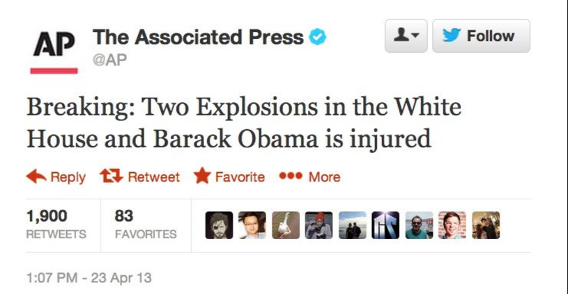

*********************************************************************
Algorithms for making fake, and beating (maybe...) fake news
*********************************************************************

A spectrum of fake news
=======================

Obviously fake on its face
--------------------------

.. rubric:: Breaking news tweet from fake account

- https://twitter.com/TheOnion/status/119419578647461888

- https://www.theguardian.com/world/blog/2011/sep/29/the-onion-fake-congress-hostage-report

    Perhaps unnecessarily, the Onion confirmed its account had not been hacked, telling the Washington Post: "This is satire, this is how it works."

Fake, but requires research
---------------------------

.. rubric:: Fake site, plausible headline and content

.. image:: image/abcnews.com-co-el-chapo.jpg

`Drug Kingpin Joaquin ‘El Chapo’ Guzman Escapes Mexican Prison For The Third Time
 <https://web.archive.org/web/20170101022500/http://abcnews.com.co/drug-kingpin-el-chapo-escapes-mexican-prison-once-again/`

This was a fake story from a fake site. But it was effective because:

- It plays on the assumption that El Chapo was unbeatable, because his recent second escape was so dramatic.
- abc.news.co looks a lot like abc.news or abc.au
- It's a fairly nice looking website, enough to fool most people.

`No, El Chapo has not escaped from prison a third time <http://www.bbc.com/news/world-latin-america-36748012> - BBC News; July 8, 2016.

Will fool some people
---------------------

.. rubric:: Fake site tweeted by politician

- `http://www.mediaite.com/online/eric-trump-cites-fake-news-website-proving-clinton-hired-protesters/`

        Finally the truth comes out! #CrookedHillary https://t.co/z6Xm6ZcCoX

        — Eric Trump (@EricTrump) October 12, 2016

.. rubric:: April Fool's Day

- https://www.washingtonpost.com/news/wonk/wp/2016/03/31/pfizer-vows-to-stop-raising-the-list-prices-of-its-drugs/

        The press release was circulated using an email address that appeared to belong to a real Pfizer spokesman, but used the domain pfizerinternational.com, a fake website that closely mimics Pfizer’s. That website, which also hosted the press release, has since been taken down. A Post reporter called the false phone number provided for the spokesman before the story was published and heard a message saying the company would not be answering questions about the press release and left a voicemail.

- http://fortune.com/2016/03/31/pfizer-drug-prices-april-fools/

Fake, but will fool most
------------------------

.. rubric:: Fake news tweeted by compromised real site

- `AP Twitter account hacked in fake 'White House blasts' post
  <http://www.bbc.com/news/world-us-canada-21508660>`
- `AP Twitter Account Hacked in Market-Moving Attack <https://www.bloomberg.com/news/articles/2013-04-23/dow-jones-drops-recovers-after-false-report-on-ap-twitter-page>`

Actually true, depending on who you are
---------------------------------------

.. rubric Fake press release by official authority

http://lawnewz.com/uncategorized/cops-draw-criticism-for-fake-press-release-that-led-to-gang-arrests/

.. rubric Authoritative official makes fake joke announcement

.. rubric Distorted headline from real news story

.. image:: images/facebook-lint-real-obama-mom.jpg

http://www.nytimes.com/2011/04/24/magazine/mag-24Obama-t.html

About how fake news spreads
===========================

The creators
------------

- `Inside a Fake News Sausage Factory: ‘This Is All About Income’ <http://www.nytimes.com/2016/11/25/world/europe/fake-news-donald-trump-hillary-clinton-georgia.html>`
- `The Agency <http://www.nytimes.com/2015/06/07/magazine/the-agency.html>`
- `We Tracked Down A Fake-News Creator In The Suburbs. Here's What We Learned <http://www.npr.org/sections/alltechconsidered/2016/11/23/503146770/npr-finds-the-head-of-a-covert-fake-news-operation-in-the-suburbs>`
- `National Report’s Allen Montgomery on What’s Wrong (and Right) With the Media <http://nymag.com/daily/intelligencer/2016/07/allen-montgomery-problem-with-media.html>`
- `The True Story Behind The Biggest Fake News Hit Of The Election <https://www.buzzfeed.com/craigsilverman/the-strangest-fake-news-empire?utm_term=.dhyeEpe9R#.fvR5yP5eD>`

Histories and case studies
--------------------------

- `How Fake News Goes Viral: A Case Study <http://www.nytimes.com/2016/11/20/business/media/how-fake-news-spreads.html>`_ by New York Times
- `The real history of fake news <http://www.cjr.org/special_report/fake_news_history.php>`
- `The Long and Brutal History of Fake News <http://www.politico.com/magazine/story/2016/12/fake-news-history-long-violent-214535>`

Trying to stop fake news
========================

- `The Real Journalists Behind Facebook’s Push to Stop Fake News
 <http://motherboard.vice.com/read/the-real-journalists-behind-facebooks-push-to-stop-fake-news>`

- `Meet the Ad Companies Ditching Breitbart and Fake News <https://www.wired.com/2016/12/fake-news-will-go-away-tech-behind-ads-wont-pay/>`

Essays about fighting/fearing fake news
=======================================

`Fact-Checking Won't Save Us From Fake News`_ by Brooke Borel (FiveThirtyEight)

I agree with professional fact-checker Borel that fact-checking is merely a "start", and probably more self-congratulatory than anything, because "some readers don't seem to care". And especially, her paraphrase of USC's `Mike Ananny<http://annenberg.usc.edu/faculty/communication-journalism/mike-ananny>`  that "fake news may be a fight, not over truth, but power".

I disagree with her that the problem is that news is "trying so hard to entertain", or that we should rely on Facebook or Google to alter their algorithms in favor of the news.

.. _Fact-Checking Won't Save Us From Fake News: http://fivethirtyeight.com/features/fact-checking-wont-save-us-from-fake-news/
